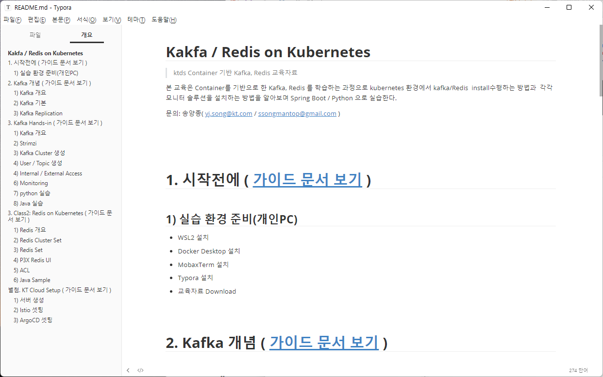
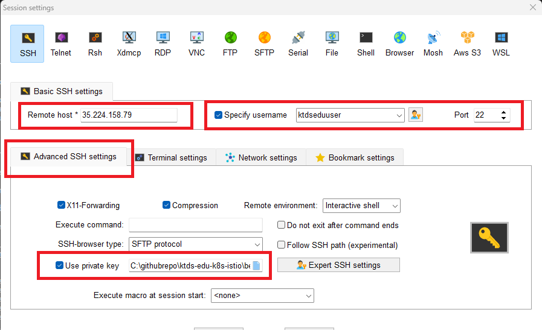

# < 시작전에 >


# 1. 실습 환경 준비(개인PC)

우리는 Kubernetes 기반에 Kafka / Redis 설치하는 실습을 진행할 것이다.

Cloud 환경에 Kubernetes가 설치된 VM 이 개인별 하나씩 준비되어 있어 있다.

그러므로 개인 PC에서 VM 접속할 수 있는 Terminal 을 설치해야 한다.


## 1.1 MobaxTerm 설치

Cloud VM에 접근하기 위해서는 터미널이 필요하다.

CMD / PowerShell / putty 와 같은 기본 터미널을 이용해도 되지만 좀더 많은 기능이 제공되는 MobaxTerm(free 버젼) 을 다운로드 하자.


- download 위치
  - 링크: https://download.mobatek.net/2312023031823706/MobaXterm_Installer_v23.1.zip

- mobaxterm 실행


## 1.2 gitBash 설치

교육문서를 다운로드 받으려면 Git Command 가 필요하다. Windows 에서는 기본 제공되지 않아 별도 설치 해야 한다.

- 다운로드 주소 : https://github.com/git-for-windows/git/releases/download/v2.40.1.windows.1/Git-2.40.1-64-bit.exe
- 참조 링크 : https://git-scm.com/


## 1.3 Typora 설치

교육자료는 MarkDown 문서로 되어 있으며 MD 파일을 확인하기 위해서  typora를 설치 한다.


### (1) 설치

- download 위치
  - 다운로드주소 : https://download.typora.io/windows/typora-setup-x64.exe


- [참고] 링크: https://typora.io/


- Typora 실행


### (2) typora 환경설정

원할한 실습을 위해 코드펜스 옵션을 아래와 같이 변경하자.

- 코드펜스 설정
  - 메뉴 : 파일 > 환경설정 > 마크다운 > 코드펜스
    - 코드펜스에서 줄번호 보이기 - check
    - 긴문장 자동 줄바꿈 : uncheck


- 개요보기 설정
  - 메뉴 : 보기 > 개요
    - 개요 : check


## 1.4 STS 설치

### (1) STS 설치

- download 링크
  - https://download.springsource.com/release/STS4/4.19.1.RELEASE/dist/e4.28/spring-tool-suite-4-4.19.1.RELEASE-e4.28.0-win32.win32.x86_64.self-extracting.jar

- 설치
  - 적당한 위치에 설치하자.

- Workspace 설정
  - 위치 : C:\workspace_STS4.18.1
- [참고] STS링크 : https://spring.io/tools


### (2) [참고] java 설치

- java 설치가 필요한 경우 아래 링크 참고
  - https://download.oracle.com/java/17/latest/jdk-17_windows-x64_bin.msi
- [참고] oracle.com 링크 : https://www.oracle.com/java/technologies/downloads/#jdk17-windows


# 2. 교육문서 Download

해당 교육문서는 모두 markdown 형식으로 작성되었다.  Chrome Browser 에서 github 문서를 직접 확인해도 된다.

하지만 실습을 따라가다 보면 개인별로 수정해야 할 부분이 있는데 web browser 에서는 수정이 안되기 때문에 수정이 용이한 환경이 훨씬 좋을 것이다.

좀더 효율적인 실습을 위해서 해당 자료를 download 하여 markdown 전용 viewer 인 Typora 로 오픈하여 실습에 참여하자.


## 2.1 교육문서 Download

gitbash 실행후 command 명령어로 아래와 같이 임의의 디렉토리를 생성후 git clone 으로 download 하자.

```sh
# GitBash 실행

# 본인 PC에서 아래 디렉토리를 생성
$ mkdir -p /c/githubrepo
 
 
$ cd /c/githubrepo

$ git clone https://github.com/ssongman/ktds-edu-kafka-redis.git
Cloning into 'ktds-edu-kafka-redis'...
remote: Enumerating objects: 590, done.
remote: Counting objects: 100% (41/41), done.
remote: Compressing objects: 100% (26/26), done.
remote: Total 590 (delta 17), reused 28 (delta 13), pack-reused 549
Receiving objects: 100% (590/590), 8.70 MiB | 9.77 MiB/s, done.
Resolving deltas: 100% (259/259), done.


$ ll /c/githubrepo
drwxr-xr-x 1 ssong 197609 0 Jun 11 14:27 ktds-edu-kafka-redis/

```


만약 교육중 (오타 변경 등의 사유로) 자료가 변경되어 다시 받아야 하는 경우 가 있을 경우 해당 위치에서 git pull 만 다시 받도록 하자.

```sh
$ cd /c/githubrepo/ktds-edu-kafka-redis

$ git pull


# 만약 Download 받은자료를 수정되어서 pull 이 안되는 경우는 
# stash 후 pull 받자.
# stash 는 내가 수행한 작업을 commit 하기전 임시로 저장해 놓는 명령이다.

$ git stash

$ git pull

```


## 2.2 Typora 로 readme.md 파일오픈


- typora 로 오픈

```
## typora 에서 아래 파일 오픈

C:\githubrepo\ktds-edu-kafka-redis\README.md
```




# 3. 실습 환경 준비(Cloud)


## 3.1 개인 VM 서버 주소 확인- ★

개인별 VM Server 접속 환경 및 Kafka 실습을 위한 개인 Topic 정보를 확인하자.

| 담당자 |        소속        | VM  Server | VM  Server IP | kafka  Topic | kafka  Group | 비고 |
| :----: | :----------------: | :--------: | :-----------: | :----------: | :----------: | :--: |
| 송양*  | ICIS Tr 아키텍처팀 | bastion01  |  34.xx.xx.xx  | edu-topic01  | edu-group01  |      |
|        |                    |            |               |              |              |      |
|        |                    |            |               |              |              |      |
|        |                    |            |               |              |              |      |
|        |                    |            |               |              |              |      |
|        |                    |            |               |              |              |      |
|        |                    |            |               |              |              |      |
|        |                    |            |               |              |              |      |
|        |                    |            |               |              |              |      |
|        |                    |            |               |              |              |      |
|        |                    |            |               |              |              |      |
|        |                    |            |               |              |              |      |
|        |                    |            |               |              |              |      |
|        |                    |            |               |              |              |      |
|        |                    |            |               |              |              |      |
|        |                    |            |               |              |              |      |
|        |                    |            |               |              |              |      |
|        |                    |            |               |              |              |      |
|        |                    |            |               |              |              |      |
|        |                    |            |               |              |              |      |
|        |                    |            |               |              |              |      |


## 3.2 ssh (Mobaxterm) 실행

Mobaxterm 을 실행하여 VM 접속정보를 위한 신규 sesion 을 생성하자.

- 메뉴
  - Session  : 상단 좌측아이콘 클릭

  - SSH : 팝업창 상단 아이콘 클릭



빨간색 영역을 주의해서 입력한 후 접속하자.


- Romote host
  - 개인별로 접근 주소가 다르므로 위 수강생별  VM  Server IP 주소를 확인하자.
  - ex)  bastion03 : 35.247.230.92

- User
  - Specify username 에 Check
  - User : ktdseduuser  입력

- Port : 22
- Advanced SSH settings
  - Use private key : C:\githubrepo\ktds-edu-kafka-redis\gcp-vm-key\ktdseduuser
    - 교육자료 Download 되는 자료에 위 key가 포함되어 있음


## 3.3 VM 서버에서 실습자료 download

실습 테스트를 위해서 실습 자료를 받아 놓자.

이미 각자 VM에 해당 교육자료가  git clone 되어 있으므로 git pull 로 최신 데이터로 update 만 진행하자

```sh

# 최신 데이터를 한번 더 받는다.

$ cd ~/githubrepo/ktds-edu-kafka-redis
$ git pull


# 만약 pull일 잘 안되는 경우는 모두 삭제후 다시 git clone 받자.

# 삭제
$ rm -rf ~/githubrepo/ktds-edu-kafka-redis/

$ cd ~/githubrepo

## git clone 수행
$ git clone https://github.com/ssongman/ktds-edu-kafka-redis.git
Cloning into 'ktds-edu-kafka-redis'...
remote: Enumerating objects: 320, done.
remote: Counting objects: 100% (320/320), done.
remote: Compressing objects: 100% (220/220), done.
remote: Total 320 (delta 95), reused 277 (delta 56), pack-reused 0
Receiving objects: 100% (320/320), 8.40 MiB | 24.22 MiB/s, done.
Resolving deltas: 100% (95/95), done.


# 확인
$ cd  ~/githubrepo/ktds-edu-kafka-redis

$ ll ~/githubrepo/ktds-edu-kafka-redis
drwxrwxr-x 8 ktdseduuser ktdseduuser 4096 Sep  3 12:27 .git/
-rw-rw-r-- 1 ktdseduuser ktdseduuser  382 Sep  2 13:45 .gitignore
-rw-rw-r-- 1 ktdseduuser ktdseduuser 4006 Sep  2 13:45 README.md
-rw-rw-r-- 1 ktdseduuser ktdseduuser  461 Sep  2 13:45 SUMMARY.md
drwxrwxr-x 4 ktdseduuser ktdseduuser 4096 Sep  3 12:27 beforebegin/
drwxrwxr-x 4 ktdseduuser ktdseduuser 4096 Sep  2 13:45 cloud-setup/
drwxrwxr-x 2 ktdseduuser ktdseduuser 4096 Sep  2 13:51 gcp-vm-key/
drwxrwxr-x 7 ktdseduuser ktdseduuser 4096 Sep  3 12:27 kafka/
drwxrwxr-x 8 ktdseduuser ktdseduuser 4096 Sep  2 13:45 redis/


```


