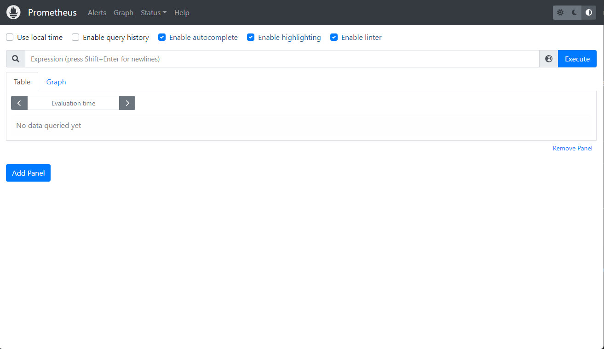
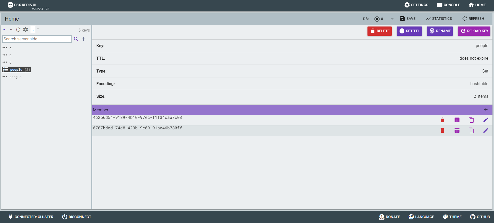
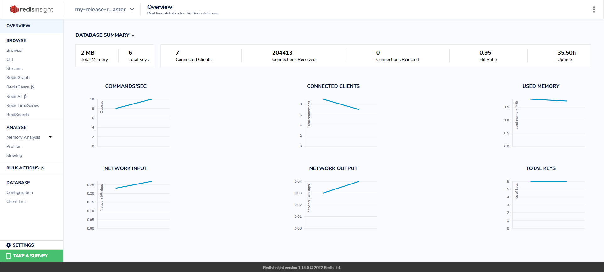

# < Bastion Server Setup >


# 1. K3S 구성(Single mode)


## 1) master node

```sh
# root 권한으로 수행
$ su

$ curl -sfL https://get.k3s.io | sh -s - --write-kubeconfig-mode 644

or

$ curl -sfL https://get.k3s.io | sh -

# 확인
$ kubectl version
WARNING: This version information is deprecated and will be replaced with the output from kubectl version --short.  Use --output=yaml|json to get the full version.
Client Version: version.Info{Major:"1", Minor:"26", GitVersion:"v1.26.5+k3s1", GitCommit:"7cefebeaac7dbdd0bfec131ea7a43a45cb125354", GitTreeState:"clean", BuildDate:"2023-05-27T00:05:40Z", GoVersion:"go1.19.9", Compiler:"gc", Platform:"linux/amd64"}
Kustomize Version: v4.5.7
Server Version: version.Info{Major:"1", Minor:"26", GitVersion:"v1.26.5+k3s1", GitCommit:"7cefebeaac7dbdd0bfec131ea7a43a45cb125354", GitTreeState:"clean", BuildDate:"2023-05-27T00:05:40Z", GoVersion:"go1.19.9", Compiler:"gc", Platform:"linux/amd64"}


# IP/ token 확인
$ cat /var/lib/rancher/k3s/server/node-token
K10f74ce1e1f309271e78114c63d51d5936249e3d379faf1c5c7b2269218f2f9220::server:459b5947077d6e612074e998ff769dd8


# 확인
$ kubectl get nodes -o wide
NAME        STATUS   ROLES                  AGE   VERSION        INTERNAL-IP   EXTERNAL-IP   OS-IMAGE             KERNEL-VERSION    CONTAINER-RUNTIME
bastion03   Ready    control-plane,master   47s   v1.26.5+k3s1   10.158.0.29   <none>        Ubuntu 22.04.2 LTS   5.19.0-1022-gcp   containerd://1.7.1-k3s1


```


## 2) kubeconfig 설정

일반 User가 직접 kubctl 명령 실행을 위해서는 kube config 정보(~/.kube/config) 가 필요하다.

k3s 를 설치하면 /etc/rancher/k3s/k3s.yaml 에 정보가 존재하므로 이를 복사한다. 또한 모든 사용자가 읽을 수 있도록 권한을 부여 한다.

```sh
## root 로 실행
$ su

$ ll /etc/rancher/k3s/k3s.yaml
-rw------- 1 root root 2961 May 14 03:23 /etc/rancher/k3s/k3s.yaml

# 모든 사용자에게 읽기권한 부여
$ chmod +r /etc/rancher/k3s/k3s.yaml

$ ll /etc/rancher/k3s/k3s.yaml
-rw-r--r-- 1 root root 2961 May 14 03:23 /etc/rancher/k3s/k3s.yaml

# 일반 user 로 전환
$ exit


## 사용자 권한으로 실행

$ mkdir -p ~/.kube

$ cp /etc/rancher/k3s/k3s.yaml ~/.kube/config

$ ll ~/.kube/config
-rw-r--r-- 1 song song 2957 May 14 03:44 /home/song/.kube/config

# 자신만 RW 권한 부여
$ chmod 600 ~/.kube/config

$ ls -ltr ~/.kube/config
-rw------- 1 ktdseduuser ktdseduuser 2957 May 13 14:35 /home/ktdseduuser/.kube/config


## 확인
$ kubectl version
Client Version: version.Info{Major:"1", Minor:"26", GitVersion:"v1.26.5+k3s1", GitCommit:"7cefebeaac7dbdd0bfec131ea7a43a45cb125354", GitTreeState:"clean", BuildDate:"2023-05-27T00:05:40Z", GoVersion:"go1.19.9", Compiler:"gc", Platform:"linux/amd64"}
Kustomize Version: v4.5.7
Server Version: version.Info{Major:"1", Minor:"26", GitVersion:"v1.26.5+k3s1", GitCommit:"7cefebeaac7dbdd0bfec131ea7a43a45cb125354", GitTreeState:"clean", BuildDate:"2023-05-27T00:05:40Z", GoVersion:"go1.19.9", Compiler:"gc", Platform:"linux/amd64"}

```

root 권한자가 아닌 다른 사용자도 사용하려면 위와 동일하게 수행해야한다.


## 3) Helm Install

### (1) helm client download

```sh
# 개인 PC WSL
# root 권한으로 수행
$ su


## 임시 디렉토리를 하나 만들자.
$ mkdir -p ~/temp/helm/
  cd ~/temp/helm/

# 다운로드
$ wget https://get.helm.sh/helm-v3.12.0-linux-amd64.tar.gz

# 압축해지
$ tar -zxvf helm-v3.12.0-linux-amd64.tar.gz

# 확인
$ ll linux-amd64/helm
-rwxr-xr-x 1 1001 docker 50597888 May 11 01:35 linux-amd64/helm*

# move
$ mv linux-amd64/helm /usr/local/bin/helm

# 확인
$ ll /usr/local/bin/helm*
-rwxr-xr-x 1 1001 docker 50597888 May 11 01:35 /usr/local/bin/helm*


# 일반유저로 복귀
$ exit


# 확인
$ helm version
version.BuildInfo{Version:"v3.12.0", GitCommit:"c9f554d75773799f72ceef38c51210f1842a1dea", GitTreeState:"clean", GoVersion:"go1.20.3"}


$ helm -n yjsong ls
NAME    NAMESPACE       REVISION        UPDATED STATUS  CHART   APP VERSION

```


### [참고] bitnami repo 추가

- 유명한 charts 들이모여있는 bitnami repo 를 추가해 보자.

```sh
# test# add stable repo
$ helm repo add bitnami https://charts.bitnami.com/bitnami

$ helm repo list

$ helm search repo bitnami
# bitnami 가 만든 다양한 오픈소스 샘플을 볼 수 있다.
NAME                                            CHART VERSION   APP VERSION     DESCRIPTION
bitnami/airflow                                 14.1.3          2.6.0           Apache Airflow is a tool to express and execute...
bitnami/apache                                  9.5.3           2.4.57          Apache HTTP Server is an open-source HTTP serve...
bitnami/appsmith                                0.3.2           1.9.19          Appsmith is an open source platform for buildin...
bitnami/argo-cd                                 4.7.2           2.6.7           Argo CD is a continuous delivery tool for Kuber...
bitnami/argo-workflows                          5.2.1           3.4.7           Argo Workflows is meant to orchestrate Kubernet...
bitnami/aspnet-core                             4.1.1           7.0.5           ASP.NET Core is an open-source framework for we...
bitnami/cassandra                               10.2.2          4.1.1           Apache Cassandra is an open source distributed ...
bitnami/consul                                  10.11.2         1.15.2          HashiCorp Consul is a tool for discovering and ...
...

$ kubectl create ns yjsong

# 설치테스트(샘플: nginx)
$ helm -n yjsong install nginx bitnami/nginx

$ kubectl -n yjsong get all
NAME                         READY   STATUS              RESTARTS   AGE
pod/nginx-68c669f78d-wgnp4   0/1     ContainerCreating   0          10s

NAME            TYPE           CLUSTER-IP    EXTERNAL-IP   PORT(S)        AGE
service/nginx   LoadBalancer   10.43.197.4   <pending>     80:32754/TCP   10s

NAME                    READY   UP-TO-DATE   AVAILABLE   AGE
deployment.apps/nginx   0/1     1            0           10s

NAME                               DESIRED   CURRENT   READY   AGE
replicaset.apps/nginx-68c669f78d   1         1         0       10s

# 간단하게 nginx 에 관련된 deployment / service / pod 들이 설치되었다.


# 설치 삭제
$ helm -n yjsong delete nginx

$ kubectl -n yjsong  get all
No resources found in yjsong namespace.
```


## 4) alias 정의

```sh
# user 권한으로

$ cat > ~/env
alias k='kubectl'
alias kk='kubectl -n kube-system'
alias ky='kubectl -n yjsong'
alias ki='kubectl -n istio-system'
alias kb='kubectl -n bookinfo'
alias kii='kubectl -n istio-ingress'
alias kubectl -n kafka='kubectl -n kafka'
alias krs='kubectl -n redis-system'

## alias 를 적용하려면 source 명령 수행
$ source ~/env

# booting 시 자동인식하게 하려면 아래 파일 수정
$ vi ~/.bashrc
...
source ~/env


```


## 5) K9S Setup

kubernetes Cluster를 관리하기 위한 kubernetes cli tool 을 설치해 보자.

```sh
# root 권한으로

$ mkdir ~/temp/k9s
  cd  ~/temp/k9s

$ wget https://github.com/derailed/k9s/releases/download/v0.27.4/k9s_Linux_amd64.tar.gz
$ tar -xzvf k9s_Linux_amd64.tar.gz

$ ll
-rw-r--r-- 1  501 staff    10174 Mar 22  2021 LICENSE
-rw-r--r-- 1  501 staff    35702 May  7 16:54 README.md
-rwxr-xr-x 1  501 staff 60559360 May  7 17:01 k9s*
-rw-r--r-- 1 root root  18660178 May  7 17:03 k9s_Linux_amd64.tar.gz

$ cp ./k9s /usr/local/bin/

$ ll /usr/local/bin/
-rwxr-xr-x  1 root root 60559360 May 15 13:05 k9s*


# 일반 사용자로 전환
$ exit 

# 실행
$ k9s

```


## 6) Clean up

### (1) node 제거

#### Cordon

현재 노드에 배포된 Pod은 그대로 유지하면서, 추가적인 Pod의 배포를 제한하는 명령어

```
$ kubectl uncordon <node-name>

$ kubectl cordon <node-name>
```

`kubectl drain` 혹은 `kubectl cordon` 명령어를 적용한 노드는 `SechedulingDisabled` 상태가 되어 더 이상 Pod이 scheduling되지 않는다.`kubectl uncordon`은 노드의 이러한 `SchedulingDisabled` 상태를 제거하여 노드에 Pod이 정상적으로 스케쥴링 될 수 있도록 복구하는 명령어이다.


#### Drain

노드에 존재하는 모든 Pod을 제거하여 노드를 비우고, Pod들을 다른 노드에 새롭게 스케쥴링하는 명령어
drain 과정에 cordon이 포함되어 있다고 볼 수 있다.

```sh
$ kubectl get nodes
NAME                   STATUS   ROLES                       AGE    VERSION
ktds-k3s-master-stpc   Ready    control-plane,etcd,master   4h4m   v1.26.4+k3s1
ktds-k3s-master-vlhj   Ready    control-plane,etcd,master   4h2m   v1.26.4+k3s1
ktds-k3s-master-wwfs   Ready    control-plane,etcd,master   4h2m   v1.26.4+k3s1
ktds-k3s-worker-9zmq   Ready    <none>                      171m   v1.26.4+k3s1
ktds-k3s-worker-b47j   Ready    <none>                      171m   v1.26.4+k3s1
ktds-k3s-worker-ncz7   Ready    <none>                      171m   v1.26.4+k3s1
ktds-k3s-worker-w2z4   Ready    <none>                      171m   v1.26.4+k3s1
ktds-k3s-worker-xmpb   Ready    <none>                      171m   v1.26.4+k3s1


$ kubectl drain ktds-k3s-worker-9zmq --ignore-daemonsets 
  kubectl drain ktds-k3s-worker-b47j --ignore-daemonsets 
  kubectl drain ktds-k3s-worker-ncz7 --ignore-daemonsets 
  kubectl drain ktds-k3s-worker-w2z4 --ignore-daemonsets 
  kubectl drain ktds-k3s-worker-xmpb --ignore-daemonsets 


$ kubectl get nodes
NAME                STATUS                     ROLES                       AGE     VERSION
ktds-k3s-master01   Ready                      control-plane,etcd,master   64m     v1.26.4+k3s1
ktds-k3s-master02   Ready                      control-plane,etcd,master   17m     v1.26.4+k3s1
ktds-k3s-master03   Ready                      control-plane,etcd,master   9m37s   v1.26.4+k3s1
ktds-k3s-worker01   Ready,SchedulingDisabled   control-plane,etcd,master   7m51s   v1.26.4+k3s1
ktds-k3s-worker02   Ready,SchedulingDisabled   control-plane,etcd,master   7m37s   v1.26.4+k3s1


```


#### Node Delete

```sh
# drain 작업 이후
$ kubectl delete node ktds-k3s-worker-9zmq
 kubectl delete node ktds-k3s-worker-b47j
 kubectl delete node ktds-k3s-worker-ncz7
 kubectl delete node ktds-k3s-worker-w2z4
 kubectl delete node ktds-k3s-worker-xmpb

```


### (2) k3s uninstall

```sh
## uninstall
$ sh /usr/local/bin/k3s-killall.sh
  sh /usr/local/bin/k3s-uninstall.sh
  
```


# 2. 기타 Tool Setup


## 1) apt install 

```sh
# root 로

$ apt update

$ apt install vim


$ apt install tree


$ apt install iputils-ping

$ apt install net-tools


$ apt install netcat


$ apt install unzip


$ apt install git
 


$ apt install podman
$ podman version
Version:      3.4.2
API Version:  3.4.2
Go Version:   go1.15.2
Built:        Thu Jan  1 09:00:00 1970
OS/Arch:      linux/amd64


```


# < Kafka Setup >

Strimzi Kafka 를 Setup 한다.


# 1. Strimzi Cluster Operator Install

srimzi  operator 를 install 한다.


## 1) namespace 생성

strimzi operator 와 kafka cluster 를 kafka namespace 에 설치해야 한다.  worker node 를 준비한후 kafka namespace 를 생성하자.

```sh
# namespace 생성
$ kubectl create ns kafka

# 확인
$ kubectl get ns kafka
NAME              STATUS   AGE
kafka             Active   11s


# alias 설정
$ alias kubectl -n kafka='kubectl -n kafka'
```


## 2) Strimzi  download


- 해당 사이트(https://strimzi.io/downloads/) 에서 해당 버젼을 다운로드 받는다.

```sh
$ mkdir -p ~/temp/strimzi

$ cd ~/temp/strimzi

# download
$ wget https://github.com/strimzi/strimzi-kafka-operator/releases/download/0.35.0/strimzi-0.35.0.zip

$ ll
-rw-rw-r-- 1 ktdseduuser ktdseduuser 5568819 May 15 15:10 strimzi-0.35.0.zip


$ unzip strimzi-0.35.0.zip
#unzip 이 없으면 설치
# apt install unzip

$ cd  ~/temp/strimzi/strimzi-0.35.0
```


## 3) single name 모드 namespace 설정

- single name 모드로 설치진행
  - strimzi operator 는 다양한 namespace 에서 kafka cluster 를 쉽게 생성할 수 있는 구조로 운영이 가능하다.  
  - 이때 STRIMZI_NAMESPACE 를 설정하여 특정 namespace 만으로 cluster 를 제한 할 수 있다.  
  - 일반적인 경우는 특정 Namespace(kafka)에서만  kafka cluster 를 구성할 수 있도록 설정한다. 
  - 그러므로 아래 중 Single namespace 설정에 해당한다.

```sh
$ cd  ~/temp/strimzi/strimzi-0.35.0

$ sed -i 's/namespace: .*/namespace: kafka/' ./install/cluster-operator/*RoleBinding*.yaml

```


## 4) Operator Deploy

- kafka namespace 를 watch 할 수 있는 권한 부여

```sh
$ cd  ~/temp/strimzi/strimzi-0.35.0

# kafka namespace 를 watch 할 수 있는 권한 부여
# 1) [생략] operator 권한부여
$ kubectl -n kafka create -f ./install/cluster-operator/020-RoleBinding-strimzi-cluster-operator.yaml

# 2) [생략] entity-operator 권한부여
$ kubectl -n kafka create -f ./install/cluster-operator/031-RoleBinding-strimzi-cluster-operator-entity-operator-delegation.yaml

# 3) Deploy the CRDs
$ kubectl -n kafka create -f ./install/cluster-operator/


# CRD 확인
$ kubectl -n kafka get crd
NAME                                    CREATED AT
...
NAME                                    CREATED AT
kafkas.kafka.strimzi.io                 2023-06-10T12:58:00Z
kafkaconnects.kafka.strimzi.io          2023-06-10T12:58:01Z
strimzipodsets.core.strimzi.io          2023-06-10T12:58:01Z
kafkatopics.kafka.strimzi.io            2023-06-10T12:58:01Z
kafkausers.kafka.strimzi.io             2023-06-10T12:58:01Z
kafkamirrormakers.kafka.strimzi.io      2023-06-10T12:58:01Z
kafkabridges.kafka.strimzi.io           2023-06-10T12:58:01Z
kafkaconnectors.kafka.strimzi.io        2023-06-10T12:58:01Z
kafkamirrormaker2s.kafka.strimzi.io     2023-06-10T12:58:01Z
kafkarebalances.kafka.strimzi.io        2023-06-10T12:58:01Z

#  *.*.strimzi.io 라는 CRD 가 생성되었다.


# operator 설치 확인
$ kubectl -n kafka get deploy
NAME                       READY   UP-TO-DATE   AVAILABLE   AGE
strimzi-cluster-operator   1/1     1            1           32s


$ kubectl -n kafka get pod
NAME                                       READY   STATUS    RESTARTS   AGE
strimzi-cluster-operator-fd6fb56f6-f8d98   1/1     Running   0          41s


# operator pod log 확인
$ kubectl -n kafka logs -f deploy/strimzi-cluster-operator
...
2023-06-10 12:48:42 INFO  ClusterOperator:136 - Setting up periodic reconciliation for namespace kafka
2023-06-10 12:48:42 INFO  Main:208 - Cluster Operator verticle started in namespace kafka without label selector

# Cluster Operator verticle started  메세지가 나오면 정상설치 완료 


```


# 2. Kafka Cluster 생성


## 1) Kafka Cluster 생성


### (1) Kafka cluster 생성

> scram -512  인증 방식의 Cluster생성

#### git clone

```sh
$ mkdir -p ~/githubrepo
$ cd ~/githubrepo

$ git clone https://github.com/ssongman/ktds-edu-kafka-redis.git

```


#### kafka cluster 생성

```sh
$ cd ~/githubrepo/ktds-edu-kafka-redis

$ cat ./kafka/strimzi/kafka/12.kafka-ephemeral-auth.yaml
apiVersion: kafka.strimzi.io/v1beta2
kind: Kafka
metadata:
  name: my-cluster
  namespace: kafka
spec:
  kafka:
    version: 3.5.1
    replicas: 3
    authorization:
      type: simple
    listeners:
      - name: plain
        port: 9092
        type: internal
        tls: false
        authentication:
          type: scram-sha-512
      - name: tls
        port: 9093
        type: internal
        tls: true
    config:
      offsets.topic.replication.factor: 3
      transaction.state.log.replication.factor: 3
      transaction.state.log.min.isr: 2
      default.replication.factor: 3
      min.insync.replicas: 1
      inter.broker.protocol.version: "3.5"
    storage:
      type: ephemeral
  zookeeper:
    replicas: 3
    storage:
      type: ephemeral
  entityOperator:
    topicOperator: {}
    userOperator: {}

# kafka Cluster 생성
$ kubectl -n kafka apply -f ./kafka/strimzi/kafka/12.kafka-ephemeral-auth.yaml


# strimzi operator 확인
$ kubectl -n kafka  logs -f -l name=strimzi-cluster-operator
2023-06-04 05:29:50 INFO  KafkaRoller:611 - Reconciliation #1(watch) Kafka(kafka/my-cluster): Dynamic update of pod my-cluster-kafka-0/0 was successful.

$ kubectl -n kafka  logs -f deploy/strimzi-cluster-operator


```

- 인증메커니즘

  - SASL 은 인증 및 보안 서비스를 제공하는 프레임워크이다.
  - 위 yaml 파일의 인증방식은 scram-sha-512  방식인데 이는 SASL 이 지원하는 메커니즘 중 하나이며 Broker 를 SASL 구성로 구성한다.


### (2) Kafka Cluster 확인

```sh
$ kubectl -n kafka get pod -w

$ kubectl -n kafka get pod
NAME                                         READY   STATUS    RESTARTS   AGE
my-cluster-entity-operator-d44f86494-cqp5b   3/3     Running   0          2m4s
my-cluster-kafka-0                           1/1     Running   0          2m56s
my-cluster-kafka-1                           1/1     Running   0          2m56s
my-cluster-kafka-2                           1/1     Running   0          2m56s
my-cluster-zookeeper-0                       1/1     Running   0          3m39s
my-cluster-zookeeper-1                       1/1     Running   0          3m38s
my-cluster-zookeeper-2                       1/1     Running   0          3m38s
strimzi-cluster-operator-fd6fb56f6-csrr4     1/1     Running   0          23h

# kafka broker 3개와  zookeeper 3개 실행된것을 확인 할 수 있다.


# Kafka Cluster 확인
$ kubectl -n kafka get kafka
NAME         DESIRED KAFKA REPLICAS   DESIRED ZK REPLICAS   READY   WARNINGS
my-cluster   3                        3                     True

# kafka Cluster 의 ready 상태가 True 인것을 확인하자.


```


### (3) [참고] Kafka cluster 생성(No 인증)

아래는 인증없이 접근 가능한 kafka cluster 를 생성하는 yaml 이므로 참고만 하자.

```sh
$ cd ~/githubrepo/ktds-edu-kafka-redis

$ cat ./kafka/strimzi/kafka/11.kafka-ephemeral-no-auth.yaml
apiVersion: kafka.strimzi.io/v1beta2
kind: Kafka
metadata:
  name: my-cluster
  namespace: kafka
spec:
  kafka:
    version: 3.5.1
    replicas: 3
    listeners:
      - name: plain
        port: 9092
        type: internal
        tls: false
      - name: tls
        port: 9093
        type: internal
        tls: true
    config:
      offsets.topic.replication.factor: 3
      transaction.state.log.replication.factor: 3
      transaction.state.log.min.isr: 2
      default.replication.factor: 3
      min.insync.replicas: 1
      inter.broker.protocol.version: "3.5"
    storage:
      type: ephemeral
  zookeeper:
    replicas: 3
    storage:
      type: ephemeral
  entityOperator:
    topicOperator: {}
    userOperator: {}


```


## 2)  KafkaUser

- kafka cluster 생성시 scram-sha-512 type 의 authentication 를 추가했다면 반드시 KafkaUser 가 존재해야 한다.

- KafkaUser 를 생성하면 secret 에 Opaque 가 생성되며 향후 인증 password 로 사용된다.
- 어떤 topic 에 어떻게 접근할지 에 대한 ACL 기능을 추가할 수 있다.


### (1) User 정책

아래와 같이 ACL (Access Control List) 정책을 지정할 수 있다.

- sample user 별 설명

```
ㅇ my-user
my 로 시작하는 모든 topic을 처리할 수 있음
my 로 시작하는 모든 group을 Consume 가능

ㅇ edu-user
edu 로 시작하는 모든 topic을 처리할 수 있음
edu 로 시작하는 모든 group을 Consume 가능

ㅇ order-user
order로 시작하는 모든 topic을 처리할 수 있음
order로 시작하는 모든 group을 Consume 가능

ㅇ order-user-readonly
order로 시작하는 모든 topic을 읽을 수 있음
order로 시작하는 모든 group을 Consume 가능
```


### (2) my-edu-admin 생성

#### KafkaUser 생성

```sh
$ cd ~/githubrepo/ktds-edu-kafka-redis

$ cat ./kafka/strimzi/user/11.my-edu-admin.yaml
---
apiVersion: kafka.strimzi.io/v1beta2
kind: KafkaUser
metadata:
  name: my-edu-admin
  labels:
    strimzi.io/cluster: my-cluster
  namespace: kafka
spec:
  authentication:
    type: scram-sha-512
  authorization:
    type: simple
    acls:
      - operation: All
        resource:
          type: topic
          name: my
          patternType: prefix
      - operation: All
        resource:
          name: my
          patternType: prefix
          type: group
      - operation: All
        resource:
          type: topic
          name: edu
          patternType: prefix
      - operation: All
        resource:
          name: edu
          patternType: prefix
          type: group
---


# KafkaUser 생성 명령 실행
$ kubectl -n kafka apply -f ./kafka/strimzi/user/11.my-edu-admin.yaml

# kafkauser 확인
$ kubectl -n kafka get kafkauser
NAME           CLUSTER      AUTHENTICATION   AUTHORIZATION   READY
my-edu-admin   my-cluster   scram-sha-512    simple          True


# Ready 상태가 True인것을 확인하자.
```

- ACL 권한설명

  - my~  또는 edu 로 시작하는 topic 을 모두 처리가능
  - ex) my-board-create,  my-board-update,  edu-topic
  - ACLs Operation 
    * 관련링크 : https://docs.confluent.io/platform/current/kafka/authorization.html

  


### (3) my-user 생성

#### KafkaUser 생성

```sh
$ cd ~/githubrepo/ktds-edu-kafka-redis

$ cat ./kafka/strimzi/user/12.my-user.yaml
---
apiVersion: kafka.strimzi.io/v1beta2
kind: KafkaUser
metadata:
  name: my-user
  labels:
    strimzi.io/cluster: my-cluster
  namespace: kafka
spec:
  authentication:
    type: scram-sha-512
  authorization:
    type: simple
    acls:
      - operations:
          - Describe
          - Read
          - Write
        resource:
          type: topic
          name: my
          patternType: prefix
      - operation: All
        resource:
          name: my
          patternType: prefix
          type: group
---


# KafkaUser 생성 명령 실행
$ kubectl -n kafka apply -f ./kafka/strimzi/user/12.my-user.yaml

# kafkauser 확인
$ kubectl -n kafka get kafkauser
NAME           CLUSTER      AUTHENTICATION   AUTHORIZATION   READY
my-edu-admin   my-cluster   scram-sha-512    simple          True
my-user        my-cluster   scram-sha-512    simple          True

# Ready 상태가 True인것을 확인하자.
```

- ACL 권한설명

  - my~  또는 edu 로 시작하는 topic 을 모두 처리가능
  - ex) my-board-create,  my-board-update,  edu-topic

  


### (4) edu-user 생성

#### KafkaUser 생성

```sh
$ cd ~/githubrepo/ktds-edu-kafka-redis

$ cat ./kafka/strimzi/user/13.edu-user.yaml
---
apiVersion: kafka.strimzi.io/v1beta2
kind: KafkaUser
metadata:
  name: edu-user
  labels:
    strimzi.io/cluster: my-cluster
  namespace: kafka
spec:
  authentication:
    type: scram-sha-512
  authorization:
    type: simple
    acls:
      - operations:
          - Describe
          - Read
          - Write
        resource:
          type: topic
          name: edu
          patternType: prefix
      - operation: All
        resource:
          name: edu
          patternType: prefix
          type: group
---


# KafkaUser 생성 명령 실행
$ kubectl -n kafka apply -f ./kafka/strimzi/user/13.edu-user.yaml

# kafkauser 확인
$ kubectl -n kafka get kafkauser
NAME           CLUSTER      AUTHENTICATION   AUTHORIZATION   READY
edu-user       my-cluster   scram-sha-512    simple          True
my-edu-admin   my-cluster   scram-sha-512    simple          True
my-user        my-cluster   scram-sha-512    simple          True


# Ready 상태가 True인것을 확인하자.
```

- ACL 권한설명

  - my~  또는 edu 로 시작하는 topic 을 모두 처리가능
  - ex) my-board-create,  my-board-update,  edu-topic

  

  


## 3) KafkaTopic


### (1) Topic 정책 

앞서 KafkaUser 의 ACL 기능을 이용해서 kafka topic 을 제어하는 방법을 확인했다.  

my~  또는 edu 로 시작하는 topic 을 모두 처리가능하므로 my-topic 이라는 이름으로 topic 을 생성해 보자.


### (2) KafkaTopic 생성

```sh
$ cd ~/githubrepo/ktds-edu-kafka-redis

$ cat ./kafka/strimzi/topic/11.kafka-topic.yaml
---
apiVersion: kafka.strimzi.io/v1beta2
kind: KafkaTopic
metadata:
  name: my-topic
  labels:
    strimzi.io/cluster: my-cluster
  namespace: kafka
spec:
  partitions: 3
  replicas: 3
  config:
    #retention.ms: 7200000      # 2 hour
    retention.ms: 86400000      # 24 hours
    segment.bytes: 1073741824   # 1GB


# topic 생성 명령 실행
$ kubectl -n kafka apply -f ./kafka/strimzi/topic/11.kafka-topic.yaml


# topic 생성 확인
$ kubectl -n kafka get kafkatopic my-topic
NAME       CLUSTER      PARTITIONS   REPLICATION FACTOR   READY
my-topic   my-cluster   3            3                    True

```


### (3) Topic  상세 확인

```sh
$ kubectl -n kafka get kafkatopic my-topic -o yaml
apiVersion: kafka.strimzi.io/v1beta2
kind: KafkaTopic
metadata:
  annotations:
    kubectl.kubernetes.io/last-applied-configuration: |
      {"apiVersion":"kafka.strimzi.io/v1beta2","kind":"KafkaTopic","metadata":{"annotations":{},"labels":{"strimzi.io/cluster":"my-cluster"},"name":"my-topic","namespace":"kafka"},"spec":{"config":{"retention.ms":86400000,"segment.bytes":1073741824},"partitions":3,"replicas":3}}
  creationTimestamp: "2022-07-03T01:07:32Z"
  generation: 1
  labels:
    strimzi.io/cluster: my-cluster
  name: my-topic
  namespace: kafka
  resourceVersion: "7214"
  uid: 0888ea4d-f966-40cb-8d7c-9f25d10e16dc
spec:
  config:
    retention.ms: 86400000
    segment.bytes: 1073741824
  partitions: 3
  replicas: 3
status:
  conditions:
  - lastTransitionTime: "2022-07-03T01:07:33.321346Z"
    status: "True"
    type: Ready
  observedGeneration: 1
  topicName: my-topic


```

- status 에서 true, ready 임을 확인하자.


# 3. Monitoring(Grafana)

모니터링이 필요할 경우 exporter 를 설치후 promtheus와 연동할 수 있다. 


## 1) metric

모니터링이 필요할 경우 아래와 같이 exporter 를 설치후 promtheus와 연동할 수 있다. 


- exporter 기능은 Strimzi에서 제공되는 통합 이미지 내에 포함되어 있음.   

  - strimzi/kafka:0.29.0-kafka-3.2.0    <-- strimzi-cluster-operator 에서 기본 이미지 설정가능
- kafka cluster 에서 위 yaml 파일만 수정후 apply 해도 추가가능.(kafka cluster 를 재설치 하지 않아도 됨.)
- prometheus / grafana 는 일반적인 내용과 동일함.
- grafana 에서는 strimzi dashboard 를 찾아서 import 한다.
- arsenal-cluster-kafka-exporter:9404 로 접근가능


### (1) my-cluster 에 exporter 생성

```sh
$ kubectl -n kafka edit kafka my-cluster
---
apiVersion: kafka.strimzi.io/v1beta2
kind: Kafka
metadata:
  name: my-cluster
  namespace: kafka
  ...
spec:
  entityOperator:
  kafka:
  zookeeper:
  
  ############# 아래 exporter 추가 ################
  kafkaExporter:
    groupRegex: .*
    topicRegex: .*
  ...    
---


```


- exporter pod 생성 여부 확인

```sh
# 확인
$ kubectl -n kafka get pod
NAME                                          READY   STATUS              RESTARTS      AGE
...
my-cluster-kafka-exporter-79b8c986f8-wg259    0/1     ContainerCreating   0             0s
...


## my-cluster-kafka-exporter 가 추가된다.
# strimzi 가 인식하는 시간이 소요되므로 약 3분정도 후 반영된다.

```


### (2) exporter service 생성

exporter service 는 자동으로 생성되지 않는다.

아래와 같이 수동으로 추가해야 한다.

```sh
$ cd ~/githubrepo/ktds-edu-kafka-redis

$ cat ./kafka/strimzi/monitoring/11.my-cluster-kafka-exporter-service.yaml
---
kind: Service
apiVersion: v1
metadata:
  name: my-cluster-kafka-exporter
  namespace: kafka
spec:
  ports:
    - name: http
      protocol: TCP
      port: 80
      targetPort: 9404
  selector:    
    app.kubernetes.io/instance: my-cluster
    app.kubernetes.io/managed-by: strimzi-cluster-operator
    app.kubernetes.io/name: kafka-exporter    
  type: ClusterIP


$ kubectl -n kafka apply -f ./kafka/strimzi/monitoring/11.my-cluster-kafka-exporter-service.yaml


```


- 확인

```sh
$ kubectl -n kafka get svc my-cluster-kafka-exporter
NAME                        TYPE        CLUSTER-IP      EXTERNAL-IP   PORT(S)   AGE
my-cluster-kafka-exporter   ClusterIP   10.43.131.199   <none>        80/TCP    14s

```


- exporter pod 에서 metric 정상 수집 여부 확인

```sh
# my-cluster-kafka-exporter POD 내로 진입(bash 실행)
$ kubectl -n kafka exec -it deploy/my-cluster-kafka-exporter -- bash


# metric 이 유효한지 조회
$ curl localhost:9404/metrics
# HELP go_gc_duration_seconds A summary of the pause duration of garbage collection cycles.
# TYPE go_gc_duration_seconds summary
go_gc_duration_seconds{quantile="0"} 0.00037912
go_gc_duration_seconds{quantile="0.25"} 0.00037912
go_gc_duration_seconds{quantile="0.5"} 0.00037912
go_gc_duration_seconds{quantile="0.75"} 0.00037912
go_gc_duration_seconds{quantile="1"} 0.00037912
go_gc_duration_seconds_sum 0.00037912
go_gc_duration_seconds_count 1
# HELP go_goroutines Number of goroutines that currently exist.
# TYPE go_goroutines gauge
go_goroutines 19
# HELP go_info Information about the Go environment.
# TYPE go_info gauge
go_info{version="go1.17.1"} 1


# 서비스명으로 조회 시도
$ curl my-cluster-kafka-exporter.kafka.svc/metrics
<-- ok
```


## 2) prometheus - helm방식


### (1) 권한부여

- openshift 에서 수행시 anyuid 권한이 필요하다.

```
# 권한부여시
oc adm policy add-scc-to-user    anyuid -z prometheus-server -n kafka

# 권한삭제시
oc adm policy remove-scc-from-user anyuid  -z prometheus-server -n kafka

```


### (2) helm deploy

```sh
# repo추가
$ helm repo add prometheus-community https://prometheus-community.github.io/helm-charts
$ helm repo list


# 설치전 기설치여부 확인
$ helm -n kafka list


# Fetch
$ mkdir -p ~/temp/helm/charts/
$ cd ~/temp/helm/charts/
$ helm fetch prometheus-community/prometheus

$ ll
-rw-r--r-- 1 ktdseduuser ktdseduuser 59331 Jun  4 12:39 prometheus-22.6.2.tgz

$ tar -zxvf prometheus-22.6.2.tgz
$ cd ~/temp/helm/charts/prometheus

$ helm -n kafka install prometheus . \
  --set configmapReload.prometheus.enabled=true \
  --set server.enabled=true \
  --set server.image.repository=quay.io/prometheus/prometheus \
  --set server.namespaces[0]=kafka \
  --set server.ingress.enabled=true \
  --set server.ingress.hosts[0]=prometheus.kafka.35.209.207.26.nip.io \
  --set server.persistentVolume.enabled=false \
  --set alertmanager.enabled=false \
  --set kube-state-metrics.enabled=false \
  --set prometheus-node-exporter.enabled=false \
  --set prometheus-pushgateway.enabled=false \
  --dry-run=true > dry-run.yaml


# 확인
$ helm -n kafka list
NAME            NAMESPACE       REVISION        UPDATED                                 STATUS          CHART                   APP VERSION
prometheus      kafka           1               2023-06-04 12:35:18.418462244 +0000 UTC deployed        prometheus-22.6.2       v2.44.0


## 확인
$ helm -n kafka status prometheus
$ helm -n kafka get all prometheus

```


#### [Troble Shooting] CRB 추가 생성

- 권한 오류가 발생하여 확인하니 helm chart 에 의해서 당연히  설치되어야 할 권한이 생기지 않았다.
- helm chart 오류인듯 하다.
- 아래와 같이 수동으로 생성한다.

```sh
$ kubectl -n kafka apply -f - <<EOF
apiVersion: rbac.authorization.k8s.io/v1
kind: ClusterRoleBinding
metadata:
  labels:
    component: "server"
    app: prometheus
    release: prometheus
    chart: prometheus-15.10.1
    heritage: Helm
  name: prometheus-server
subjects:
  - kind: ServiceAccount
    name: prometheus-server
    namespace: kafka
roleRef:
  apiGroup: rbac.authorization.k8s.io
  kind: ClusterRole
  name: prometheus-server
EOF

```


### (3) prometheus 확인 

```sh
# pod 확인
$ kubectl -n kafka get pod 
NAME                                          READY   STATUS    RESTARTS      AGE
prometheus-server-5b5d787f8d-rb8zz            1/1     Running   0             4m36s

# pod log 확인
$ kubectl -n kafka logs -f deploy/prometheus-server


# svc 확인
$ kubectl -n kafka get svc
NAME                                  TYPE        CLUSTER-IP       EXTERNAL-IP   PORT(S)                               AGE
...
prometheus-server                     ClusterIP   10.43.124.104   <none>        80/TCP                                117s


# ClusterRoleBinding 확인
$ kubectl -n kafka get ClusterRoleBinding prometheus-server
NAME                ROLE                            AGE
prometheus-server   ClusterRole/prometheus-server   36s


```


### (4) ingress

````sh
$ cd ~/githubrepo/ktds-edu-kafka-redis

$ cat ./kafka/strimzi/monitoring/21.prometheus-ingress.yaml
---
apiVersion: networking.k8s.io/v1
kind: Ingress
metadata:
  name: prometheus-ingress
  annotations:
    kubernetes.io/ingress.class: "traefik"
spec:
  rules:
  - host: "prometheus.kafka.35.209.207.26.nip.io"
    http:
      paths:
      - path: /
        pathType: Prefix
        backend:
          service:
            name: prometheus-server
            port:
              number: 80


$ kubectl -n kafka apply -f ./kafka/strimzi/monitoring/21.prometheus-ingress.yaml

````

- 확인
  - URL : http://prometheus.kafka.ktcloud.211.254.212.105.nip.io





#### [참고] Openshift Route

openshift 환경일때는 route 를 생성한다.

````sh
$ cd ~/githubrepo/ktds-edu-kafka-redis

$ cat ./kafka/strimzi/monitoring/22.prometheus-route.yaml
---
kind: Route
apiVersion: route.openshift.io/v1
metadata:
  name: prometheus-route
  namespace: kafka-system
  labels:
    app: prometheus
    app.kubernetes.io/managed-by: Helm
    chart: prometheus-15.8.4
    component: server
    heritage: Helm
    release: prometheus
spec:
  host: prometheus-kafka.apps.211-34-231-82.nip.io
  to:
    kind: Service
    name: prometheus-server
    weight: 100
  port:
    targetPort: http
    
$ kubectl -n kafka apply -f ./kafka/strimzi/monitoring/22.prometheus-route.yaml
````


### (5) configmap 정리

- 기존에 존재하는 모든 job_name 을 삭제하고
- kafka-exporter jobname 만 추가하자.

````sh
$ kubectl -n kafka edit configmap prometheus-server
---
kind: ConfigMap
apiVersion: v1
metadata:
  name: prometheus-server
  namespace: kafka
  ...
data:
  ...
  prometheus.yml: |
    global:
      evaluation_interval: 1m
      scrape_interval: 1m
      scrape_timeout: 10s
    rule_files:
    - /etc/config/recording_rules.yml
    - /etc/config/alerting_rules.yml
    - /etc/config/rules
    - /etc/config/alerts
    scrape_configs: 
    
    #### 아래 부분 추가 ####
    - job_name: kafka-exporter
      metrics_path: /metrics
      scrape_interval: 10s
      scrape_timeout: 10s
      static_configs:
      - targets:
        - my-cluster-kafka-exporter.kafka.svc
     ...
````

- 추가후 prometheus server 재기동

```sh
$ kubectl -n kafka get pod
NAME                                          READY   STATUS    RESTARTS      AGE
...
prometheus-server-5dc67b6855-cdm54            1/1     Running   0             24m
...


$ kubectl -n kafka delete pod prometheus-server-5dc67b6855-cdm54
pod "prometheus-server-5dc67b6855-cdm54" deleted


$ kubectl -n kafka get pod
NAME                                          READY   STATUS    RESTARTS      AGE
my-cluster-kafka-exporter-79b8c986f8-wg259    1/1     Running   1 (60m ago)   60m
prometheus-server-5dc67b6855-67xts            0/1     Running   0             9s

```


- target 확인 
  - URL : http://prometheus.kafka.ktcloud.211.254.212.105.nip.io
  - 메뉴 : status / target 에서 아래와 같이 kafka-exporter 가 추가된것을 확인한다.


- metric 확인
  - 메뉴 : Graph

```
kafka_topic_partition_current_offset

```


```
sum(rate(kafka_topic_partition_current_offset{topic="edu-topic-01"}[1m])) by (topic)
```


### (6) clean up

```sh
## 삭제
$ helm -n kafka delete prometheus 

$ helm -n kafka list

```


## 3) Grafana deploy

- deploy

```sh
$ cd ~/githubrepo/ktds-edu-kafka-redis

$ cat ./kafka/strimzi/monitoring/31.grafana-deployment.yaml
---
apiVersion: apps/v1
kind: Deployment
metadata:
  name: grafana
  namespace: kafka
  labels:
    app: strimzi
spec:
  replicas: 1
  selector:
    matchLabels:
      name: grafana
  template:
    metadata:
      labels:
        name: grafana
    spec:
      containers:
      - name: grafana
        image: docker.io/grafana/grafana:7.3.7
        ports:
        - name: grafana
          containerPort: 3000
          protocol: TCP
        volumeMounts:
        - name: grafana-data
          mountPath: /var/lib/grafana
        - name: grafana-logs
          mountPath: /var/log/grafana
        readinessProbe:
          httpGet:
            path: /api/health
            port: 3000
          initialDelaySeconds: 5
          periodSeconds: 10
        livenessProbe:
          httpGet:
            path: /api/health
            port: 3000
          initialDelaySeconds: 15
          periodSeconds: 20
      volumes:
      - name: grafana-data
        emptyDir: {}
      - name: grafana-logs
        emptyDir: {}
        
$ kubectl -n kafka apply -f ./kafka/strimzi/monitoring/31.grafana-deployment.yaml
deployment.apps/grafana created

```


- service

```sh
$ cd ~/githubrepo/ktds-edu-kafka-redis

$ cat ./kafka/strimzi/monitoring/32.grafana-svc.yaml
---
apiVersion: v1
kind: Service
metadata:
  name: grafana
  namespace: kafka
  labels:
    app: strimzi
spec:
  ports:
  - name: grafana
    port: 3000
    targetPort: 3000
    protocol: TCP
  selector:
    name: grafana
  type: ClusterIP

$ kubectl -n kafka apply -f ./kafka/strimzi/monitoring/32.grafana-svc.yaml
service/grafana created


```


- ingress

```sh
$ cat ./kafka/strimzi/monitoring/33.grafana-ingress.yaml
---
apiVersion: networking.k8s.io/v1
kind: Ingress
metadata:
  name: grafana-ingress
  annotations:
    kubernetes.io/ingress.class: "traefik"
spec:
  rules:
  - host: "grafana.kafka.35.209.207.26.nip.io"
    http:
      paths:
      - path: /
        pathType: Prefix
        backend:
          service:
            name: grafana
            port:
              number: 3000


$ kubectl -n kafka apply -f ./kafka/strimzi/monitoring/33.grafana-ingress.yaml
ingress.networking.k8s.io/grafana-ingress created

```


- [참고] Openshift Route
  - openshift 환경에서만 사용

```yaml
$ cat ./kafka/strimzi/monitoring/34.grafana-route.yaml
---
kind: Route
apiVersion: route.openshift.io/v1
metadata:
  name: grafana-kafka-route
  namespace: kafka
  labels:
    app: strimzi
spec:
  host: grafana.kafka.35.209.207.26.nip.io
  to:
    kind: Service
    name: grafana
    weight: 100
  port:
    targetPort: grafana
  wildcardPolicy: None
$ kubectl -n kafka apply -f ./kafka/strimzi/monitoring/34.grafana-route.yaml
```


- 로그인

기본 Grafana 사용자 이름과 암호는 모두 admin 이다.


 

## 4) Grafana Monitoring

### (1) Grafana 접속

- URL : http://grafana.kafka.35.209.207.26.nip.io

- User : admin

- Pass : admin -->  adminpass


### (2) promehteus 연동

- 메뉴 : Data Sources / Promehteus 
- URL
  - prometheus-server:80  
  - or
  - prometheus-operated:9090


### (3) strimzi exporter dashboard import

- 메뉴: Dashboards / Manage
- import : 11285입력
- 참고링크 : https://grafana.com/grafana/dashboards/11285-strimzi-kafka-exporter
- or
- strimzi 에서 제공하는 dashboard 
  - examples/metrics/grafana-dashboards


### (4) 확인

http://grafana.kafka.ktcloud.211.254.212.105.nip.io/d/jwPKIsniz/strimzi-kafka-exporter?orgId=1&refresh=5s&from=now-30m&to=now&var-consumergroup=edu-topic-group&var-topic=edu-topic-01


- 메뉴 위치 : Dashboards > Manage > Strimzi Kafka Exporter


## 5) Clean Up

```sh
## 1) Grafana 삭제
cd ~/githubrepo/ktds-edu-kafka-redis
kubectl -n kafka delete -f ./kafka/strimzi/monitoring/31.grafana-deployment.yaml
kubectl -n kafka delete -f ./kafka/strimzi/monitoring/33.grafana-ingress.yaml

## 2) Prometheus 삭제
helm -n kafka delete prometheus 
kubectl -n kafka apply -f ./kafka/strimzi/monitoring/21.prometheus-ingress.yaml
kubectl -n kafka delete ClusterRoleBinding prometheus-server
  
```


# 4. Monitoring(Kafdrop)

참조링크 : https://ricardo-aires.github.io/helm-charts/charts/kafdrop/


## 1) kafdrop install

### (1) properties 확인

#### kafka-my-cluster.properties

```sh
# user / password 확인
$ kubectl -n kafka get secret my-edu-admin -o jsonpath='{.data.sasl.jaas.config}' | base64 -d

$ echo b3JnLmFwYWNoZS5rYWZrYS5jb21tb24uc2VjdXJpdHkuc2NyYW0uU2NyYW1Mb2dpbk1vZHVsZSByZXF1aXJlZCB1c2VybmFtZT0ibXktZWR1LWFkbWluIiBwYXNzd29yZD0iT0hON0h6Y0RJZzlkRGxGM05Jd0FvSFJDZ3ZQOG9Gb28iOw== | base64 -d
org.apache.kafka.common.security.scram.ScramLoginModule required username="my-edu-admin" password="OHN7HzcDIg9dDlF3NIwAoHRCgvP8oFoo";

$ cd ~/temp/kafka

$ cat > kafka-my-edu-admin.properties
security.protocol=SASL_PLAINTEXT
sasl.mechanism=SCRAM-SHA-512
sasl.jaas.config=org.apache.kafka.common.security.scram.ScramLoginModule required username="my-edu-admin" password="OHN7HzcDIg9dDlF3NIwAoHRCgvP8oFoo";

---

# kafka_properties
$ export kafka_properties_base64_enc=$(cat kafka-my-edu-admin.properties | base64)
$ echo $kafka_properties_base64_enc


```


### (2) helm install

```sh
$ cd ~/temp/kafka


$ git clone https://github.com/obsidiandynamics/kafdrop

$ cd ~/temp/kafka/kafdrop/chart


# dry-run
$ helm -n kafka install kafdrop .\
    --set kafka.brokerConnect=my-cluster-kafka-bootstrap:9092 \
    --set kafka.properties="$kafka_properties_base64_enc" \
    --set server.servlet.contextPath="/" \
    --set cmdArgs="--topic.deleteEnabled=true --topic.createEnabled=true" \
    --set jvm.opts="-Xms32M -Xmx64M" \
    --dry-run=true


# 참고
    --set image.tag=3.31.0 \
    --set cmdArgs="--message.format=AVRO --schemaregistry.connect=http://localhost:8080" \ #optional
    

# 삭제
$ helm -n kafka uninstall kafdrop

$ helm -n kafka ls

```


####  확인

```sh
# log 확인
$ kubectl -n kafka logs -f deploy/kafdrop

Writing Kafka properties into kafka.properties
2023-06-10 05:48:38.384  INFO ${sys:PID} [           main] k.Kafdrop$EnvironmentSetupListener       : Initializing JAAS config
2023-06-10 05:48:38.400  INFO ${sys:PID} [           main] k.Kafdrop$EnvironmentSetupListener       : env: null .isSecured kafka: false
2023-06-10 05:48:38.401  INFO ${sys:PID} [           main] k.Kafdrop$EnvironmentSetupListener       : Env: null
2023-06-10 05:48:38.608  INFO 1 [kground-preinit] o.h.v.i.u.Version                        : HV000001: Hibernate Validator 6.2.5.Final
2023-06-10 05:48:38.713  INFO 1 [           main] o.s.b.StartupInfoLogger                  : Starting application using Java 11.0.18 on kafdrop-6d4fb5db44-6944k with PID 1 (started by root in /)
2023-06-10 05:48:38.800  INFO 1 [           main] o.s.b.SpringApplication                  : No active profile set, falling back to 1 default profile: "default"
2023-06-10 05:48:44.260  INFO 1 [           main] i.u.s.s.ServletContextImpl               : Initializing Spring embedded WebApplicationContext
2023-06-10 05:48:44.261  INFO 1 [           main] w.s.c.ServletWebServerApplicationContext : Root WebApplicationContext: initialization completed in 5251 ms
2023-06-10 05:48:44.865  INFO 1 [           main] k.c.KafkaConfiguration                   : Checking truststore file kafka.truststore.jks
2023-06-10 05:48:44.866  INFO 1 [           main] k.c.KafkaConfiguration                   : Checking keystore file kafka.keystore.jks
2023-06-10 05:48:44.867  INFO 1 [           main] k.c.KafkaConfiguration                   : Checking properties file kafka.properties
2023-06-10 05:48:44.867  INFO 1 [           main] k.c.KafkaConfiguration                   : Loading properties from kafka.properties
2023-06-10 05:48:45.287  INFO 1 [           main] k.c.KafkaConfiguration                   : Checking truststore file kafka.truststore.jks
2023-06-10 05:48:45.288  INFO 1 [           main] k.c.KafkaConfiguration                   : Checking keystore file kafka.keystore.jks
2023-06-10 05:48:45.288  INFO 1 [           main] k.c.KafkaConfiguration                   : Checking properties file kafka.properties
2023-06-10 05:48:45.290  INFO 1 [           main] k.c.KafkaConfiguration                   : Loading properties from kafka.properties
2023-06-10 05:48:45.415  INFO 1 [           main] k.s.BuildInfo                            : Kafdrop version: 3.31.0, build time: 2023-03-20T17:07:14.026Z
2023-06-10 05:48:47.606  INFO 1 [           main] o.s.b.a.e.w.EndpointLinksResolver        : Exposing 13 endpoint(s) beneath base path '/actuator'
2023-06-10 05:48:49.548  INFO 1 [           main] i.u.Undertow                             : starting server: Undertow - 2.2.20.Final
2023-06-10 05:48:49.586  INFO 1 [           main] o.x.Xnio                                 : XNIO version 3.8.7.Final
2023-06-10 05:48:49.602  INFO 1 [           main] o.x.n.NioXnio                            : XNIO NIO Implementation Version 3.8.7.Final
2023-06-10 05:48:49.654  INFO 1 [           main] o.j.t.Version                            : JBoss Threads version 3.1.0.Final
2023-06-10 05:48:49.738  INFO 1 [           main] o.s.b.w.e.u.UndertowWebServer            : Undertow started on port(s) 9000 (http)
2023-06-10 05:48:50.813  INFO 1 [           main] o.s.b.StartupInfoLogger                  : Started application in 13.148 seconds (JVM running for 15.8)
2023-06-10 05:48:56.114  INFO 1 [  XNIO-1 task-1] i.u.s.s.ServletContextImpl               : Initializing Spring DispatcherServlet 'dispatcherServlet'
2023-06-10 05:48:56.117  INFO 1 [  XNIO-1 task-1] o.s.w.s.FrameworkServlet                 : Initializing Servlet 'dispatcherServlet'
2023-06-10 05:48:56.134  INFO 1 [  XNIO-1 task-1] o.s.w.s.FrameworkServlet                 : Completed initialization in 17 ms


# curl 확인
$ curl localhost:9000/actuator/health
{"status":"UP","groups":["liveness","readiness"]}


$ curl localhost:9000 -i
HTTP/1.1 200 OK

```


## 2) ingress 


```sh
$ cd ~/temp/kafka

$ cat > 11.kafdrop-ingress.yaml
apiVersion: networking.k8s.io/v1
kind: Ingress
metadata:
  annotations:
    kubernetes.io/ingress.class: traefik
  name: kafdrop-ingress
spec:
  rules:
  - host: kafdrop.kafka.35.209.207.26.nip.io
    http:
      paths:
      - backend:
          service:
            name: kafdrop
            port:
              number: 9000
        path: /
        pathType: Prefix


$ kubectl -n kafka apply -f 11.kafdrop-ingress.yaml


$ kubectl -n kafka get ingress
NAME                CLASS     HOSTS                                   ADDRESS                                                                 PORTS   AGE
kafdrop-ingress     <none>    kafdrop.kafka.35.209.207.26.nip.io      10.128.0.35,10.128.0.36,10.128.0.38,10.128.0.39,10.208.0.2,10.208.0.3   80      12s
...

```


# < Redis Setup >

Redis 및 Redis Cluster / P3X Redis UI tool  을 Setup 한다.


# 1. Install 준비


## 1) namespace 생성

```sh
$ kubectl create ns redis-system

$ alias krs='kubectl -n redis-system'

```


# 2. Redis Cluster Install

kubernetes 기반에서 Redis 를 설치해보자.

참조link : https://github.com/bitnami/charts/tree/master/bitnami/redis-cluster


## 1) helm chart download


### (1) Repo add

redis-cluster chart 를 가지고 있는 bitnami repogistory 를  helm repo 에 추가한다.

```sh
$ helm repo add bitnami https://charts.bitnami.com/bitnami
$ helm repo list
```


### (2) Helm Search

추가된 bitnami repo에서 redis-cluster 를 찾는다.

```sh
$ helm search repo redis
NAME                                            CHART VERSION   APP VERSION     DESCRIPTION
bitnami/redis                                   17.11.2         7.0.11          Redis(R) is an open source, advanced key-value ...
bitnami/redis-cluster                           8.6.1           7.0.11          Redis(R) is an open source, scalable, distribut...
prometheus-community/prometheus-redis-exporter  5.3.2           v1.44.0         Prometheus exporter for Redis metrics


```

우리가 사용할 redis-cluster 버젼은 chart version 8.6.1( app version: 7.0.11) 이다.


### (3) Helm Fetch

helm chart 를 fetch 받는다.

```sh
# chart 를 저장할 적당한 위치로 이동
$ cd ~/temp/helm/charts

$ helm fetch bitnami/redis-cluster

$ ls
redis-cluster-8.6.1.tgz

$ tar -xzvf redis-cluster-8.6.1.tgz
...

$ cd redis-cluster

$ ls -ltr
-rw-r--r-- 1 ktdseduuser ktdseduuser   333 May 17 09:27 .helmignore
-rw-r--r-- 1 ktdseduuser ktdseduuser   225 May 17 09:27 Chart.lock
-rw-r--r-- 1 ktdseduuser ktdseduuser   747 May 17 09:27 Chart.yaml
-rw-r--r-- 1 ktdseduuser ktdseduuser 75295 May 17 09:27 README.md
drwxrwxr-x 3 ktdseduuser ktdseduuser  4096 Jun  4 15:32 charts/
drwxrwxr-x 2 ktdseduuser ktdseduuser  4096 Jun  4 15:32 img/
drwxrwxr-x 2 ktdseduuser ktdseduuser  4096 Jun  4 15:32 templates/
-rw-r--r-- 1 ktdseduuser ktdseduuser 42469 May 17 09:27 values.yaml

```


## 2) Install

> without pv


### (1) helm install

```sh
$ cd  ~/temp/helm/charts/redis-cluster

## dry-run 으로 실행
$ helm -n redis-system install my-release . \
    --set password=new1234 \
    --set persistence.enabled=false \
    --set metrics.enabled=true \
    --set cluster.nodes=6 \
    --set cluster.replicas=1 \
    --debug --dry-run=true > dry-run_1.yaml

## 실행
$ helm -n redis-system install my-release . \
    --set password=new1234 \
    --set persistence.enabled=false \
    --set metrics.enabled=false \
    --set cluster.nodes=6 \
    --set cluster.replicas=1 
    
    
    # node port 접속시 - redis cluster  에서는 의미 없다.
    --set service.type=NodePort \
    --set service.nodePorts.redis=32300 \


To get your password run:
    export REDIS_PASSWORD=$(kubectl get secret --namespace "redis-system" my-release-redis-cluster -o jsonpath="{.data.redis-password}" | base64 -d)

You have deployed a Redis&reg; Cluster accessible only from within you Kubernetes Cluster.INFO: The Job to create the cluster will be created.To connect to your Redis&reg; cluster:

1. Run a Redis&reg; pod that you can use as a client:
kubectl run --namespace redis-system my-release-redis-cluster-client --rm --tty -i --restart='Never' \
 --env REDIS_PASSWORD=$REDIS_PASSWORD \
--image docker.io/bitnami/redis-cluster:6.2.7-debian-11-r3 -- bash

2. Connect using the Redis&reg; CLI:

redis-cli -c -h my-release-redis-cluster -a $REDIS_PASSWORD


## 확인
$ helm -n redis-system ls
NAME            NAMESPACE       REVISION        UPDATED                                 STATUS          CHART                   APP VERSION
my-release      redis-system    1               2022-06-26 05:45:14.961024747 +0000 UTC deployed        redis-cluster-7.6.3     6.2.7     


$ helm -n redis-system status my-release
NAME: my-release
LAST DEPLOYED: Sun Jun 26 05:45:14 2022
NAMESPACE: redis-system
STATUS: deployed
REVISION: 1
TEST SUITE: None
NOTES:
CHART NAME: redis-cluster
CHART VERSION: 7.6.3
APP VERSION: 6.2.7** Please be patient while the chart is being deployed **


To get your password run:
    export REDIS_PASSWORD=$(kubectl get secret --namespace "redis-system" my-release-redis-cluster -o jsonpath="{.data.redis-password}" | base64 -d)

You have deployed a Redis&reg; Cluster accessible only from within you Kubernetes Cluster.INFO: The Job to create the cluster will be created.To connect to your Redis&reg; cluster:

1. Run a Redis&reg; pod that you can use as a client:
kubectl run --namespace redis-system my-release-redis-cluster-client --rm --tty -i --restart='Never' \
 --env REDIS_PASSWORD=$REDIS_PASSWORD \
--image docker.io/bitnami/redis-cluster:6.2.7-debian-11-r3 -- bash

2. Connect using the Redis&reg; CLI:

redis-cli -c -h my-release-redis-cluster -a $REDIS_PASSWORD

```


### (2) pod/svc 확인

```sh
## redis cluster 를 구성하고 있는 pod 를 조회
$ kubectl -n redis-system get pod -o wide
NAME                            READY   STATUS    RESTARTS   AGE     IP            NODE       NOMINATED NODE   READINESS GATES
my-release-redis-cluster-0      1/1     Running   0          12m     10.42.1.108   master02   <none>           <none>
my-release-redis-cluster-1      1/1     Running   0          12m     10.42.4.131   worker02   <none>           <none>
my-release-redis-cluster-2      1/1     Running   0          12m     10.42.2.160   master03   <none>           <none>
my-release-redis-cluster-3      1/1     Running   0          12m     10.42.5.114   worker03   <none>           <none>
my-release-redis-cluster-4      1/1     Running   0          12m     10.42.0.121   master01   <none>           <none>
my-release-redis-cluster-5      1/1     Running   0          12m     10.42.3.126   worker01   <none>           <none>
...


$ kubectl -n redis-system get svc
NAME                                TYPE        CLUSTER-IP      EXTERNAL-IP   PORT(S)              AGE
my-release-redis-cluster            ClusterIP   10.43.102.114   <none>        6379/TCP             2m8s
my-release-redis-cluster-headless   ClusterIP   None            <none>        6379/TCP,16379/TCP   2m8s
my-release-redis-cluster-metrics    ClusterIP   10.43.33.250    <none>        9121/TCP             2m8s


```


## 3) Internal Access

redis client를 cluster 내부에서 실행후 접근하는 방법을 알아보자.

### (1) Redis client 실행

먼저 아래와 같이 동일한 Namespace 에 redis-client 를 실행한다.

```sh
## redis-client 용도로 deployment 를 실행한다.
$ kubectl -n redis-system create deploy redis-client --image=docker.io/bitnami/redis-cluster:7.0.11-debian-11-r3 -- sleep 365d
deployment.apps/redis-client created


## redis client pod 확인
$ kubectl -n redis-system get pod
NAME                            READY   STATUS    RESTARTS   AGE
redis-client-7cdd56bb6c-njjls   1/1     Running   0          5s     <--- redis client pod


## redis-client pod 내부로 접근한다.
$ kubectl -n redis-system exec -it deploy/redis-client -- bash

```


### (2) Redis-cluster 상태 확인

```sh
## redis-client pod 내부
## service 명으로 cluster mode 접근
$ redis-cli -h my-release-redis-cluster -c -a new1234

## cluster node 를 확인
$ my-release-redis-cluster:6379> cluster nodes
e813d075698b45761acc779090e36c6f98db1cbd 10.42.4.8:6379@16379 master - 0 1685893925419 2 connected 5461-10922
bb927c4a19bad6d232cfb71b1ae24c3920620a9b 10.42.0.12:6379@16379 myself,slave e813d075698b45761acc779090e36c6f98db1cbd 0 1685893925000 2 connected
997b209bdc77e4a25cb0fd158a2e797edd322723 10.42.5.7:6379@16379 slave 8b35d87da909a7cc46a4dee24e6e4711c14caee6 0 1685893926000 3 connected
8b35d87da909a7cc46a4dee24e6e4711c14caee6 10.42.1.13:6379@16379 master - 0 1685893927281 3 connected 10923-16383
cf2ec83e6c76aa972204664b41f9515df29f3ff6 10.42.2.13:6379@16379 slave 0b27530df5d4257362a99b8db6dfc006127035dc 0 1685893926276 1 connected
0b27530df5d4257362a99b8db6dfc006127035dc 10.42.3.16:6379@16379 master - 0 1685893925000 1 connected 0-5460
## master 3개, slave가 3개 사용하는 모습을 볼 수가 있다.


## cluster info 확인
my-release-redis-cluster:6379> cluster info
cluster_state:ok
cluster_slots_assigned:16384
cluster_slots_ok:16384
cluster_slots_pfail:0
cluster_slots_fail:0
cluster_known_nodes:6
cluster_size:3
cluster_current_epoch:6
cluster_my_epoch:2
cluster_stats_messages_ping_sent:541
cluster_stats_messages_pong_sent:556
cluster_stats_messages_meet_sent:1
cluster_stats_messages_sent:1098
cluster_stats_messages_ping_received:556
cluster_stats_messages_pong_received:542
cluster_stats_messages_received:1098
total_cluster_links_buffer_limit_exceeded:0
## cluster state 가 OK 인 것을 확인할 수 있다.

```


### (3) set / get 확인

```sh
## service 명으로 cluster mode 접근
$ redis-cli -h my-release-redis-cluster -c -a new1234


## set 명령 수행
my-release-redis-cluster:6379> set a 1
-> Redirected to slot [15495] located at 10.42.1.13:6379
sOK
(0.59s)
10.42.1.13:6379> set b 2
-> Redirected to slot [3300] located at 10.42.3.16:6379
OK
10.42.3.16:6379> set c 3
-> Redirected to slot [7365] located at 10.42.4.8:6379
OK
10.42.4.8:6379> set d 4
-> Redirected to slot [11298] located at 10.42.1.13:6379
OK
10.42.1.13:6379> set e 5
OK
## Set 명령수행시 master node 를 변경하면서 set 하는 모습을 확인할 수 있다.


# get 명령 수행
10.42.1.13:6379> get a
"1"
10.42.1.13:6379> get b
-> Redirected to slot [3300] located at 10.42.3.16:6379
"2"
10.42.3.16:6379> get c
-> Redirected to slot [7365] located at 10.42.4.8:6379
"3"
10.42.4.8:6379> get d
-> Redirected to slot [11298] located at 10.42.1.13:6379
"4"
10.42.1.13:6379> get e
"5"
10.42.1.13:6379> get d
"4"
## get 명령을 실행하면 해당 데이터가 존재하는 master pod 로 redirectred 되는 것을 확인할 수 있다.

```


## 4) External Access

redis cluster 를  외부에서 접근할 수 있는 방법을 알아보자.


### (1) redis-cluster-proxy 

* 참조링크
  * 링크1 : https://github.com/RedisLabs/redis-cluster-proxy
  * 링크2: https://yoonbh2714.blogspot.com/2021/01/k8s-redis-cluster.html


```sh
$ mkdir -p ~/temp/redis
$ cd ~/temp/redis

$ cat > 11.redis-cluster-proxy.yaml
apiVersion: apps/v1
kind: Deployment
metadata:
  labels:
    app: redis-cluster-proxy
  name: redis-cluster-proxy
spec:
  replicas: 1
  selector:
    matchLabels:
      app: redis-cluster-proxy
  template:
    metadata:
      labels:
        app: redis-cluster-proxy
    spec:
      containers:
        - name: redis-cluster-proxy
          image: ysoftman/redis_cluster_proxy:latest
          imagePullPolicy: Always
          command: ["/bin/sh"]
          args: ["-c",  "/redis-cluster-proxy/src/redis-cluster-proxy --auth new1234 my-release-redis-cluster-0.my-release-redis-cluster-headless.redis-system.svc:6379 my-release-redis-cluster-1.my-release-redis-cluster-headless.redis-system.svc:6379 my-release-redis-cluster-2.my-release-redis-cluster-headless.redis-system.svc:6379 my-release-redis-cluster-3.my-release-redis-cluster-headless.redis-system.svc:6379 my-release-redis-cluster-4.my-release-redis-cluster-headless.redis-system.svc:6379 my-release-redis-cluster-5.my-release-redis-cluster-headless.redis-system.svc:6379"]

---
apiVersion: v1
kind: Service
metadata:
  name: redis-cluster-proxy
  labels:
    app: redis-cluster-proxy
spec:
  # type: ClusterIP
  type: NodePort
  ports:
    - port: 7777
      targetPort: 7777
      nodePort: 32300 # The range of valid ports is 30000-32767
      name: redis-cluster-proxy
  selector:
    app: redis-cluster-proxy
---


# k8s service(+pod) 반영
$ kubectl -n redis-system apply -f 11.redis-cluster-proxy.yaml


# 삭제
$ kubectl -n redis-system delete -f 11.redis-cluster-proxy.yaml


```


### (2) GCP LB 확인

#### LB 셋팅

설명 생략


#### 방화벽 셋팅

설명 생략

* 확인

```sh
$ nc -zv 35.209.207.26 32300
$ nc -zv 35.209.207.26 32310
```


### (3) Redis client 확인

#### docker redis client

local pc 에서 access 테스트를 위해 docker redis client 를 설치하자.

```sh
## redis-client 용도로 docker client 를 실행한다.
$ docker run --name redis-client -d --rm --user root docker.io/bitnami/redis-cluster:7.0.11-debian-11-r3 sleep 365d

## docker 내에 진입후
$ docker exec -it redis-client bash

## Local PC IP로 cluster mode 접근
$ redis-cli -h 35.209.207.26 -a new1234 -c -p 32300


```


### (4) set/get 확인

```
35.209.207.26:32300> get a
"1"
35.209.207.26:32300> get b
"2"
35.209.207.26:32300> get c
"3"
35.209.207.26:32300> get d
"4"
35.209.207.26:32300> get e
"5"
35.209.207.26:32300> get f
(nil)
35.209.207.26:32300> set f 6
OK
35.209.207.26:32300> get f
"6"

```


* 결론
  * redis-cluster-proxy 를 이용하니 local 에서 접속이 가능하다.
  * 하지만 proxy pod 가 core dump 를 남기면서 죽는 현상이 빈번하게 발생한다.
  * 아직 좀 불안하다.


## 4) Helm Update


node 추가와 같은 helm 기반 update 가 필요할때는 아래와 같은 방식으로 update 를 수행한다.

```sh
## update sample 1
$ helm3 upgrade --timeout 600s my-release \
    --set "password=${REDIS_PASSWORD},cluster.nodes=7,cluster.update.addNodes=true,cluster.update.currentNumberOfNodes=6" bitnami/redis-cluster

## update sample 2
$ helm upgrade <release> \
  --set "password=${REDIS_PASSWORD}
  --set cluster.externalAccess.enabled=true
  --set cluster.externalAccess.service.type=LoadBalancer
  --set cluster.externalAccess.service.loadBalancerIP[0]=<loadBalancerip-0>
  --set cluster.externalAccess.service.loadBalancerIP[1]=<loadbalanacerip-1>
  --set cluster.externalAccess.service.loadBalancerIP[2]=<loadbalancerip-2>
  --set cluster.externalAccess.service.loadBalancerIP[3]=<loadbalancerip-3>
  --set cluster.externalAccess.service.loadBalancerIP[4]=<loadbalancerip-4>
  --set cluster.externalAccess.service.loadBalancerIP[5]=<loadbalancerip-5>
  --set cluster.externalAccess.service.loadBalancerIP[6]=
  --set cluster.nodes=7
  --set cluster.init=false bitnami/redis-cluster

---

$ cd  ~/temp/helm/charts/redis-cluster

## 실행
$ helm -n redis-system upgrade my-release . \
    --set password=new1234 \
    
    --set service.type.redis=NodePort \
    --set service.nodePorts.redis=32300 \
    
    --set persistence.enabled=false \
    --set metrics.enabled=true \
    --set cluster.nodes=6 \
    --set cluster.replicas=1 
    

```


## 5) Clean Up

helm chart 로 설치된 모든 리소스가 한꺼번에 삭제된다.

```sh
## redis cluster helm 삭제
$ helm -n redis-system delete my-release
$ helm -n redis-system ls


## redis-client 삭제
$ kubectl -n redis-system delete deploy/redis-client
$ kubectl -n redis-system get all


## redis-cluster-proxy
$ cd ~/temp/redis
$ kubectl -n redis-system delete -f 11.redis-cluster-proxy.yaml


```


# 3. Redis Install

External (Cluster 외부) 에서 access 하기 위해서 node port 를 이용해야 한다.

하지만 Redis Cluster 의 경우 접근해야 할 Master Node 가 두개 이상이며 해당 데이터가 저장된 위치를 찾아 redirect 된다.

이때 redirect 가 정확히 이루어지려면 Client 가 인식가능한 Node 주소를 알아야 한다.

하지만 Redis Cluster 는 원격지 Client 가 인식가능한 Node 들의 DNS를 지원하지 않는다.

결국 Redis Cluster 는 PRD환경과 같이 Kubernetes Cluster 내에서는 사용가능하지만 

개발자 PC에서 연결이 필요한 DEV환경에서는 적절치 않다.

그러므로 redis-cluster 가 아닌 redis 로 설치 하여 테스트를 진행한다.


## 1) helm chart download


### (1)  Redis Install


#### helm Search

추가된 bitnami repo에서 redis-cluster 를 찾는다.

```sh
$ helm search repo redis
NAME                                            CHART VERSION   APP VERSION     DESCRIPTION
bitnami/redis                                   17.11.2         7.0.11          Redis(R) is an open source, advanced key-value ...
bitnami/redis-cluster                           8.6.1           7.0.11          Redis(R) is an open source, scalable, distribut...
prometheus-community/prometheus-redis-exporter  5.3.2           v1.44.0         Prometheus exporter for Redis metrics

```

bitnami/redis


#### helm Fetch

```sh
$ cd ~/temp/helm/charts/

$ helm fetch bitnami/redis
$ tar -xzvf redis-17.11.2.tgz
$ cd redis/

$ ll
total 232
drwxrwxr-x 5 ktdseduuser ktdseduuser   4096 Jun  4 16:02 ./
drwxrwxr-x 5 ktdseduuser ktdseduuser   4096 Jun  4 16:02 ../
-rw-r--r-- 1 ktdseduuser ktdseduuser    333 May 18 09:09 .helmignore
-rw-r--r-- 1 ktdseduuser ktdseduuser    225 May 18 09:09 Chart.lock
-rw-r--r-- 1 ktdseduuser ktdseduuser    723 May 18 09:09 Chart.yaml
-rw-r--r-- 1 ktdseduuser ktdseduuser 115978 May 18 09:09 README.md
drwxrwxr-x 3 ktdseduuser ktdseduuser   4096 Jun  4 16:02 charts/
drwxrwxr-x 2 ktdseduuser ktdseduuser   4096 Jun  4 16:02 img/
drwxrwxr-x 5 ktdseduuser ktdseduuser   4096 Jun  4 16:02 templates/
-rw-r--r-- 1 ktdseduuser ktdseduuser   4483 May 18 09:09 values.schema.json
-rw-r--r-- 1 ktdseduuser ktdseduuser  76405 May 18 09:09 values.yaml


```

my-release-redis-master 는 read/write 용도로 사용되며 my-release-redis-replicas 는 read-only 용도로 사용된다.


## 2) Redis(Single Master) Install


### (1) helm install

```sh
# helm install

$ cd ~/temp/helm/charts/redis/

# master 1, slave 3 실행
$ helm -n redis-system install my-release . \
    --set global.redis.password=new1234 \
    --set master.count=1 \
    --set master.persistence.enabled=false \
    --set master.service.type=NodePort \
    --set master.service.nodePorts.redis=32300 \
    --set replica.replicaCount=3 \
    --set replica.persistence.enabled=false \
    --set replica.service.type=NodePort \
    --set replica.service.nodePorts.redis=32310 \
    --set metrics.enabled=false

    
    
##

    my-release-redis-master.redis-system.svc.cluster.local for read/write operations (port 6379)
    my-release-redis-replicas.redis-system.svc.cluster.local for read-only operations (port 6379)


To get your password run:

    export REDIS_PASSWORD=$(kubectl get secret --namespace redis-system my-release-redis -o jsonpath="{.data.redis-password}" | base64 -d)

To connect to your Redis&reg; server:

1. Run a Redis&reg; pod that you can use as a client:

   kubectl run --namespace redis-system redis-client --restart='Never'  --env REDIS_PASSWORD=$REDIS_PASSWORD  --image docker.io/bitnami/redis:7.0.11-debian-11-r7 --command -- sleep infinity

   Use the following command to attach to the pod:

   kubectl exec --tty -i redis-client \
   --namespace redis-system -- bash

2. Connect using the Redis&reg; CLI:
   REDISCLI_AUTH="$REDIS_PASSWORD" redis-cli -h my-release-redis-master
   REDISCLI_AUTH="$REDIS_PASSWORD" redis-cli -h my-release-redis-replicas

To connect to your database from outside the cluster execute the following commands:

    export NODE_IP=$(kubectl get nodes --namespace redis-system -o jsonpath="{.items[0].status.addresses[0].address}")
    export NODE_PORT=$(kubectl get --namespace redis-system -o jsonpath="{.spec.ports[0].nodePort}" services my-release-redis-master)
    REDISCLI_AUTH="$REDIS_PASSWORD" redis-cli -h $NODE_IP -p $NODE_PORT


# 확인
$ helm -n redis-system ls
NAME            NAMESPACE       REVISION        UPDATED                                 STATUS          CHART           APP VERSION
my-release      redis-system    1               2023-06-04 16:12:27.966182264 +0000 UTC deployed        redis-17.11.2   7.0.11


```

my-release-redis-master 는 read/write 용도로 사용되며 my-release-redis-replicas 는 read-only 용도로 사용된다.


### (2) pod / svc 확인

```sh
$ krs get pod
NAME                          READY   STATUS    RESTARTS   AGE
my-release-redis-master-0     2/2     Running   0          8m54s
my-release-redis-replicas-0   2/2     Running   0          8m54s
my-release-redis-replicas-1   2/2     Running   0          8m18s
my-release-redis-replicas-2   2/2     Running   0          7m52s


$ krs get svc
NAME                        TYPE        CLUSTER-IP     EXTERNAL-IP   PORT(S)          AGE
my-release-redis-headless   ClusterIP   None           <none>        6379/TCP         9m15s
my-release-redis-master     NodePort    10.43.215.74   <none>        6379:32300/TCP   9m15s
my-release-redis-metrics    ClusterIP   10.43.8.0      <none>        9121/TCP         9m15s
my-release-redis-replicas   NodePort    10.43.29.243   <none>        6379:32310/TCP   9m15s


# metric 이 유효한지 확인 ( metric=true 일때만 )
$ kubectl -n yjsong exec -it curltest -- curl my-release-redis-metrics.redis-system.svc:9121/metrics


# my-release-redis-master 가 유효한 서비스인지 확인
$ kubectl -n yjsong exec -it curltest -- nc -zv my-release-redis-master.redis-system.svc 6379
my-release-redis-master.redis-system.svc (10.43.215.74:6379) open


```


## 3) Internal Access

redis client를 cluster 내부에서 실행후 접근해 보자.

### (1) Redis client 실행

먼저 아래와 같이 동일한 Namespace 에 redis-client 를 실행한다.

```sh
## redis-client 용도로 deployment 를 실행한다.
$ kubectl -n redis-system create deploy redis-client --image=docker.io/bitnami/redis-cluster:7.0.11-debian-11-r3 -- sleep 365d
deployment.apps/redis-client created


## redis client pod 확인
$ kubectl -n redis-system get pod
NAME                            READY   STATUS    RESTARTS   AGE
redis-client-7cdd56bb6c-njjls   1/1     Running   0          5s     <--- redis client pod


## redis-client pod 내부로 접근한다.
$ kubectl -n redis-system exec -it deploy/redis-client -- bash

```


### (2) Redis Info

```sh
## redis-client pod 내부에서
$ redis-cli -h my-release-redis-master -a new1234

# redis info 
$ my-release-redis-master:6379> info
# Server
redis_version:7.0.11
redis_git_sha1:00000000
redis_git_dirty:0
redis_build_id:2626b293ca250e47
redis_mode:standalone
os:Linux 5.19.0-1025-gcp x86_64
arch_bits:64
monotonic_clock:POSIX clock_gettime
multiplexing_api:epoll
atomicvar_api:c11-builtin
gcc_version:10.2.1
process_id:1
process_supervised:no
run_id:58b382f41a4448751d0a8a88ccc61aa29469425d
tcp_port:6379
server_time_usec:1686021965069930
uptime_in_seconds:126809
uptime_in_days:1
hz:10
configured_hz:10
lru_clock:8300365
executable:/redis-server
config_file:
io_threads_active:0
...
...


$ my-release-redis-master:6379> Ctrl+D
```


### (3) set / get 확인

```sh
## redis-client pod 내부에서
$ redis-cli -h my-release-redis-master -a new1234

## set 명령 수행
my-release-redis-master:6379> set a 1
OK
my-release-redis-master:6379> set b 2
OK
my-release-redis-master:6379> set c 3
OK
my-release-redis-master:6379> set d 4
OK
my-release-redis-master:6379> set e 5
OK


# get 명령 수행
my-release-redis-master:6379> get a
"1"
my-release-redis-master:6379> get b
"2"
my-release-redis-master:6379> get c
"3"
my-release-redis-master:6379> get d
"4"
my-release-redis-master:6379> get e
"5"

# keys 조회
$ keys *
1) "e"
2) "c"
3) "f"
4) "aa"
5) "d"
6) "g"
7) "b"
8) "a"

# del 
$ del aa

```


## 4) External Access

redis client를 cluster 내부에서 실행후 접근하는 방법을 알아보자.


### (1) GCP LB 확인

#### LB 셋팅

#### 방화벽 셋팅

* 확인

```sh
$ nc -zv 35.209.207.26 32300
$ nc -zv 35.209.207.26 32310

```


### (2) Redis client 확인

#### docker redis client

local pc 에서 access 테스트를 위해 docker redis client 를 설치하자.

```sh
## redis-client 용도로 docker client 를 실행한다.
$ docker run --name redis-client -d --rm --user root docker.io/bitnami/redis-cluster:7.0.11-debian-11-r3 sleep 365d

## docker 내에 진입후
$ docker exec -it redis-client bash

## Local PC IP로 cluster mode 접근
$ redis-cli -h 35.209.207.26 -a new1234 -p 32300


```


### (3) set/get 확인

```
35.209.207.26:32300> get a
"1"
35.209.207.26:32300> get b
"2"
35.209.207.26:32300> get c
"3"
35.209.207.26:32300> get d
"4"
35.209.207.26:32300> get e
"5"
35.209.207.26:32300> get f
(nil)
35.209.207.26:32300> set f 6
OK
35.209.207.26:32300> get f
"6"

```


## 5) Clean Up

```sh
# 삭제시
$ helm -n redis-system delete my-release

```


# 4. Web UI


## 1) P3X Redis UI

참고링크 : https://github.com/patrikx3/redis-ui/blob/master/k8s/manifests/service.yaml

Redis DB 관리를 위한  편리한 데이터베이스 GUI app이며  WEB  UI 와 Desktop App 에서 작동한다.

P3X Web UI 를 kubernetes 에 설치해 보자.


### (1) p3x deploy

아래 yaml  manifest file을 활용하여 configmap, deployment, service, ingress 를 실행한다.

#### configmap(connection 정보) 설정

```sh
$ mkdir -p ~/temp/redis/redisui/p3x
$ cd ~/temp/redis/redisui/p3x

$ cat > 11.p3xredisui-cm.yaml
apiVersion: v1
kind: ConfigMap
metadata:
  name: p3x-redis-ui-settings
data:
  .p3xrs-conns.json: |
    {
      "list": [
        {
          "name": "my-release-redis-master",
          "host": "my-release-redis-master",
          "port": 6379,
          "password": "new1234",
          "id": "unique"
        }
      ],
      "license": ""
    }
---

# 설치
$ kubectl -n redis-system apply -f 11.p3xredisui-cm.yaml

# 확인
$ kubectl -n redis-system get cm


# 삭제시
$ kubectl -n redis-system delete -f 11.p3xredisui-cm.yaml


```


#### deploy/svc 생성

```sh
$ cd ~/temp/redis/redisui/p3x

$ cat > 12.p3xredisui-deploy-svc.yaml
apiVersion: apps/v1
kind: Deployment
metadata:
  name: p3x-redis-ui
spec:
  replicas: 1
  selector:
    matchLabels:
      app.kubernetes.io/name: p3x-redis-ui
  template:
    metadata:
      labels:
        app.kubernetes.io/name: p3x-redis-ui
    spec:
      containers:
      - name: p3x-redis-ui
        image: patrikx3/p3x-redis-ui:2023.4.102
        ports:
        - name: p3x-redis-ui
          containerPort: 7843
        volumeMounts:
        - name: p3x-redis-ui-settings
          mountPath: /settings/.p3xrs-conns.json
          subPath: .p3xrs-conns.json
      volumes:
      - name: p3x-redis-ui-settings
        configMap:
          defaultMode: 420
          name: p3x-redis-ui-settings
---
apiVersion: v1
kind: Service
metadata:
  name: p3x-redis-ui-service
  labels:
    app.kubernetes.io/name: p3x-redis-ui-service
spec:
  ports:
  - port: 7843
    targetPort: p3x-redis-ui
    name: p3x-redis-ui
  selector:
    app.kubernetes.io/name: p3x-redis-ui
---
apiVersion: networking.k8s.io/v1
kind: Ingress
metadata:
  name: p3x-redis-ui-ingress
  annotations:
    # kubernetes.io/ingress.class: nginx
    kubernetes.io/ingress.class: traefik
    # cert-manager support
    # cert-manager.io/cluster-issuer: letsencrypt
    # oauth2-proxy support
    # nginx.ingress.kubernetes.io/auth-url: "https://$host/oauth2/auth"
    # nginx.ingress.kubernetes.io/auth-signin: "https://$host/oauth2/start?rd=$escaped_request_uri"
spec:
  # tls:
  # - hosts: [p3x-redis-ui.example.com]
  #   secretName: p3x-redis-ui-tls
  rules:
  - host: p3x.redis-system.35.209.207.26.nip.io
    http:
      paths:
      - backend:
          service:
            name: p3x-redis-ui-service
            port:
              number: 7843
        path: /
        pathType: Prefix
---

# install
$ kubectl -n redis-system apply -f 12.p3xredisui-deploy-svc.yaml

# 확인
$ kubectl -n redis-system get all


# 삭제시
$ kubectl -n redis-system delete -f 12.p3xredisui-deploy-svc.yaml


```


#### [참고] connection 정보 추가 및 수정

configmap 을 수정하여 재기동 한다.

```sh

```


#### [참고] p3x-redis-ui reconnect 현상

```sh
# 
## 아래 메세지와 함께서 30초에 한번씩 reconnect 되는 오류가 있는듯... 

[P3XRS] [PID: 000009]  socket.p3xrs.connectionId unique
[P3XRS] [PID: 000009]  shared disconnectRedisIo try
[P3XRS] [PID: 000009]  shared disconnectRedisIo executed
[P3XRS] [PID: 000009]  socket.io disconnected %s G4NtFObUeq7ABR0YAAeu
[P3XRS] [PID: 000009]  socket.io connected KKi0opa2RuUBbFQyAAew
[P3XRS] [PID: 000009]  shared disconnectRedisIo try
[P3XRS] [PID: 000009]  socket.io connection-connect added new socket.id KKi0opa2RuUBbFQyAAew to unique name with my-release-redis-master
[P3XRS] [PID: 000009]  socket.io connection-connect unique my-release-redis-master connected
[P3XRS] [PID: 000009]  my-release-redis-master instance successfully works the database listing
[P3XRS] [PID: 000009]  my-release-redis-master databases got 16
[P3XRS] [PID: 000009]  my-release-redis-master instance command listing is available


```


#### [참고] p3x-redis-ui image

```sh
#
# patrikx3/p3x-redis-ui:2023.4.102
# patrikx3/p3x-redis-ui:2022.10.111
# patrikx3/p3x-redis-ui:2022.4.126
# patrikx3/p3x-redis-ui:2022.4.116
# patrikx3/p3x-redis-ui:
# patrikx3/p3x-redis-ui:


```


#### Clean Up

```sh
$ cd ~/temp/redis/redisui/p3x

# Configmap 삭제
$ kubectl -n redis-system delete -f 11.p3xredisui-cm.yaml

# Deploy/svc
$ kubectl -n redis-system delete -f 12.p3xredisui-deploy-svc.yaml

```


### (2) UI확인

http://p3x.redis-system.35.209.207.26.nip.io/




## 2) RedisInsight

[참고] 

* 설치링크1 : https://developer.redis.com/explore/redisinsight/usinghelm
* 설치링크2 : https://docs.redis.com/latest/ri/installing/install-k8s/


### (1) RedisInsight deploy


```sh
$ mkdir -p ~/temp/redisui/redisinsight
$ cd ~/temp/redisui/redisinsight

$ cat > 11.redisinsight.yaml
# RedisInsight service with name 'redisinsight-service'
apiVersion: v1
kind: Service
metadata:
  name: redisinsight-service       # name should not be 'redisinsight'
                                   # since the service creates
                                   # environment variables that
                                   # conflicts with redisinsight
                                   # application's environment
                                   # variables `REDISINSIGHT_HOST` and
                                   # `REDISINSIGHT_PORT`
spec:
  type: ClusterIP   # LoadBalancer
  ports:
    - port: 80
      targetPort: 8001
  selector:
    app: redisinsight
---
# RedisInsight deployment with name 'redisinsight'
apiVersion: apps/v1
kind: Deployment
metadata:
  name: redisinsight #deployment name
  labels:
    app: redisinsight #deployment label
spec:
  replicas: 1 #a single replica pod
  selector:
    matchLabels:
      app: redisinsight #which pods is the deployment managing, as defined by the pod template
  template: #pod template
    metadata:
      labels:
        app: redisinsight #label for pod/s
    spec:
      containers:

      - name:  redisinsight #Container name (DNS_LABEL, unique)
        image: redislabs/redisinsight:latest #repo/image
        imagePullPolicy: IfNotPresent #Always pull image
        volumeMounts:
        - name: db #Pod volumes to mount into the container's filesystem. Cannot be updated.
          mountPath: /db
        ports:
        - containerPort: 8001 #exposed container port and protocol
          protocol: TCP
      volumes:
      - name: db
        emptyDir: {} # node-ephemeral volume https://kubernetes.io/docs/concepts/storage/volumes/#emptydir
---
apiVersion: networking.k8s.io/v1
kind: Ingress
metadata:
  annotations:
    kubernetes.io/ingress.class: traefik
  name: redisinsight-ingress
  labels:
    helm.sh/chart: redisinsight-chart-0.1.0
    app.kubernetes.io/name: redisinsight-chart
    app.kubernetes.io/instance: redisinsight
    app.kubernetes.io/managed-by: Helm
spec:
  rules:
  - host: redisinsight.redis-system.35.209.207.26.nip.io
    http:
      paths:
      - backend:
          service:
            name: redisinsight-service
            port:
              number: 80
        path: /
        pathType: Prefix
---


# install
$ kubectl -n redis-system apply -f ./11.redisinsight.yaml


# 확인
$ kubectl -n redis-system get pod


# 삭제시
$ kubectl -n redis-system delete -f ./11.redisinsight.yaml


```


### (2) UI확인

http://http://redisinsight.redis-system.35.209.207.26.nip.io/




### (3) [참고] helm install

```sh
$ cd ~/temp/helm/charts


$ wget https://docs.redis.com/latest/pkgs/redisinsight-chart-0.1.0.tgz
$ ll
-rw-rw-r-- 1 ktdseduuser ktdseduuser   3658 Jun  3 01:22 redisinsight-chart-0.1.0.tgz

$ tar -xzvf redisinsight-chart-0.1.0.tgz

$ cd redisinsight-chart/


# without ingress
$ helm -n redis-system install redisinsight . \
    --set service.type=ClusterIP \
    --dry-run=true

NAME: redisinsight
LAST DEPLOYED: Tue Jun  6 02:54:17 2023
NAMESPACE: redis-system
STATUS: deployed
REVISION: 1
NOTES:
1. Get the application URL by running these commands:
  export POD_NAME=$(kubectl get pods --namespace redis-system -l "app.kubernetes.io/name=redisinsight-chart,app.kubernetes.io/instance=redisinsight" -o jsonpath="{.items[0].metadata.name}")
  echo "Visit http://127.0.0.1:8001 to use your application"
  kubectl --namespace redis-system port-forward $POD_NAME 8001:8001


# [참고] with ingress
$ helm -n redis-system install redisinsight . \
    --set service.type=ClusterIP \
    --set ingress.enabled=true \
    --set ingress.hosts[0].host=redisinsight.redis-system.35.209.207.26.nip.io \
    --set ingress.hosts[0].paths=/ \
    --dry-run=true
    
    
$ helm -n redis-system list

NAME            NAMESPACE       REVISION        UPDATED                                 STATUS          CHART                           APP VERSION
redisinsight    redis-system    1               2023-06-06 02:54:17.804212167 +0000 UTC deployed        redisinsight-chart-0.1.0
..


# 삭제시
$ helm -n redis-system delete redisinsight


```

