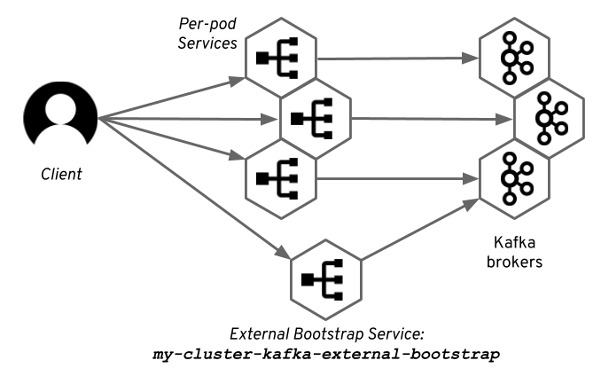
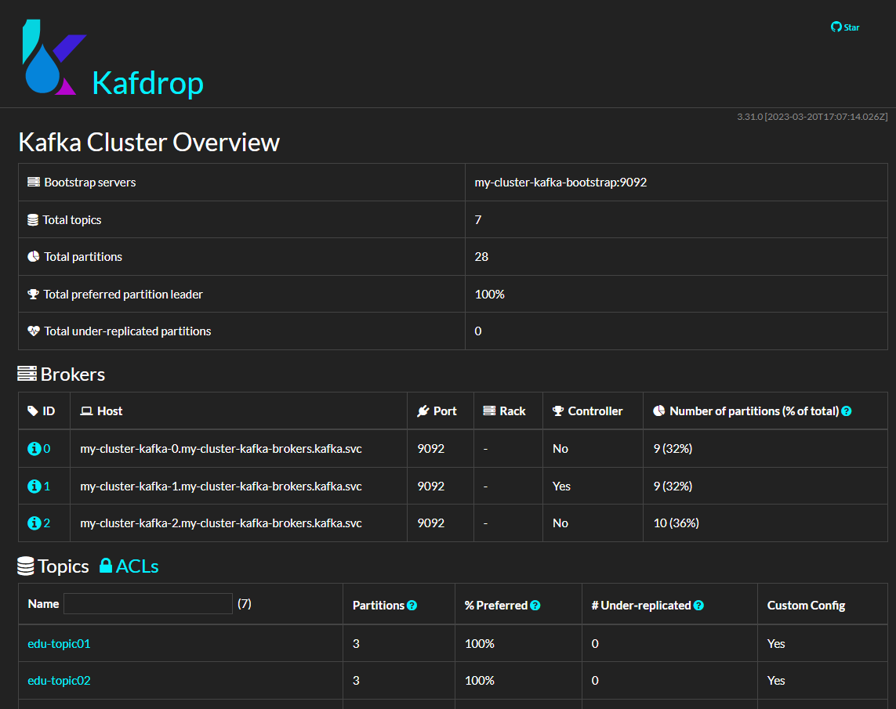
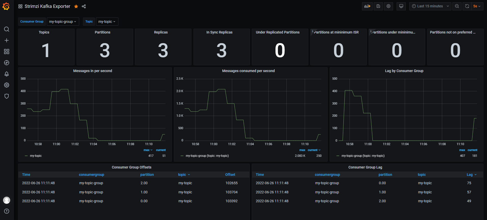

# Kafka Hands-in

>Kafka On Kubernetes


# 1. Strimzi


## 1.1 Strimzi 란 ?


Strimzi는 Kubernetes 클러스터에서 Apache Kafka를 실행하는 프로세스를 단순화시키는 오픈소스 툴이다.

- Strimzi는 Kubernetes에서 Kafka를 실행하기 위한 컨테이너 이미지 및 Operator를 제공함

- Operator 는 Kubernetes 에서 운영작업을 단순화 하기 위해 제공되는 CRD(Custom Resource Definition) 의 운영체
- Strimzi Operator 는 Kubernetes 기능을 확장하여 Kafka 배포와 관련된 일반적이고 복잡한 작업을 자동화


## 1.2 Strimzi Operator

Strimzi는 Kubernetes 클러스터 내에서 실행되는 Kafka 클러스터를 관리하기 위한 Operator를 제공한다.

- Cluster Operator

  Apache Kafka Cluster, Kafka Connect, Kafka MirrorMaker, Kafka Bridge, Kafka Exporter, Cruise Control 및 Entity Operator 배포 및 관리

- Topic  Operator

  Kafka Topic을 관리합니다.

- User Operator

  Kafka User 관리


# 2. Strimzi Install

준비된 Bastion Server 에 Strimzi (kafka) 를 설치한다.


## 2.1 namespace 생성

strimzi operator 와 kafka cluster를 설치하기위해 kafka namespace 를 생성한다.


```sh
# namespace 생성
$ kubectl create ns kafka

# 확인
$ kubectl get ns
NAME              STATUS   AGE
kube-system       Active   8m25s
default           Active   8m25s
kube-public       Active   8m25s
kube-node-lease   Active   8m24s
kafka             Active   5s


```


## 2.2 Strmzi download

사전에 download 받아 놓은 실습자료에 설치 파일이 존재한다.

참고로 strimzi site 에서 최신버젼을 다운로드 받을 수 있다.

- 링크: https://strimzi.io/downloads/

```sh

$ mkdir -p ~/temp/strimzi
  cd ~/temp/strimzi

# download
$ wget https://github.com/strimzi/strimzi-kafka-operator/releases/download/0.36.1/strimzi-0.36.1.zip


$ ll
-rw-rw-r-- 1 ktdseduuser ktdseduuser 5503466 Jul 31 19:32 strimzi-0.36.1.zip


# 압축해지
$ unzip strimzi-0.36.1.zip


$ cd  ~/temp/strimzi/strimzi-0.36.1


$ ll
-rw-r--r--  1 ktdseduuser ktdseduuser 54859 Jul 31 16:48 CHANGELOG.md
drwxr-xr-x  4 ktdseduuser ktdseduuser  4096 Jul 31 16:50 docs/
drwxr-xr-x 11 ktdseduuser ktdseduuser  4096 Jul 31 16:49 examples/
drwxr-xr-x  8 ktdseduuser ktdseduuser  4096 Jul 31 16:49 install/

```


## 2.3 Single namespace 설정

- single namespace 감시 모드로 설치진행
  - strimzi operator 는 다양한 namespace 에서 kafka cluster 를 쉽게 생성할 수 있는 구조로 운영이 가능하다.  
  - 이때 STRIMZI_NAMESPACE 를 설정하여 특정 namespace 만으로 cluster 를 제한 할 수 있다.  

```sh

$ cd ~/temp/strimzi/strimzi-0.36.1/

# 변경
$ sed -i 's/namespace: .*/namespace: kafka/' install/cluster-operator/*RoleBinding*.yaml


# 확인
$ cat install/cluster-operator/*RoleBinding*.yaml
apiVersion: rbac.authorization.k8s.io/v1
kind: RoleBinding
metadata:
  name: strimzi-cluster-operator
  labels:
    app: strimzi
subjects:
  - kind: ServiceAccount
    name: strimzi-cluster-operator
    namespace: kafka                        # <-- 이렇게 보인다면 성공
...


```


## 2.4 Operator Deploy

- kafka namespace 를 watch 할 수 있는 권한 부여

```sh
$ cd  ~/temp/strimzi/strimzi-0.36.1

# 1) Deploy the CRDs
$ kubectl -n kafka create -f ./install/cluster-operator/


# 2) CRD 확인
$ kubectl -n kafka get crd
NAME                                    CREATED AT
...
NAME                                    CREATED AT
kafkas.kafka.strimzi.io                 2023-06-10T12:58:00Z
kafkaconnects.kafka.strimzi.io          2023-06-10T12:58:01Z
strimzipodsets.core.strimzi.io          2023-06-10T12:58:01Z
kafkatopics.kafka.strimzi.io            2023-06-10T12:58:01Z
kafkausers.kafka.strimzi.io             2023-06-10T12:58:01Z
kafkamirrormakers.kafka.strimzi.io      2023-06-10T12:58:01Z
kafkabridges.kafka.strimzi.io           2023-06-10T12:58:01Z
kafkaconnectors.kafka.strimzi.io        2023-06-10T12:58:01Z
kafkamirrormaker2s.kafka.strimzi.io     2023-06-10T12:58:01Z
kafkarebalances.kafka.strimzi.io        2023-06-10T12:58:01Z

#  *.*.strimzi.io 라는 CRD 가 생성되었다.


# 3) operator 설치 확인
$ kubectl -n kafka get deploy
NAME                       READY   UP-TO-DATE   AVAILABLE   AGE
strimzi-cluster-operator   1/1     1            1           45s


$ kubectl -n kafka get pod
NAME                                        READY   STATUS    RESTARTS   AGE
strimzi-cluster-operator-75f57bc754-vvsdr   1/1     Running   0          37s


# 4) pod log 확인
$ kubectl -n kafka logs deploy/strimzi-cluster-operator
...
2023-06-10 12:48:42 INFO  ClusterOperator:136 - Setting up periodic reconciliation for namespace kafka
2023-06-10 12:48:42 INFO  Main:208 - Cluster Operator verticle started in namespace kafka without label selector

# Cluster Operator verticle started  메세지가 나오면 정상설치 완료 


```


# 3. Kafka Cluster 생성


## 3.1 Kafka Cluster 생성


### (1) Kafka cluster 생성

> scram -512  인증 방식의 Cluster생성

#### git clone

```sh
$ mkdir -p ~/githubrepo
  cd ~/githubrepo

$ git clone https://github.com/ssongman/ktds-edu-kafka-redis.git

# 존재한다면 최신데이터로 다시 pull

$ cd ~/githubrepo/ktds-edu-kafka-redis
$ git pull

```


#### kafka cluster 생성

```sh
$ cd ~/githubrepo/ktds-edu-kafka-redis

$ cat ./kafka/strimzi/kafka/12.kafka-ephemeral-auth.yaml
apiVersion: kafka.strimzi.io/v1beta2
kind: Kafka
metadata:
  name: my-cluster
  namespace: kafka
spec:
  kafka:
    version: 3.5.1
    replicas: 3
    authorization:
      type: simple
    listeners:
      - name: plain
        port: 9092
        type: internal
        tls: false
        authentication:
          type: scram-sha-512
      - name: tls
        port: 9093
        type: internal
        tls: true
    config:
      offsets.topic.replication.factor: 3
      transaction.state.log.replication.factor: 3
      transaction.state.log.min.isr: 2
      default.replication.factor: 3
      min.insync.replicas: 1
      inter.broker.protocol.version: "3.5"
    storage:
      type: ephemeral
  zookeeper:
    replicas: 3
    storage:
      type: ephemeral
  entityOperator:
    topicOperator: {}
    userOperator: {}

# kafka Cluster 생성
$ kubectl -n kafka apply -f ./kafka/strimzi/kafka/12.kafka-ephemeral-auth.yaml

```

- 인증메커니즘

  - SASL 은 인증 및 보안 서비스를 제공하는 프레임워크이다.
  - 위 yaml 파일의 인증방식은 scram-sha-512  방식인데 이는 SASL 이 지원하는 메커니즘 중 하나이며 Broker 를 SASL 구성로 구성한다.


### (2) Kafka Cluster 확인

```sh

# cluster 생성중인 상태 확인
$ kubectl -n kafka get pod -w
...
Ctrl+C

$ kubectl -n kafka get pod
NAME                                         READY   STATUS    RESTARTS   AGE
my-cluster-entity-operator-7cfdb67c4-d4qc7   3/3     Running   0          3m24s
my-cluster-kafka-0                           1/1     Running   0          4m3s
my-cluster-kafka-1                           1/1     Running   0          4m3s
my-cluster-kafka-2                           1/1     Running   0          4m3s
my-cluster-zookeeper-0                       1/1     Running   0          4m28s
my-cluster-zookeeper-1                       1/1     Running   0          4m28s
my-cluster-zookeeper-2                       1/1     Running   0          4m28s
strimzi-cluster-operator-86864b86d5-8rlfx    1/1     Running   0          5h24m

# kafka broker 3개와  zookeeper 3개 실행된것을 확인 할 수 있다.
# kafka cluster 가 구성되는데 약 2분정도 소요됨


# Kafka Cluster 확인
$ kubectl -n kafka get kafka
NAME         DESIRED KAFKA REPLICAS   DESIRED ZK REPLICAS   READY   WARNINGS
my-cluster   3                        3                     True

# kafka Cluster 의 ready 상태가 True 인것을 확인하자.

```


### (3) [참고] Kafka cluster 생성(No 인증)

아래는 인증없이 접근 가능한 kafka cluster 를 생성하는 yaml 이므로 참고만 하자.

```sh
$ cd ~/githubrepo/ktds-edu-kafka-redis

$ cat ./kafka/strimzi/kafka/11.kafka-ephemeral-no-auth.yaml
apiVersion: kafka.strimzi.io/v1beta2
kind: Kafka
metadata:
  name: my-cluster
  namespace: kafka
spec:
  kafka:
    version: 3.5.1
    replicas: 3
    listeners:
      - name: plain
        port: 9092
        type: internal
        tls: false
      - name: tls
        port: 9093
        type: internal
        tls: true
    config:
      offsets.topic.replication.factor: 3
      transaction.state.log.replication.factor: 3
      transaction.state.log.min.isr: 2
      default.replication.factor: 3
      min.insync.replicas: 2
      inter.broker.protocol.version: "3.5"
    storage:
      type: ephemeral
  zookeeper:
    replicas: 3
    storage:
      type: ephemeral
  entityOperator:
    topicOperator: {}
    userOperator: {} 


```


## 3.2  KafkaUser

- kafka cluster 생성시 scram-sha-512 type 의 authentication 를 추가했다면 반드시 KafkaUser 가 존재해야 한다.

- KafkaUser 를 생성하면 secret 에 Opaque 가 생성되며 향후 인증 password 로 사용된다.
- 어떤 topic 에 어떻게 접근할지 에 대한 ACL 기능을 추가할 수 있다.


### (1) User 정책

아래와 같이 ACL (Access Control List) 정책을 지정할 수 있다.

- sample user 별 설명

```
ㅇ my-user
my 로 시작하는 모든 topic을 처리할 수 있음
my 로 시작하는 모든 group을 Consume 가능

ㅇ edu-user
edu 로 시작하는 모든 topic을 처리할 수 있음
edu 로 시작하는 모든 group을 Consume 가능

ㅇ order-user
order로 시작하는 모든 topic을 처리할 수 있음
order로 시작하는 모든 group을 Consume 가능

ㅇ order-user-readonly
order로 시작하는 모든 topic을 읽을 수 있음
order로 시작하는 모든 group을 Consume 가능
```


### (2) my-edu-admin 생성

#### KafkaUser 생성

```sh
$ cd ~/githubrepo/ktds-edu-kafka-redis

$ cat ./kafka/strimzi/user/11.my-edu-admin.yaml
---
apiVersion: kafka.strimzi.io/v1beta2
kind: KafkaUser
metadata:
  name: my-edu-admin
  labels:
    strimzi.io/cluster: my-cluster
  namespace: kafka
spec:
  authentication:
    type: scram-sha-512
  authorization:
    type: simple
    acls:
      - operation: All
        resource:
          type: topic
          name: my
          patternType: prefix
      - operation: All
        resource:
          name: my
          patternType: prefix
          type: group
      - operation: All
        resource:
          type: topic
          name: edu
          patternType: prefix
      - operation: All
        resource:
          name: edu
          patternType: prefix
          type: group

---


# KafkaUser 생성 명령 실행
$ kubectl -n kafka apply -f ./kafka/strimzi/user/11.my-edu-admin.yaml

# kafkauser 확인
$ kubectl -n kafka get kafkauser
NAME           CLUSTER      AUTHENTICATION   AUTHORIZATION   READY
my-edu-admin   my-cluster   scram-sha-512    simple          True


# Ready 상태가 True인것을 확인하자.
```

- ACL 권한설명

  - my  또는 edu 로 시작하는 topic을 모두 처리가능
  - ex) my-board-create,  my-board-update,  edu-topic
- ACLs Operation 
    * 관련링크 : https://docs.confluent.io/platform/current/kafka/authorization.html


#### [참고] kafkauser Sample

```yaml

apiVersion: kafka.strimzi.io/v1beta2
kind: KafkaUser
metadata:
  name: my-user
  labels:
    strimzi.io/cluster: my-cluster
spec:
  authentication:
    type: tls
  authorization:
    type: simple
    acls:
      # Example consumer Acls for topic my-topic using consumer group my-group
      - resource:
          type: topic
          name: my-topic
          patternType: literal
        operations:
          - Describe
          - Read
        host: "*"
      - resource:
          type: group
          name: my-group
          patternType: literal
        operations:
          - Read
        host: "*"
      # Example Producer Acls for topic my-topic
      - resource:
          type: topic
          name: my-topic
          patternType: literal
        operations:
          - Create
          - Describe
          - Write
        host: "*"

```


#### password 확인 ★

```sh

# secret 확인
$ kubectl -n kafka get secret my-edu-admin
NAME           TYPE     DATA   AGE
my-edu-admin   Opaque   2      46s


# secret 내에서 password 추출
$ kubectl -n kafka get secret my-edu-admin -o jsonpath='{.data.password}' | base64 -d
M6vDkb9nrKEhc02ZcL8zzR2OQgl2CTzX

# prompt 와 붙어 있으니 잘 확인할것

# user/pass         <-- Password 를 반드시 기억하세요.
## my-edu-admin / M6vDkb9nrKEhc02ZcL8zzR2OQgl2CTzX

```


※ Typora 를 사용하고 있다면 본문서에 등장하는 password 를 모두 자신의 password 로 Replace 하여 사용하자.

```
CTRL + H

M6vDkb9nrKEhc02ZcL8zzR2OQgl2CTzX --> (자신의 Password) 로 변경

```


## 3.3 KafkaTopic


### (1) Topic 정책 

앞서 KafkaUser 의 ACL 기능을 이용해서 kafka topic 을 제어하는 방법을 확인했다.  

my~  또는 edu 로 시작하는 topic 을 모두 처리가능하므로 my-topic 이라는 이름으로 topic 을 생성해 보자.


### (2) KafkaTopic 생성

```sh
$ cd ~/githubrepo/ktds-edu-kafka-redis


$ cat ./kafka/strimzi/topic/11.kafka-topic.yaml
---
apiVersion: kafka.strimzi.io/v1beta2
kind: KafkaTopic
metadata:
  name: my-topic
  labels:
    strimzi.io/cluster: my-cluster
  namespace: kafka
spec:
  partitions: 3
  replicas: 3
  config:
    #retention.ms: 7200000      # 2 hour
    retention.ms: 86400000      # 24 hours
    segment.bytes: 1073741824   # 1GB
---

# topic 생성 명령 실행
$ kubectl -n kafka apply -f ./kafka/strimzi/topic/11.kafka-topic.yaml


# topic 생성 확인
$ kubectl -n kafka get kafkatopic my-topic
NAME       CLUSTER      PARTITIONS   REPLICATION FACTOR   READY
my-topic   my-cluster   3            3                    True


```


### (3) Topic  상세 확인

```sh

$ kubectl -n kafka get kafkatopic my-topic -o yaml
apiVersion: kafka.strimzi.io/v1beta2
kind: KafkaTopic
metadata:
  annotations:
    kubectl.kubernetes.io/last-applied-configuration: |
      {"apiVersion":"kafka.strimzi.io/v1beta2","kind":"KafkaTopic","metadata":{"annotations":{},"labels":{"strimzi.io/cluster":"my-cluster"},"name":"my-topic","namespace":"kafka"},"spec":{"config":{"retention.ms":86400000,"segment.bytes":1073741824},"partitions":3,"replicas":3}}
  creationTimestamp: "2023-09-02T14:01:01Z"
  generation: 1
  labels:
    strimzi.io/cluster: my-cluster
  name: my-topic
  namespace: kafka
  resourceVersion: "2086"
  uid: d83f3976-1866-4883-bbd8-1af681270282
spec:
  config:
    retention.ms: 86400000
    segment.bytes: 1073741824
  partitions: 3
  replicas: 3
status:
  conditions:
  - lastTransitionTime: "2023-09-02T14:01:01.777646039Z"
    status: "True"
    type: Ready
  observedGeneration: 1
  topicName: my-topic


```

- status 에서 true, ready 임을 확인하자.


### [참고] ICIS-TR Topic Name 정책

topiic 명칭을 어떻게 정하는지에 대해서 다양한 시나리오를 생각해 볼 수 있다. 아래 특정 프로젝트의 topic name 정책을 살펴보자.

- topic 정책 및 샘플

```
# 정책
[Part명]-[서비스명]-[서브도메인]-[사용자정의]


# 샘플
order-intl-board-create
order-intl-board-update
order-intl-board-delete

bill-intl-board-create
bill-intl-board-update
bill-intl-board-delete

rater-intl-board-create
rater-intl-board-update
rater-intl-board-delete
```


# 4. Accessing Kafka

- Kafka 의 주요기능 중 하나는 확장성이다.  즉, 데이터를 분할하고 여러 브로커에 파티션을 분산하여 관리한다. 
- 그러므로 이러한 분산환경은 Client 가 Broker 에 연결하는 방식에도 큰 영향을 미친다. 
- Strimzi kafka 는 Kubernetes 플랫폼 내에서 실행중이므로 Kubernetes 플랫폼 내부/외부에서 접근할때 각각 방식이 다르다. 


## 4.1 Broker 접근 방식의 이해


### (1) Client 와 Broker Connect

- 특정 파티션에 지정된 클라이언트는 해당 파티션을 호스팅하는 리더 브로커에 직접 연결한다.

- 그러므로 브로커간 데이터전달 불필요하며 이러한 방식은 클러스터내 트래픽의 양을 줄이는데 도움이 됨


클라이언트는 어떻게 해당 브로커의 위치를 알 수 있을까?


### (2) kafka discovery protocol

- Kafka에는 자체 discovery protocol 이 있음

- Kafka 클라이언트가 Kafka 클러스터에 연결할 때 먼저 클러스터의 구성원인 브로커에 연결하고 하나 이상의 Topic에 대한 메타데이터 를 요청함
- 메타데이터에는 Topic, 해당 Partition 및 이러한 Partition 을 호스팅하는 브로커에 대한 정보가 포함됨 
- 모든 브로커는 Zookeeper를 통해 모두 동기화되기 때문에 전체 클러스터에 대해 이 데이터를 가지고 있음
- 따라서 클라이언트가 처음으로 연결된 브로커는 중요하지 않으며 모든 브로커가 동일한 응답을 제공함


- 클라이언트는 *메타데이터* 를 사용 하여 주어진 파티션에 쓰거나 읽으려고 할 때 연결할 위치를 파악함

- *메타데이터* 에 사용된 브로커 주소 는 브로커가 실행되는 시스템의 호스트 이름을 기반으로 브로커 자체에서 생성됨
- 또는 `advertised.listeners` 옵션을 사용하여 사용자가 구성할 수 있음


### (3) Internal Access 과 External Access

DEV환경과 PRD 환경을 각각 생각해 보자.

PRD 환경의 경우 Kubernetes Cluster내에 Kafka가 설치되어 있고 연결을 원하는 App이 해당 클러스터 내에 배포된 상태에서 Kafka를 접속한다.

그러므로 Kakfa 를 접속시 Cluster 내부 주소체계를 사용한다.  (Internal Access)

하지만 DEV환경의 경우 개발자PC와 같이 Kubernetes Cluster 외부에서 접근해야 하므로 별도의 주소체계가 있어야 한다. (External Access)

이러한 부분의 차이가 있음을 이해하자.


### (4) 클러스터 내부에서 연결

- Kafka 클러스터와 동일한 Kubernetes 클러스터 내에서 실행되는 클라이언트는 Kubernetes `service` 를 이용해서 접근함
- Strimzi는 Kafka 브로커를 StatefulSet로 실행함
- 그러므로 `Kubernetes headless service` 를 사용하여 각 pod별 고유한  DNS 이름을 가질 수 있음
- Strimzi는 이러한 DNS 이름을 `advertised.listeners`로 사용하고 있음


- 초기 연결은 *메타데이터* 를 가져오기 위해 일반 Kubernetes service 를 사용하여 수행됨 
- 후속 연결은 다른 headless Kubernetes service 에서 Pod에 제공한 DNS 이름을 사용하여 열림 


### (5) 클러스터 외부에서 연결(Node Port)

- Kubernetes 클러스터 외부에서 Kafka Client 가 접근시에는 Node Port Type 의 Service 를 통해서 접근할 수 있음
- Client 는 특정 Node IP 의 Node Port 를 이용해서 각각의 POD 로 연결할 수 있음
- 참고 : https://strimzi.io/blog/2019/04/23/accessing-kafka-part-2/





## 4.2 Internal Access


### (1) Kafka Cluster Service 확인


```sh
$ kubectl -n kafka get svc
NAME                          TYPE        CLUSTER-IP      EXTERNAL-IP   PORT(S)                               AGE
my-cluster-kafka-bootstrap    ClusterIP   10.105.0.19     <none>        9091/TCP,9092/TCP,9093/TCP            75m
my-cluster-kafka-brokers      ClusterIP   None            <none>        9090/TCP,9091/TCP,9092/TCP,9093/TCP   75m
my-cluster-zookeeper-client   ClusterIP   10.105.55.137   <none>        2181/TCP                              75m
my-cluster-zookeeper-nodes    ClusterIP   None            <none>        2181/TCP,2888/TCP,3888/TCP            75m


$ kubectl -n kafka get pod
NAME                                         READY   STATUS    RESTARTS   AGE
strimzi-cluster-operator-fd6fb56f6-f8d98     1/1     Running   0          55m
my-cluster-zookeeper-1                       1/1     Running   0          27m
my-cluster-zookeeper-0                       1/1     Running   0          27m
my-cluster-zookeeper-2                       1/1     Running   0          27m
my-cluster-kafka-1                           1/1     Running   0          27m
my-cluster-kafka-2                           1/1     Running   0          27m
my-cluster-kafka-0                           1/1     Running   0          27m
my-cluster-entity-operator-d44f86494-2k9l8   3/3     Running   0          26m
```

- my-cluster-kafka-bootstrap 이 일반 kubernetes service 이며 POD 로 트래픽을 RR 방식으로 연결한다.
- my-cluster-kafka-brokers 는 ip 가 없는 headless service 이다. 그러므로 pod 명을 붙여서 DNS 로 사용된다.
  - headless service 사용예시
    - my-cluster-kafka-0.my-cluster-kafka-brokers.kafka.svc
    - my-cluster-kafka-1.my-cluster-kafka-brokers.kafka.svc
    - my-cluster-kafka-2.my-cluster-kafka-brokers.kafka.svc

- 우리는 Cluster 내에서  my-cluster-kafka-bootstrap:9092 로 접근을 시도할 것이다.
  - 이후 kafka 로부터 전달 받은 metadata 는 headless service 들이 포함되어 있을 것이다.


### (2) kafkacat 로 확인

Kubernetes Cluster 내에서 kafka 접근 가능여부를 확인하기 위해 kafka Client 용 app 인 kafkacat 을 설치하자.


#### kafkacat 설치

```sh
# kafka cat 설치
$ kubectl -n kafka create deploy kafkacat \
    --image=confluentinc/cp-kafkacat:latest \
    -- sleep 365d

# 설치진행 확인
$ kubectl -n kafka get pod
NAME                                         READY   STATUS              RESTARTS   AGE
kafkacat-7648db7f48-wg4hn                    0/1     ContainerCreating   0          4s


## READY 상태가 1/1 로 변할때까지 대기...


# pod 내부로 진입( bash 명령 수행)
$ kubectl -n kafka exec -it deploy/kafkacat -- bash
[appuser@kafkacat-7648db7f48-wg4hn ~]$


```


#### ※ [참고] windows WSL에서 수행시...
windows 환경의 gitbash 를 이용해 pod 내부명령을 수행한다면 prompt 가 보이지 않을수도 있다.

이런경우 windows 에서 linux 체제와 호환이 되지 않아서 발생하는 이슈이다.

아래와 같이 winpty 를 붙인다면 prompt 가 보이니 참고하자.

```sh

# pod 내부명령 수행
$ winpty kubectl -n kafka exec -it deploy/kafkacat -- bash

```


#### pub/sub test

Terminal 을 두개 실행하여 pub 과 sub을 실행해 보자.


#### sub termnial 실행

```sh

# pod 내부로 진입( bash 명령 수행)
$ kubectl -n kafka exec -it deploy/kafkacat -- bash
[appuser@kafkacat-7648db7f48-wg4hn ~]$


# kafkacat pod 내부에서...
# $ kubectl -n kafka exec -it deploy/kafkacat -- bash

export BROKERS=my-cluster-kafka-bootstrap:9092
export KAFKAUSER=my-edu-admin
export PASSWORD=M6vDkb9nrKEhc02ZcL8zzR2OQgl2CTzX        ## 개인별 passwrod 붙여넣자.   위 3.2 KafkaUser 를 참고하자. 
export TOPIC=my-topic
 
 
## topic 리스트
kafkacat -b $BROKERS \
  -X security.protocol=SASL_PLAINTEXT \
  -X sasl.mechanisms=SCRAM-SHA-512 \
  -X sasl.username=$KAFKAUSER \
  -X sasl.password=$PASSWORD -L

Metadata for all topics (from broker -1: sasl_plaintext://my-cluster-kafka-bootstrap:9092/bootstrap):
 3 brokers:
  broker 0 at my-cluster-kafka-0.my-cluster-kafka-brokers.kafka.svc:9092
  broker 2 at my-cluster-kafka-2.my-cluster-kafka-brokers.kafka.svc:9092 (controller)
  broker 1 at my-cluster-kafka-1.my-cluster-kafka-brokers.kafka.svc:9092
 1 topics:
  topic "my-topic" with 3 partitions:
    partition 0, leader 1, replicas: 1,2,0, isrs: 1,2,0
    partition 1, leader 0, replicas: 0,1,2, isrs: 0,1,2
    partition 2, leader 2, replicas: 2,0,1, isrs: 2,0,1

## 위 내용중 3개의 brokers 주소를 잘 이해하자.
## 위주소는 headless service 이용한 pod dns 이다.


## consumer
kafkacat -b $BROKERS \
  -X security.protocol=SASL_PLAINTEXT \
  -X sasl.mechanisms=SCRAM-SHA-512 \
  -X sasl.username=$KAFKAUSER \
  -X sasl.password=$PASSWORD \
  -t $TOPIC -C -o -5


## 수신대기...


```


#### pub termnial 실행

terminal 을 한개 더 실행하여 아래와 같이 pub 테스트를 수행하자.

```sh

# pod 내부로 진입( bash 명령 수행)
$ kubectl -n kafka exec -it deploy/kafkacat -- bash
[appuser@kafkacat-7648db7f48-wg4hn ~]$


# kafkacat pod 내부에서...
# $ kubectl -n kafka exec -it deploy/kafkacat -- bash

export BROKERS=my-cluster-kafka-bootstrap:9092
export KAFKAUSER=my-edu-admin
export PASSWORD=M6vDkb9nrKEhc02ZcL8zzR2OQgl2CTzX        ## 개인별 passwrod 붙여넣자.   위 3.2 KafkaUser 를 참고하자. 
export TOPIC=my-topic


## terminal 을 한개 더 실행하여 위 환경변수 인식후 아래 producer 를 실행하자.
## producer
kafkacat -b $BROKERS \
  -X security.protocol=SASL_PLAINTEXT \
  -X sasl.mechanisms=SCRAM-SHA-512 \
  -X sasl.username=$KAFKAUSER \
  -X sasl.password=$PASSWORD \
  -t $TOPIC -P -X acks=1 

# 임의의 text 입력


# 테스트 완료후
# Ctrl+C or Ctrl+D (exit) 수행하여 POD terminal 을 빠져나오자.
```


- Consumer 결과확인

```
% Reached end of topic my-topic [2] at offset 0
% Reached end of topic my-topic [0] at offset 0
% Reached end of topic my-topic [1] at offset 0

asdf
% Reached end of topic my-topic [2] at offset 1
asdf
% Reached end of topic my-topic [2] at offset 2
asdf
asd
% Reached end of topic my-topic [1] at offset 2
fsad
% Reached end of topic my-topic [2] at offset 3
f
% Reached end of topic my-topic [2] at offset 4
sdf
% Reached end of topic my-topic [1] at offset 3
asdfasd
% Reached end of topic my-topic [0] at offset 1
fas
% Reached end of topic my-topic [0] at offset 2
fsda
% Reached end of topic my-topic [0] at offset 3
fsa
% Reached end of topic my-topic [1] at offset 4

```

- offset 값이 partition 단위로 증가됨을 할 수 있다.


#### [참고] kafkacat 추가명령

```sh

## consumer group
kafkacat -b $BROKERS \
  -X security.protocol=SASL_PLAINTEXT \
  -X sasl.mechanisms=SCRAM-SHA-512 \
  -X sasl.username=$KAFKAUSER \
  -X sasl.password=$PASSWORD \
  -t $TOPIC -C \
  -X group.id=my-board-group


## consumer group
kafkacat -b $BROKERS \
  -X security.protocol=SASL_PLAINTEXT \
  -X sasl.mechanisms=SCRAM-SHA-512 \
  -X sasl.username=$KAFKAUSER \
  -X sasl.password=$PASSWORD \
  -t $TOPIC -C \
  -X group.id=order-intl-board-group -o -5


## producer : 입력모드
kafkacat -b $BROKERS \
  -X security.protocol=SASL_PLAINTEXT \
  -X sasl.mechanisms=SCRAM-SHA-512 \
  -X sasl.username=$KAFKAUSER \
  -X sasl.password=$PASSWORD \
  -t $TOPIC -P -X acks=1
 


## 대량 발송 모드
$ cat > msg.txt
---
{"eventName":"a","num":1,"title":"a", "writeId":"", "writeName": "", "writeDate":"" }
---

## producer : file mode
kafkacat -b $BROKERS \
  -X security.protocol=SASL_PLAINTEXT \
  -X sasl.mechanisms=SCRAM-SHA-512 \
  -X sasl.username=$KAFKAUSER \
  -X sasl.password=$PASSWORD \
  -t $TOPIC -P ./msg.txt


## producer : while
while true; do kafkacat -b $BROKERS \
  -X security.protocol=SASL_PLAINTEXT \
  -X sasl.mechanisms=SCRAM-SHA-512 \
  -X sasl.username=$KAFKAUSER \
  -X sasl.password=$PASSWORD \
  -t $TOPIC -P ./msg.txt; done;

```


### (3) python 으로 확인

Kubernetes Cluster 내에서 kafka 접근 가능여부를 확인하기 위해 python 을 설치후 kafka 에 connect 해 보자.


#### python  설치

```sh
# bastion Serve 에서 수행

# python deploy
$ kubectl -n kafka create deploy python --image=python:3.9 -- sleep 365d


# 설치진행 확인
$ kubectl -n kafka get pod
...
python-fb57f7bd4-4w6pz                       1/1     Running   0              32s
...

## READY 상태가 1/1 로 변할때까지 대기...
## 약 1분 소요


# python pod 내부로 진입( bash 명령 수행)
$ kubectl -n kafka exec -it deploy/python -- bash
root@python-7d59455985-ml8vw:/#                  <-- 이런 prompt 가 정상


```


#### python library install

kafka 에 접근하기 위해서 kafka-python 을 설치해야 한다.

```bash
# python pod 내부에서
$ pip install kafka-python

Collecting kafka-python
  Downloading kafka_python-2.0.2-py2.py3-none-any.whl (246 kB)
     ━━━━━━━━━━━━━━━━━━━━━━━━━━━━━━━━━━━━━━━━ 246.5/246.5 kB 7.8 MB/s eta 0:00:00
Installing collected packages: kafka-python
Successfully installed kafka-python-2.0.2

```


#### [참고] kafka host 확인

```sh
# internal 접근을 위한 host 확인
# nc 명령으로 접근가능여부를 확인할 수 있다.

$ apt update
$ apt install netcat

$
nc -zv my-cluster-kafka-bootstrap.kafka.svc 9092
nc -zv my-cluster-kafka-0.my-cluster-kafka-brokers.kafka.svc 9092
nc -zv my-cluster-kafka-1.my-cluster-kafka-brokers.kafka.svc 9092
nc -zv my-cluster-kafka-2.my-cluster-kafka-brokers.kafka.svc 9092

```


#### consumer

consumer 실행을 위해서 python cli 환경으로 들어가자.

```sh
# python pod 내부에서
$ python
Python 3.9.18 (main, Aug 26 2023, 01:24:18)
[GCC 12.2.0] on linux
Type "help", "copyright", "credits" or "license" for more information.
>>>

```


CLI 환경에서 아래  Python 명령을 하나씩 실행해 보자.

```python

from kafka import KafkaConsumer

# 개인환경으로 변경
bootstrap_servers='my-cluster-kafka-bootstrap.kafka.svc:9092'
sasl_plain_password='M6vDkb9nrKEhc02ZcL8zzR2OQgl2CTzX'             ## 개인별 passwrod 붙여넣자.   위 3.2 KafkaUser 를 참고하자. 
sasl_plain_username='my-edu-admin'
group_id='my-topic-group'

consumer = KafkaConsumer(bootstrap_servers=bootstrap_servers,
                        security_protocol="SASL_PLAINTEXT",
                        sasl_mechanism='SCRAM-SHA-512',
                        sasl_plain_username=sasl_plain_username,
                        sasl_plain_password=sasl_plain_password,
                        auto_offset_reset='earliest',
                        enable_auto_commit= True,
                        group_id=group_id)


# my-user로 확인가능한 topic 목록들을 확인할 수 있다.
consumer.topics()

# 사용할 topic 지정(구독)
consumer.subscribe("my-topic")

# 구독 확인
consumer.subscription()
#{'my-topic'}            <-- 해당 Topic 이 출력되어야 한다.


# 메세지 읽기
for message in consumer:
   print("topic=%s partition=%d offset=%d: key=%s value=%s" %
        (message.topic,
          message.partition,
          message.offset,
          message.key,
          message.value))

# 수신대기중....


'''
topic=my-topic partition=0 offset=38: key=None value=b'{"eventName":"a","num":88,"title":"a", "writeId":"", "writeName": "", "writeDate":"" }'
topic=my-topic partition=0 offset=39: key=None value=b'{"eventName":"a","num":90,"title":"a", "writeId":"", "writeName": "", "writeDate":"" }'
topic=my-topic partition=0 offset=40: key=None value=b'{"eventName":"a","num":96,"title":"a", "writeId":"", "writeName": "", "writeDate":"" }'
'''
```


#### producer

producer 실행을 위해서 별도의 terminal 을 실행한 후 python cli 환경으로 들어가자.

```sh

# python pod 내 진입(bash 실행)
$ kubectl -n kafka exec -it deploy/python -- bash
root@python-7d59455985-ml8vw:/#                  <-- 이런 prompt 가 정상


$ python

Python 3.9.18 (main, Aug 26 2023, 01:24:18)
[GCC 12.2.0] on linux
Type "help", "copyright", "credits" or "license" for more information.

>>>

```


internal 에서 접근시에는 인증서가 없는  9092 port 접근이므로 사용되는 protocol은 SASL_PLAINTEXT 이다.CLI 환경에서 아래  Python 명령을 하나씩 실행해 보자.

```python

from kafka import KafkaProducer
from time import sleep

# 개인환경으로 변경
bootstrap_servers='my-cluster-kafka-bootstrap.kafka.svc:9092'
sasl_plain_password='M6vDkb9nrKEhc02ZcL8zzR2OQgl2CTzX'             ## 개인별 passwrod 붙여넣자.   위 3.2 KafkaUser 를 참고하자. 
sasl_plain_username='my-edu-admin'
group_id='my-topic-group'

producer = KafkaProducer(bootstrap_servers=bootstrap_servers,
                        security_protocol="SASL_PLAINTEXT",
                        sasl_mechanism='SCRAM-SHA-512',
                        sasl_plain_username=sasl_plain_username,
                        sasl_plain_password=sasl_plain_password)

# 아래 명령 부터 Consumer 수신을 관찰하면서 수행하자.
producer.send('my-topic', b'python test1')
producer.send('my-topic', b'python test2')
producer.send('my-topic', b'{"eventName":"a","num":%d,"title":"a", "writeId":"", "writeName": "", "writeDate":"" }' % 1)

# 10000건을 0.5초에 한번씩 발송해보자.
for i in range(10000):
    print(i)
    sleep(0.5)
    producer.send('my-topic', b'{"eventName":"a","num":%d,"title":"a", "writeId":"", "writeName": "", "writeDate":"" }' % i)

    
# 테스트를 끝내려면 Ctrl + C 로 중지하자.
```


- 대량 발송(성능테스트)

```python
# 만건 테스트
import time
start_time = time.time() # 시작시간
for i in range(10000):
    print(i)
    producer.send('my-topic', b'{"eventName":"a","num":%d,"title":"a", "writeId":"", "writeName": "", "writeDate":"" }' % i)

end_time = time.time() # 종료시간
print("duration time :", end_time - start_time)  # 현재시각 - 시작시간 = 실행 시간


# 1만건 테스트 결과
# duration time : 29.434531688690186
# duration time : 25.90397334098816

```


- 참고

```python
# 2만건 테스트
for i in range(10001, 20000):
    print(i)
    producer.send('my-topic', b'{"eventName":"a","num":%d,"title":"a", "writeId":"", "writeName": "", "writeDate":"" }' % i)
    
```


- python 종료 Ctrl+D 

```sh
# POD Terminal 을 빠져나가려면 exit(Ctrl+D)
```


### (4) kafkacat / python 으로 확인

sub 은 python 으로 유지하면서 pub 은 kafkacat 으로 데이터를 전송하는 테스트를 진행해 보자.


## 4.3 External Access(Node Port)


### (1) Strimzi가 제공하는 외부 접근방식

- Strimzi 는 외부에서 접근가능하도록  다양한 기능을 제공함

- Strimzi 가 제공하는 외부 접근방식
  - Node port
  - Ingress
  - Openshift Route
  - Load Balancer


### (2) Node Port


#### Node IP 확인

- node port 를 인식할 수 있는 본인 Bastion Server IP를 확인해야 한다.
- Bastion Server IP 는 개인별로 부여된 IP 이므로 이를 사용하자.

  ※ Typora 를 사용하고 있다면 본문서에 등장하는 34.130.165.53 를 모두 자신의 IP 로 Replace 사용하자.

```
CTRL + H

34.130.165.53 --> (자신의 Bastion Server IP)로 변경
```


- 이 IP 는 아래 Node Port 등록시 nip host 에 사용된다.

```sh
# nip 
my-cluster.kafka.34.130.165.53.nip.io
```

  


#### NodePort Listener 등록

- Kafka Cluster 를 수정모드로 변경하여 node port  listener 를 삽입하자.
- node Port 를 직접 명시할 수 있다.
- AdvertisedHost 필드에는 DNS 이름이나 IP 주소를 표기할 수 있다.

```sh
$ cd ~/githubrepo/ktds-edu-kafka-redis

$ cat ./kafka/strimzi/kafka/13.kafka-ephemeral-auth-nodeport.yaml
apiVersion: kafka.strimzi.io/v1beta2
kind: Kafka
metadata:
  name: my-cluster
spec:
  kafka:
    version: 3.5.1
    replicas: 3
    authorization:
      type: simple
    listeners:
      - name: plain
        port: 9092
        type: internal
        tls: false
        authentication:
          type: scram-sha-512
      - name: tls
        port: 9093
        type: internal
        tls: true

      ## nodeport type 등록 -------
      - name: external
        port: 9094
        type: nodeport
        tls: false
        authentication:
          type: scram-sha-512
        configuration:
          bootstrap:
            nodePort: 32100
          brokers:
          - broker: 0
            advertisedHost: my-cluster.kafka.34.130.165.53.nip.io    # 각자의 Node IP로 변경
            nodePort: 32200
          - broker: 1
            advertisedHost: my-cluster.kafka.34.130.165.53.nip.io    # 각자의 Node IP로 변경
            nodePort: 32201
          - broker: 2
            advertisedHost: my-cluster.kafka.34.130.165.53.nip.io    # 각자의 Node IP로 변경
            nodePort: 32202
      ## nodeport type 등록 -------
....


# 각자의 Node IP로 변경
$ vi ./kafka/strimzi/kafka/13.kafka-ephemeral-auth-nodeport.yaml


# 확인
$ cat ./kafka/strimzi/kafka/13.kafka-ephemeral-auth-nodeport.yaml
...
          - broker: 0
            advertisedHost: my-cluster.kafka.34.130.165.53.nip.io    # 각자의 Node IP로 변경
            nodePort: 32200
          - broker: 1
            advertisedHost: my-cluster.kafka.34.130.165.53.nip.io    # 각자의 Node IP로 변경
            nodePort: 32201
          - broker: 2
            advertisedHost: my-cluster.kafka.34.130.165.53.nip.io    # 각자의 Node IP로 변경
...


# Cluster 적용
$ kubectl -n kafka apply -f ./kafka/strimzi/kafka/13.kafka-ephemeral-auth-nodeport.yaml

```


##### Kafka Cluster 확인

```sh

# pod 변화를 살펴보자.

$ kubectl -n kafka get pod -w
...

# 상태 확인
my-cluster-kafka-0
my-cluster-kafka-1
my-cluster-kafka-2 순서로 rolling 방식으로 재기동 될것이다.

Ctrl+C


## broker pod 3개 가 모두 재기동 될때까지 대기한다.
## 약 3분~5분 정도 소요된다.


$ kubectl -n kafka get pod
NAME                                         READY   STATUS     RESTARTS   AGE
strimzi-cluster-operator-fd6fb56f6-v265q     1/1     Running    0          52m
my-cluster-zookeeper-0                       1/1     Running    0          51m
my-cluster-zookeeper-1                       1/1     Running    0          51m
my-cluster-zookeeper-2                       1/1     Running    0          51m
my-cluster-kafka-2                           1/1     Running    0          50m
my-cluster-entity-operator-d44f86494-27plh   3/3     Running    0          49m
kafkacat-686d9c5977-pkrq7                    1/1     Running    0          46m
python-7d59455985-ml8vw                      1/1     Running    0          34m
my-cluster-kafka-0                           1/1     Running    0          50s
my-cluster-kafka-1                           0/1     Init:0/1   0          5s


# 확인
$ kubectl -n kafka get kafka my-cluster
NAME         DESIRED KAFKA REPLICAS   DESIRED ZK REPLICAS   READY   WARNINGS
my-cluster   3                        3                     True


$ kubectl -n kafka get kafka my-cluster -o yaml
...
status:
...
  - addresses:
    - host: my-cluster.kafka.34.xx.xx.xx.nip.io
      port: 32100
    bootstrapServers: my-cluster.kafka.34.xx.xx.xx.nip.io:32100
    name: external
    type: external

---

## name: external (port 32100) 이 표기되어야 정상 반영 된 것이다.


$ kubectl -n kafka get svc
NAME                                  TYPE        CLUSTER-IP      EXTERNAL-IP   PORT(S)                               AGE
my-cluster-zookeeper-client           ClusterIP   10.43.21.153    <none>        2181/TCP                              83m
my-cluster-zookeeper-nodes            ClusterIP   None            <none>        2181/TCP,2888/TCP,3888/TCP            83m
my-cluster-kafka-brokers              ClusterIP   None            <none>        9090/TCP,9091/TCP,9092/TCP,9093/TCP   82m
my-cluster-kafka-external-bootstrap   NodePort    10.43.107.247   <none>        9094:32100/TCP                        33m
my-cluster-kafka-2                    NodePort    10.43.77.231    <none>        9094:32202/TCP                        33m
my-cluster-kafka-bootstrap            ClusterIP   10.43.189.63    <none>        9091/TCP,9092/TCP,9093/TCP            82m
my-cluster-kafka-1                    NodePort    10.43.30.140    <none>        9094:32201/TCP                        33m
my-cluster-kafka-0                    NodePort    10.43.246.241   <none>        9094:32200/TCP                        33m


```


##### 접근주소 확인

외부에서 접근시 아래 주소로 cluster내부에 있는 kafka 에 접근 할 수 있다.

```sh
bootstrap  : my-cluster.kafka.34.xx.xx.xx.nip.io:32100
broker0    : my-cluster.kafka.34.xx.xx.xx.nip.io:32200
broker1    : my-cluster.kafka.34.xx.xx.xx.nip.io:32201
broker2    : my-cluster.kafka.34.xx.xx.xx.nip.io:32202


# port 가 살아 있는지 netcat 으로 확인해 보자.
$ nc -zv my-cluster.kafka.34.xx.xx.xx.nip.io 32100
Connection to my-cluster.kafka.34.xx.xx.xx.nip.io (34.xx.xx.xx) 32100 port [tcp/*] succeeded!


# 모두 succeeded 인 것을 확인할 수 있다.


# 존재하지 않는 port는 아래와 같이 refused 된다.
$ nc -zv my-cluster.kafka.34.xx.xx.xx.nip.io 32203
nc: connect to my-cluster.kafka.localhost.127.0.0.1.nip.io (127.0.0.1) port 32203 (tcp) failed: Connection refused


```


### (2) kafkacat 로 확인

Local PC(Cluster 외부) 에서  kafka 접근 가능여부를 확인하기 위해 kafkacat 을 Container 로 실행하자.

#### Container run

kafkacat 을 docker 으로 실행한다.

```sh
# 실행
$ docker run --name kafkacat -d --user root docker.io/confluentinc/cp-kafkacat:latest sleep 365d


# 확인
$ docker ps -a
CONTAINER ID   IMAGE                             COMMAND                  CREATED          STATUS                      PORTS     NAMES
3a0ae7a699ad   confluentinc/cp-kafkacat:latest   "sleep 365d"             2 weeks ago      Up 2 seconds                          kafkacat


# Container 내부로 진입( bash 명령 수행)
$ docker exec -it kafkacat bash
[root@3a0ae7a699ad appuser]#           <-- 이런 prompt 가 표기 되어야 정상

```


#### pub/sub 확인

Terminal 을 두개 실행하여 pub 과 sub을 실행해 보자.


#### sub termnial 실행

```sh

# Container 내부로 진입( bash 명령 수행)
$ docker exec -it kafkacat bash
[root@3a0ae7a699ad appuser]#           <-- 이런 prompt 가 표기 되어야 정상


export BROKERS=my-cluster.kafka.34.130.165.53.nip.io:32100
export KAFKAUSER=my-edu-admin
export PASSWORD=M6vDkb9nrKEhc02ZcL8zzR2OQgl2CTzX        ## 개인별 passwrod 붙여넣자.   위 3.2 KafkaUser 를 참고하자. 
export TOPIC=my-topic
export GROUP=my-topic-group


## topic 리스트
kafkacat -b $BROKERS \
  -X security.protocol=SASL_PLAINTEXT \
  -X sasl.mechanisms=SCRAM-SHA-512 \
  -X sasl.username=$KAFKAUSER \
  -X sasl.password=$PASSWORD -L

Metadata for all topics (from broker -1: sasl_plaintext://my-cluster.kafka.34.130.165.53.nip.io:32100/bootstrap):
 3 brokers:
  broker 0 at my-cluster.kafka.34.130.165.53.nip.io:32200
  broker 2 at my-cluster.kafka.34.130.165.53.nip.io:32202 (controller)
  broker 1 at my-cluster.kafka.34.130.165.53.nip.io:32201
 1 topics:
  topic "my-topic" with 3 partitions:
    partition 0, leader 2, replicas: 2,0,1, isrs: 0,2,1
    partition 1, leader 1, replicas: 1,2,0, isrs: 0,2,1
    partition 2, leader 0, replicas: 0,1,2, isrs: 0,2,1


# 3개의 brokers 를 확인하자.
# Internal 에서 확인했을때와 주소가 다른 것을 확인할 수 있다.
# local PC 에서 접근가능한 3개의 nodeport 주소가 kafka discovery 에 의해 반환되었다.
# kafka discovery protocol 임을 이해하자.


## consumer
kafkacat -b $BROKERS \
  -X security.protocol=SASL_PLAINTEXT \
  -X sasl.mechanisms=SCRAM-SHA-512 \
  -X sasl.username=$KAFKAUSER \
  -X sasl.password=$PASSWORD \
  -t $TOPIC -C -o -5


## producer : 입력모드
kafkacat -b $BROKERS \
  -X security.protocol=SASL_PLAINTEXT \
  -X sasl.mechanisms=SCRAM-SHA-512 \
  -X sasl.username=$KAFKAUSER \
  -X sasl.password=$PASSWORD \
  -t $TOPIC -P -X acks=1
  
# 임의의 text 입력


# 테스트 완료후
# Ctrl+C or Ctrl+D (exit) 수행하여 POD terminal 을 빠져나오자.
```


#### pub termnial 실행

terminal 을 한개 더 실행하여 아래와 같이 pub 테스트를 수행하자.

```sh
# Container 내부로 진입( bash 명령 수행)
$ docker exec -it kafkacat bash
[root@3a0ae7a699ad appuser]#           <-- 이런 prompt 가 표기 되어야 정상


export BROKERS=my-cluster.kafka.34.130.165.53.nip.io:32100
export KAFKAUSER=my-edu-admin
export PASSWORD=M6vDkb9nrKEhc02ZcL8zzR2OQgl2CTzX        ## 개인별 passwrod 붙여넣자.   위 3.2 KafkaUser 를 참고하자. 
export TOPIC=my-topic
export GROUP=my-topic-group


## producer : 입력모드
kafkacat -b $BROKERS \
  -X security.protocol=SASL_PLAINTEXT \
  -X sasl.mechanisms=SCRAM-SHA-512 \
  -X sasl.username=$KAFKAUSER \
  -X sasl.password=$PASSWORD \
  -t $TOPIC -P -X acks=1
  
# 임의의 text 입력


# 테스트 완료후
# Ctrl+C or Ctrl+D (exit) 수행하여 POD terminal 을 빠져나오자.
```


### (3) python 으로 확인

External access 를 위한 python 을 Container로 실행후 kafka 에 Connect 해 보자.


#### Container run

python image 를 Container 로 실행한다.

```sh
# bastion Server 에서

## docker 실행
$ docker run --name python --user root -d python:3.9 sleep 365d


# python 확인
$ docker ps -a
CONTAINER ID  IMAGE                         COMMAND     CREATED        STATUS            PORTS       NAMES
fb231e23f9f1  docker.io/library/python:3.9  sleep 365d  2 seconds ago  Up 2 seconds ago              python


# python Container 내부로 진입( bash 명령 수행)
$ docker exec -it python bash
root@a225dc4c3dd7:/#           <-- 이런 prompt 가 표기 되어야 정상

```


#### python library install

python 을 이용해서 kafka 에 접근하기 위해서는 kafka 가아닌 kafka-python 을 설치해야 한다.

```bash

# python Container 내부에서
$ pip install kafka-python
```


#### [참고] kafka host 확인

```sh
## external 접근을 위한 host (nodeport 기준)
bootstrap  : my-cluster.kafka.34.130.165.53.nip.io:32100
broker0    : my-cluster.kafka.34.130.165.53.nip.io:32200
broker1    : my-cluster.kafka.34.130.165.53.nip.io:32201
broker2    : my-cluster.kafka.34.130.165.53.nip.io:32202


# internal 접근을 위한 host 확인
# nc 명령으로 접근가능여부를 확인할 수 있다.

$ apt update
$ apt install netcat

$ nc -zv my-cluster.kafka.34.130.165.53.nip.io 32100
Connection to my-cluster.kafka.34.130.165.53.nip.io (34.130.165.53) 32100 port [tcp/*] succeeded!

```


#### consumer

consumer 실행을 위해서 python cli 환경으로 들어가자.

```sh
$ python
Python 3.9.18 (main, Aug 26 2023, 01:24:18)
[GCC 12.2.0] on linux
Type "help", "copyright", "credits" or "license" for more information.

>>>

```


CLI 환경에서 아래  Python 명령을 하나씩 실행해 보자.

```python
from kafka import KafkaConsumer

# 개인환경으로 변경
bootstrap_servers='my-cluster.kafka.34.130.165.53.nip.io:32100'
sasl_plain_password='M6vDkb9nrKEhc02ZcL8zzR2OQgl2CTzX'             ## 개인별 passwrod 붙여넣자.   위 3.2 KafkaUser 를 참고하자. 
sasl_plain_username='my-edu-admin'
topic_name='my-topic' 
group_id='my-topic-group'

consumer = KafkaConsumer(bootstrap_servers=bootstrap_servers,
                        security_protocol="SASL_PLAINTEXT",
                        sasl_mechanism='SCRAM-SHA-512',
                        sasl_plain_username=sasl_plain_username,
                        sasl_plain_password=sasl_plain_password,
                        ssl_check_hostname=True,
                        auto_offset_reset='earliest',
                        enable_auto_commit= True,
                        group_id=group_id)

# 접속한 계정으로 확인가능한 topic 목록들을 확인할 수 있다.
consumer.topics()

# 사용할 topic 지정(구독)
consumer.subscribe(topic_name)

# 구독 확인
consumer.subscription()
#{'my-topic'}            <-- 해당 Topic 이 출력되어야 한다.


# 메세지 읽기
for message in consumer:
   print("topic=%s partition=%d offset=%d: key=%s value=%s" %
        (message.topic,
          message.partition,
          message.offset,
          message.key,
          message.value))

# 수신대기중....

'''
---
topic=my-topic partition=0 offset=38: key=None value=b'{"eventName":"a","num":88,"title":"a", "writeId":"", "writeName": "", "writeDate":"" }'
topic=my-topic partition=0 offset=39: key=None value=b'{"eventName":"a","num":90,"title":"a", "writeId":"", "writeName": "", "writeDate":"" }'
topic=my-topic partition=0 offset=40: key=None value=b'{"eventName":"a","num":96,"title":"a", "writeId":"", "writeName": "", "writeDate":"" }'
'''
```


#### producer

producer 실행을 위해서 별도의 terminal 을 실행한 후 python cli 환경으로 들어가자.

```sh
# Container 내부로 진입( bash 명령 수행)
$ docker exec -it python bash
root@a225dc4c3dd7:/#


$ python
Python 3.9.18 (main, Aug 26 2023, 01:24:18)
[GCC 12.2.0] on linux
Type "help", "copyright", "credits" or "license" for more information.

>>>

```


CLI 환경에서 아래  Python 명령을 하나씩 실행해 보자.

```python
from kafka import KafkaProducer
from time import sleep

# 개인환경으로 변경
bootstrap_servers='my-cluster.kafka.34.130.165.53.nip.io:32100'
sasl_plain_password='M6vDkb9nrKEhc02ZcL8zzR2OQgl2CTzX'             ## 개인별 passwrod 붙여넣자.   위 3.2 KafkaUser 를 참고하자. 
sasl_plain_username='my-edu-admin'
topic_name='my-topic' 
group_id='my-topic-group'

producer = KafkaProducer(bootstrap_servers=bootstrap_servers,
                        security_protocol="SASL_PLAINTEXT",
                        sasl_mechanism='SCRAM-SHA-512',
                        ssl_check_hostname=True,
                        sasl_plain_username=sasl_plain_username,
                        sasl_plain_password=sasl_plain_password)

# 아래 명령 부터 Consumer 수신을 관찰하면서 수행하자.
producer.send(topic_name, b'python test1')
producer.send(topic_name, b'python test2')
producer.send(topic_name, b'{"eventName":"a","num":%d,"title":"a", "writeId":"", "writeName": "", "writeDate":"" }' % 1)

# 10000건을 1초에 한번씩 발송해보자.
for i in range(10000):
    print(i)
    sleep(1)
    producer.send(topic_name, b'{"eventName":"a","num":%d,"title":"a", "writeId":"", "writeName": "", "writeDate":"" }' % i)

# 테스트를 끝내려면 Ctrl + C 로 중지하자.

```


- 대량 발송(성능테스트)

```python
# 만건 테스트
import time
start_time = time.time() # 시작시간
for i in range(10000):
    print(i)
    producer.send(topic_name, b'{"eventName":"a","num":%d,"title":"a", "writeId":"", "writeName": "", "writeDate":"" }' % i)

end_time = time.time() # 종료시간
print("duration time :", end_time - start_time)  # 현재시각 - 시작시간 = 실행 시간


# 1만건 테스트
# duration time : 9.254887104034424
# duration time : 10.304309129714966

```

- 결론
  - 일반적으로 External 이 Internal 보다 network 부하가 심해서 속도가 훨씬 느리다.
  - 하지만 우리가 테스트한 환경은 동일 PC 에서 실행하므로 속도가 거의 동일한 점을 참고하자.


- 참고

```python
# 2만건 테스트
for i in range(10001, 20000):
    print(i)
    producer.send(topic_name, b'{"eventName":"a","num":%d,"title":"a", "writeId":"", "writeName": "", "writeDate":"" }' % i)
    
```


- python 종료 Ctrl+D 

```sh
# POD Terminal 을 빠져나가려면 exit(Ctrl+D)
```


### (4) kafkacat / python 으로 확인

sub 은 python 으로 유지하면서 pub 은 kafkacat 으로 데이터를 전송하는 테스트를 진행해 보자.


## 4.4 [참고] Route

Openshift 를 사용하는 경우 Route로 접근할 수 있다.


#### Route Listener 등록

- Kafka Cluster 를 수정모드로 변경하여 Route  listener 를 삽입하자.
- node Port 를 직접 명시할 수 있다.
- AdvertisedHost 필드에는 DNS 이름이나 IP 주소를 표기할 수 있다.


```yaml

apiVersion: kafka.strimzi.io/v1beta2
kind: Kafka
metadata:
  name: my-cluster
  namespace: kafka
spec:
  kafka:
    version: 3.5.1
    replicas: 3
    authorization:
      type: simple
    listeners:
      - name: plain
        port: 9092
        type: internal
        tls: false
        authentication:
          type: scram-sha-512
      - name: tls
        port: 9093
        type: internal
        tls: true

      - name: external
        port: 9094
        type: route
        tls: true
        authentication:
          type: tls
        configuration:
          bootstrap:
            host: bootstrap.kafka.apps.211-34-231-82.nip.io
          brokers:
          - broker: 0
            host: broker-0.kafka.apps.211-34-231-82.nip.io
          - broker: 1
            host: broker-1.kafka.apps.211-34-231-82.nip.io
          - broker: 2
            host: broker-2.kafka.apps.211-34-231-82.nip.io
            
            
      - authentication:
          sasl: true
          type: tls
        configuration:
          bootstrap:
            host: bootstrap.kafka.apps.211-34-231-82.nip.io
          brokers:
            - broker: 0
              advertisedHost: broker-0.kafka.apps.211-34-231-82.nip.io
              advertisedPort: 443
            - broker: 1
              advertisedHost: broker-1.kafka.apps.211-34-231-82.nip.io
              advertisedPort: 443
            - broker: 2
              advertisedHost: broker-2.kafka.apps.211-34-231-82.nip.io
              advertisedPort: 443
            
....
```


## 4.5 [참고] Python Admin 

### (1) Consumer Group List 

```python
from kafka.admin import KafkaAdminClient

# 개인환경으로 변경
bootstrap_servers='my-cluster.kafka.localhost.192.168.31.1.nip.io:32100'
sasl_plain_password='PkcAIUblNHFg'             ## 개인별 passwrod 붙여넣자.   위 3.2 KafkaUser 를 참고하자. 

admin_client = KafkaAdminClient(bootstrap_servers=bootstrap_servers, 
                        security_protocol="SASL_PLAINTEXT",
                        sasl_mechanism='SCRAM-SHA-512',
                        sasl_plain_username='my-user',
                        sasl_plain_password=sasl_plain_password,
                        #client_id='test1'
                        )

list_cg = admin_client.list_consumer_groups()
print(type(list_cg))
print(list_cg )
# [('my-topic-group', 'consumer')]

```


### (2) describe_consumer_groups

CG 명을 던져서 topicname, partition, current-offset 이 리턴되어야 한다.

참조: https://kafka-python.readthedocs.io/en/master/apidoc/KafkaAdminClient.html

참조: https://github.com/dpkp/kafka-python/issues/1798

```python
from kafka.admin import KafkaAdminClient

# 개인환경으로 변경
bootstrap_servers='my-cluster.kafka.localhost.192.168.31.1.nip.io:32100'
sasl_plain_password='PkcAIUblNHFg'             ## 개인별 passwrod 붙여넣자.   위 3.2 KafkaUser 를 참고하자. 

admin_client = KafkaAdminClient(bootstrap_servers=bootstrap_servers, 
                        security_protocol="SASL_PLAINTEXT",
                        sasl_mechanism='SCRAM-SHA-512',
                        sasl_plain_username='my-user',
                        sasl_plain_password=sasl_plain_password,
                        #client_id='test1'
                        )

# 그룹명을 인수로 보낼때는 반드시 리스트[] 로 보내야 한다.
cg_desc = admin_client.describe_consumer_groups(['my-topic-group'])
print(type(cg_desc))
print(cg_desc)

'''
[
GroupInformation(
error_code=0, 
group='my-topic-group', 
state='Stable', 
protocol_type='consumer', 
protocol='range', 
members=[MemberInformation(member_id='kafka-python-2.0.2-06e95b4b-6f67-467d-ac8e-64c34710c5a2', 
client_id='kafka-python-2.0.2', 
client_host='/192.168.65.3', 
member_metadata=ConsumerProtocolMemberMetadata(version=0, subscription=['my-topic'], user_data=b''), 
member_assignment=ConsumerProtocolMemberAssignment(version=0, 
assignment=[(topic='my-topic', partitions=[0, 1, 2])], 
user_data=b''))], 
authorized_operations=None)
]
'''


# offset 정보
cg_offsets = admin_client.list_consumer_group_offsets('my-topic-group')
print(type(cg_offsets))
print(cg_offsets)

'''
{
TopicPartition(topic='my-topic', partition=0): OffsetAndMetadata(offset=13449, metadata=''), 
TopicPartition(topic='my-topic', partition=1): OffsetAndMetadata(offset=13534, metadata=''), 
TopicPartition(topic='my-topic', partition=2): OffsetAndMetadata(offset=13151, metadata='')
}
'''

```


### (3) kafka admin Client

- topic 생성시

```python
from kafka.admin import KafkaAdminClient, NewTopic

# 개인환경으로 변경
bootstrap_servers='my-cluster.kafka.localhost.192.168.31.1.nip.io:32100'
sasl_plain_password='eGVNg7ZvPbi0'

admin_client = KafkaAdminClient(bootstrap_servers=bootstrap_servers, 
                        security_protocol="SASL_PLAINTEXT",
                        sasl_mechanism='SCRAM-SHA-512',
                        sasl_plain_username='my-user',
                        sasl_plain_password=sasl_plain_password,
                        #client_id='test1'
                        )

topic_list = []
topic_list.append(NewTopic(name="example_topic", num_partitions=1, replication_factor=1))
admin_client.create_topics(new_topics=topic_list, validate_only=False)

'''
---
python kafkaAdminClient.py
---
'''
```


# 5. Strimzi Clean up

Bastion Server 에서의 Strimzi 실습이 완료되었다. 불필요한 리소스 사용을 없애기 위해서 깨끗히 삭제하도록 하자.

필요시 추후 삭제하도록 하자.


## 5.1 Strimzi All Clean Up

```sh
# bastion Server 에서...

# 1) client tool clean up
$ kubectl -n kafka delete deploy kafkacat
  kubectl -n kafka delete deploy python


# 2) 확인
$ kubectl -n kafka get kafkauser
  kubectl -n kafka get kafkatopic
  kubectl -n kafka get all


# 3) kafka resource clean up
$ kubectl -n kafka delete kafkauser my-edu-admin
  kubectl -n kafka delete kafkatopic my-topic
  kubectl -n kafka delete kafka my-cluster


# 4) strimzi clean up
$ cd ~/githubrepo/ktds-edu-kafka-redis
$ kubectl -n kafka delete -f ./kafka/strimzi/install/cluster-operator

# 5) kafka namespace clean up
$ kubectl delete namespace kafka

# 6) 확인
$ kubectl -n kafka get kafkauser
$ kubectl -n kafka get kafkatopic
$ kubectl -n kafka get all

# 7) strimzi directory
$ cd
$ rm -rf ~/temp/strimzi

```


## 5.2 Container Clean up

```sh
# bastion Server 에서

# 확인
$ docker ps -a
CONTAINER ID  IMAGE                                      COMMAND     CREATED         STATUS             PORTS       NAMES
598840f3a513  docker.io/library/python:3.9               sleep 365d  49 minutes ago  Up 49 minutes ago              python
add15a7fd413  docker.io/confluentinc/cp-kafkacat:latest  sleep 365d  22 minutes ago  Up 22 minutes ago              kafkacat


# 1) Container 삭제
$ docker rm -f python
  docker rm -f kafkacat

$ docker ps -a


```


# 6. [EduCluster] Kafka Cluster 접근

그 동안 한개의 Node 로 구성된 Bastion Server 를 이용하여 테스트를 수행하였지만 다수의 사용자들이 접속하여 테스트가 가능한 안정적인 서버가 필요하다.  또한 모니터링등 좀 더 많은 리소스를 사용하는 Tool 의 안정적인 서비스를 위해서 별도의 공용서버가 준비되어 있다.

아래 실습 부터는 공용서버에서 수행한다.


## 6.1 Monitoring

이미 설치되어 있는 Monitoring tool 을 함께 보면서 실습을 할 것이다.

### (1) kafdrop

* 링크: http://kafdrop.kafka.35.209.207.26.nip.io




### (2) grafana

* 링크 : http://grafana.kafka.35.209.207.26.nip.io
* ID / Pass : admin / adminpass

- 메뉴 위치 : Dashboards > Manage > Strimzi Kafka Exporter




## 6.2 수강생별 topic 접속정보

별도공지


## 6.3 공용서버 Kafka Access(Node Port)


### (1) 접속정보 확인


#### 접속 Domain(IP) 확인

공용서버 접근을 위한 외부IP와 Node Port를 확인하자.

```sh
bootstrap  : my-cluster.kafka.35.209.207.26.nip.io:32100
broker0    : my-cluster.kafka.35.209.207.26.nip.io:32200
broker1    : my-cluster.kafka.35.209.207.26.nip.io:32201
broker2    : my-cluster.kafka.35.209.207.26.nip.io:32202


# port 가 살아 있는지 netcat 으로 확인해 보자.
$ nc -zv my-cluster.kafka.35.209.207.26.nip.io 32100
Connection to my-cluster.kafka.35.209.207.26.nip.io (35.209.207.26) 32100 port [tcp/*] succeeded!


# 모두 succeeded 인 것을 확인할 수 있다.

```


#### 접속 계정 확인

```sh

# user/pass 
## edu-user / nxRcaiHkAOi9YhaFcm3zn6STlWyqivCf

```


### (2) [참고] kafkacat 로 확인

Local PC(Cluster 외부) 에서  kafka 접근 가능여부를 확인하기 위해 kafkacat 을 Container 로 실행하자.

#### Container run

kafkacat 을 docker 으로 실행한다.

```sh
# 실행
$ docker run --name kafkacat -d --user root docker.io/confluentinc/cp-kafkacat:latest sleep 365d


# 확인
$ docker ps -a
CONTAINER ID   IMAGE                             COMMAND                  CREATED          STATUS                      PORTS     NAMES
3a0ae7a699ad   confluentinc/cp-kafkacat:latest   "sleep 365d"             2 weeks ago      Up 2 seconds                          kafkacat


# Container 내부로 진입( bash 명령 수행)
$ docker exec -it kafkacat bash
[root@3a0ae7a699ad appuser]#           <-- 이런 prompt 가 표기 되어야 정상

```


#### pub/sub 확인

password  와 주소를 확인한 후 변경하자.

```sh


# Container 내부로 진입( bash 명령 수행)
$ docker exec -it kafkacat bash


export BROKERS=my-cluster.kafka.35.209.207.26.nip.io:32100
export KAFKAUSER=edu-user
export PASSWORD=nxRcaiHkAOi9YhaFcm3zn6STlWyqivCf
export TOPIC=edu-topic01      # <-- 본인 topic명으로 지정
export GROUP=edu-group01      # <-- 본인 group명으로 지정


## topic 리스트
kafkacat -b $BROKERS \
  -X security.protocol=SASL_PLAINTEXT \
  -X sasl.mechanisms=SCRAM-SHA-512 \
  -X sasl.username=$KAFKAUSER \
  -X sasl.password=$PASSWORD -L


Metadata for all topics (from broker -1: sasl_plaintext://my-cluster.kafka.35.209.207.26.nip.io:32100/bootstrap):
 3 brokers:
  broker 0 at my-cluster.kafka.35.209.207.26.nip.io:32200
  broker 2 at my-cluster.kafka.35.209.207.26.nip.io:32202
  broker 1 at my-cluster.kafka.35.209.207.26.nip.io:32201 (controller)
 3 topics:
  topic "edu-topic03" with 3 partitions:
    partition 0, leader 0, replicas: 0, isrs: 0
    partition 1, leader 2, replicas: 2, isrs: 2
    partition 2, leader 1, replicas: 1, isrs: 1
  topic "edu-topic02" with 3 partitions:
    partition 0, leader 1, replicas: 1, isrs: 1
    partition 1, leader 0, replicas: 0, isrs: 0
    partition 2, leader 2, replicas: 2, isrs: 2
  topic "edu-topic01" with 3 partitions:
    partition 0, leader 2, replicas: 2, isrs: 2
    partition 1, leader 1, replicas: 1, isrs: 1
    partition 2, leader 0, replicas: 0, isrs: 0


## consumer
kafkacat -b $BROKERS \
  -X security.protocol=SASL_PLAINTEXT \
  -X sasl.mechanisms=SCRAM-SHA-512 \
  -X sasl.username=$KAFKAUSER \
  -X sasl.password=$PASSWORD \
  -t $TOPIC -C -o -5


## terminal 을 한개 더 실행하여 위 환경변수 인식후 아래 producer 를 실행하자.
## producer : 입력모드
kafkacat -b $BROKERS \
  -X security.protocol=SASL_PLAINTEXT \
  -X sasl.mechanisms=SCRAM-SHA-512 \
  -X sasl.username=$KAFKAUSER \
  -X sasl.password=$PASSWORD \
  -t $TOPIC -P -X acks=1
  
# 임의의 text 입력


# 테스트 완료후
# Ctrl+C or Ctrl+D (exit) 수행하여 POD terminal 을 빠져나오자.
```


### (3) python 으로 확인

External access 를 위한 python 을 Container로 실행후 kafka 에 Connect 해 보자.


#### Bastion Server Container run ★

python image 를 Container 로 실행한다.

```sh
# bastion Server 에서

## docker 실행
$ docker run --name python --user root -d python:3.9 sleep 365d


# python 확인
$ docker ps -a
CONTAINER ID  IMAGE                         COMMAND     CREATED        STATUS            PORTS       NAMES
fb231e23f9f1  docker.io/library/python:3.9  sleep 365d  2 seconds ago  Up 2 seconds ago              python


# python Container 내부로 진입( bash 명령 수행)
$ docker exec -it python bash
root@a225dc4c3dd7:/#           <-- 이런 prompt 가 표기 되어야 정상

```


#### python library install

python 을 이용해서 kafka 에 접근하기 위해서는 kafka 가아닌 kafka-python 을 설치해야 한다.

```bash
# python Container 내부에서
$ pip install kafka-python
```


#### consumer

consumer 실행을 위해서 python cli 환경으로 들어가자.

```sh
$ python
Python 3.9.18 (main, Aug 26 2023, 01:24:18)
[GCC 12.2.0] on linux
Type "help", "copyright", "credits" or "license" for more information.

>>>

```


CLI 환경에서 아래  Python 명령을 하나씩 실행해 보자.

```python

from kafka import KafkaConsumer

# 개인환경으로 변경
bootstrap_servers='my-cluster.kafka.35.209.207.26.nip.io:32100'
sasl_plain_username='edu-user'
sasl_plain_password='nxRcaiHkAOi9YhaFcm3zn6STlWyqivCf'
topic_name='edu-topic01'      # <-- 본인 topic명으로 지정
group_id='edu-group01'        # <-- 본인 group명으로 지정


consumer = KafkaConsumer(bootstrap_servers=bootstrap_servers,
                        security_protocol="SASL_PLAINTEXT",
                        sasl_mechanism='SCRAM-SHA-512',
                        sasl_plain_username=sasl_plain_username,
                        sasl_plain_password=sasl_plain_password,
                        ssl_check_hostname=True,
                        auto_offset_reset='earliest',
                        enable_auto_commit= True,
                        group_id=group_id)

# 접속한 계정으로 확인가능한 topic 목록들을 확인할 수 있다.
consumer.topics()

# 사용할 topic 지정(구독)
consumer.subscribe(topic_name)

# 구독 확인
consumer.subscription()
#{'edu-topic01'}            <-- 본인의 Topic이 출력되어야 한다.


# 메세지 읽기
for message in consumer:
   print("topic=%s partition=%d offset=%d: key=%s value=%s" %
        (message.topic,
          message.partition,
          message.offset,
          message.key,
          message.value))

# 수신대기중....

'''
---
topic=my-topic partition=0 offset=38: key=None value=b'{"eventName":"a","num":88,"title":"a", "writeId":"", "writeName": "", "writeDate":"" }'
topic=my-topic partition=0 offset=39: key=None value=b'{"eventName":"a","num":90,"title":"a", "writeId":"", "writeName": "", "writeDate":"" }'
topic=my-topic partition=0 offset=40: key=None value=b'{"eventName":"a","num":96,"title":"a", "writeId":"", "writeName": "", "writeDate":"" }'
'''
```


#### producer

producer 실행을 위해서 별도의 terminal 을 실행한 후 python cli 환경으로 들어가자.

```sh
# Container 내부로 진입( bash 명령 수행)
$ docker exec -it python bash
root@a225dc4c3dd7:/#


$ python
Python 3.9.18 (main, Aug 26 2023, 01:24:18)
[GCC 12.2.0] on linux
Type "help", "copyright", "credits" or "license" for more information.

>>>

```


CLI 환경에서 아래  Python 명령을 하나씩 실행해 보자.

```python

from kafka import KafkaProducer
from time import sleep

# 개인환경으로 변경
bootstrap_servers='my-cluster.kafka.35.209.207.26.nip.io:32100'
sasl_plain_username='edu-user'
sasl_plain_password='nxRcaiHkAOi9YhaFcm3zn6STlWyqivCf'
topic_name='edu-topic01'      # <-- 본인 타픽명으로 지정


producer = KafkaProducer(bootstrap_servers=bootstrap_servers,
                        security_protocol="SASL_PLAINTEXT",
                        sasl_mechanism='SCRAM-SHA-512',
                        ssl_check_hostname=True,
                        sasl_plain_username=sasl_plain_username,
                        sasl_plain_password=sasl_plain_password)

# 아래 명령 부터 Consumer 수신을 관찰하면서 수행하자.
producer.send(topic_name, b'python test1')
producer.send(topic_name, b'python test2')
producer.send(topic_name, b'{"eventName":"a","num":%d,"title":"a", "writeId":"", "writeName": "", "writeDate":"" }' % 1)

# 10000건을 0.5초에 한번씩 발송해보자.
for i in range(10000):
    print(i)
    sleep(0.5)
    producer.send(topic_name, b'{"eventName":"a","num":%d,"title":"a", "writeId":"", "writeName": "", "writeDate":"" }' % i)

# 테스트를 끝내려면 Ctrl + C 로 중지하자.

```


* 모니터링 결과 확인
  * Kafdrop 확인
    * 링크 : http://kafdrop.kafka.35.209.207.26.nip.io
  * Grafana 확인
    * 링크 : http://grafana.kafka.35.209.207.26.nip.io
    * 메뉴 위치 : Dashboards > Manage > Strimzi Kafka Exporter
  * Consumer 중단시 Lag 값 증가 현상 확인


- python 종료 Ctrl+D 

```sh
# POD Terminal 을 빠져나가려면 exit(Ctrl+D)
```


# 7.  Java - STS

Java 실습은 Spring Boot (STS) 를 이용해서 진행할 것이다.  

EduCluster에 Kafka 와 관련 모니터링 툴(Prometheus, Grafana)이 설치 되어 있으며  이 환경에 접속하여 실습을 진행할 것이다.


 

## 7.1 사전정보 확인


### (1) 개인 Topic 정보

 실습을 위해서 Topic/Group/User 정보 대해서 아래와 같이 준비되어 있다.


#### 개인별 할당 Topic 확인

```sh
# topic
edu-topic01 ~ edu-topic20
 
# group - 사용자가 consum 할때 선언함
edu-group01 ~ edu-group20
 
```

* 관련 링크 :  ( [가이드 문서 보기](../beforebegin/beforebegin.md) )
  * 시시작전 문서 중    `3.1 수강생별 접속 서버 주소`   확인


### (2) 공용 접속 정보 확인

EduCluster 의 kafka Cluster를 접속한다.

```sh
# kafka bootstrap-servers
my-cluster.kafka.35.209.207.26.nip.io:32100

# user/pass 
edu-user / nxRcaiHkAOi9YhaFcm3zn6STlWyqivCf

```


## 7.2 kafka-consumer

PC 에 설치되어 있는 STS 를 실행하자.


### (1) sample import

- STS 에서 import 
  - Package Explorer 에서 우클릭 이후 아래 메뉴 선택


```
1) import > Maven > Existing Maven Projects

2) Root Directory
   directory 선택 : C:\githubrepo\ktds-edu-kafka-redis\kafka\SpringBootSample\kafka-sample-consumer

3) finish
```


### (2) 소스내 Topic/Group 수정

- application.yml 파일 수정
  - 위치
    - src/main/resources/application.yml

  - 수정내용


```yaml
server:
  port: 8080
     
spring:
  application:
    name: kafka-consumer
    
  kafka:
    bootstrap-servers: my-cluster.kafka.35.209.207.26.nip.io:32100
    security:
      protocol: SASL_PLAINTEXT
    properties:
      sasl:
        jaas:
          config: org.apache.kafka.common.security.scram.ScramLoginModule required username="edu-user" password="iUfOLiK9LM4QxwTMYnjOQHrG0gJiwQpa";
        mechanism: SCRAM-SHA-512
     
    consumer:
      group-id: edu-group__         # 본인의 그룹명으로 수정할것

topic:
  name: edu-topic__                 # 본인의 토픽명으로 수정할것
```

 

### (3) Consumer 실행

```
[Package Explorer] 
- kafka-consumer 에서 우측버튼 클릭
- Run As 
- Spring Boot App 실행
```


- Console log 확인

```
...
edu-group01: partitions assigned: [edu-topic01-0, edu-topic01-1, edu-topic01-2]
```

- 3개의 partition 이 모두 하나의 Consumer 에 assigned 되었다.
- 차후 리발린싱 테스트시 어떻게 변경되는지 확인해 볼 것이다.


## 7.3 kafka-producer

 

### (1) sample import

- STS 에서 import
  - Package Explorer 에서 우클릭 이후 아래 메뉴 선택

```
1) import > Maven > Existing Maven Projects

2) Root Directory
   directory 선택 : C:\githubrepo\ktds-edu-kafka-redis\kafka\SpringBootSample\kafka-sample-producer

3) finish
```


### (2) 소스내 Topic 수정

src/main/resources/config/application-local.yaml 에서 아래 내용 수정

```yaml
server:
  port: 8081


spring:
  application:
    name: kafka-producer
    
  kafka:
    bootstrap-servers: my-cluster.kafka.35.209.207.26.nip.io:32100
    security:
      protocol: SASL_PLAINTEXT
    properties:
      sasl:
        jaas:
          config: org.apache.kafka.common.security.scram.ScramLoginModule required username="my-user" password="McUI8xslZvTgp9ApNWygNDLi0cJLblPD";
        mechanism: SCRAM-SHA-512

topic:
  name: edu-topic__                 # 본인의 토픽명으로 수정할것

```

 

### (3) producer 실행

```
[Package Explorer] 
- kafka-producer 에서 우측버튼 클릭
- Run As 
- Spring Boot App 실행
```

 

- Console log 확인

```
...
Tomcat started on port(s): 8081 (http) with context path ''
```


### (4) pub test (create api call)

postman 이나 curl 을 통해서 아래와 같이 테스트를 수행한다.

Local Terminal(window command, gitbash, mobaxterm shell) 에서 수행해야 함을 유의하자.

```sh
$ curl -X GET http://localhost:8081/publish?message=test


## 초당 1회 call 발생(producer )
$ while true; do curl -X GET http://localhost:8081/publish?message=test; date; echo;sleep 1; echo; done

```


### (5) Monitoring 확인

- 모니터링 결과 확인
  * Kafdrop 확인
    * 링크 : http://kafdrop.kafka.35.209.207.26.nip.io
  * Grafana 확인
    * 링크 : http://grafana.kafka.35.209.207.26.nip.io
    * 메뉴 위치 : Dashboards > Manage > Strimzi Kafka Exporter


# 8. Rebalancing Round

 일반적으로 Consumer group의 멤버 구성에 변화가 생기면 리소스의 재분배가 필요한데 이를 **Rebalancing Round** 라고 한다.

이 Rebalancing Round가 발생하는 동안은 어떤 컨슈머들도 정상적인 데이터 처리를 하지 못한다는 문제를 가지는데 카프카에서는 이를 **Stop The World** 라는 용어로 부른다. 

이는 수천 개의 Connect Task 가 그룹에 존재했을 때 그 수천 개의 프로세스가 전부 정상 동작하지 못하게 되는 상황을 맞이한다. 

이런 Rebalancing 과 관련된 Stop The World 는 일반적인 하드웨어나 네트워크 손실 문제로 발생한 일시적인 client fail 과 더불어, scale up / down 의 상황이나 계획적인 클라이언트 start / stop / restart 의 상황에서 전부 발생할 수 있다. 

그럼 Consumer 갯수에 따른 Partition 매핑 관계와 Consumer Rebalancing 현상에 대해서 확인해 보자.


## 8.1 Rebalancing 시나리오

### (1) 설명 

- Partition 3개인 Topic 에서 Consumer 갯수 변화에 따른 partition assigned 현황 관찰

### (2) Consumer 환경 

- Consumer1:  Spring boot

- Consumer2:  python [Container]
- Consumer3:  python [Container]
- Consumer4:  python [Container]

### (3) Producer 환경 

- 한개의 python producer 에서 1초에 한번씩 전송


## 8.2 테스트 수행 

이전에 python으로 실습했던 자료를 참고하여 테스트 수행한다.

bastion Server Terminal 4개를 준비한다.


### (1) step1 :  Spring boot  - Consumer

- edu-topic__ / edu-group__ 셋팅후 실행

- Spring boot 로 Consumer 실행한다.

- Spring boot log 를 확인한다.

- 예상결과 : partition 1,2,3 이 모두 한꺼번에 assigned 될 것이다.

  ```
  edu-group01: partitions assigned: [edu-topic01-0, edu-topic01-1, edu-topic01-2]
  ```

  

### (2) step2 :  python  - Consumer 1 실행

- Bastion Server Terminal 1번 접속

- python  로 Consumer 실행한다.

  - 이전에 실습했던 [python 실습 자료(Bastion Server Container run)](#Bastion-Server-Container-run-★)를 참조한다.

- Spring boot log 를 확인한다.

- 예상결과 : partition 1,2,3 중 하나가 제외 처리 될 것이다.

  ```
  edu-group01: partitions assigned: [edu-topic01-0, edu-topic01-1]
  ```

  

### (3) step3 :  python  - Consumer2 실행

- Bastion Server Terminal 2번 접속

- python  로 Consumer 실행한다.

- Spring boot log 를 확인한다.

- 예상결과 : partition 1,2,3 중 두개가 제외 처리 될 것이다.

  ```
  edu-group01: partitions assigned: [edu-topic01-0]
  ```


### (4) step4 :  python  - Consumer3 실행

- Bastion Server Terminal 3번 접속
- python  로 Consumer 실행한다.
- Spring boot log 를 확인한다.
- 예상결과 : 변화사항이 없다. - assigned 될 partition 이 없어서 Consumer 가 낭비되는 상황이다.


### (5) step5 :  python  - Producer 실행

- Bastion Server Terminal 4번 접속
- python producer 로 초당 1회 발송
- Grafana 확인
- 각각 Consumer log 를 확인한다.
- 예상결과
  - 3개의 Consumer 에서 각각 로그가 균등하게 출력될 것이다. 
  - assigned 되지 못한 python-consumer3 은 변화가 없을 것이다.


### (6) step6 :  python  - Consumer 삭제

- producer 초당 1회 발송을 유지하며 ...
- python Consumer 3번을 제거한다. ( Ctrl+C, Ctrl+D 로 python 종료까지 해야 한다.)
- [stop the world확인] 각각 Consumer log 를 확인한다. 
- python Consumer 2번을 제거
- [stop the world확인] 각각 Consumer log 를 확인한다. 
- python Consumer 1번을 제거
- [stop the world확인] 각각 Consumer log 를 확인한다. 

 

### (7) step7: Clean up

```sh

# python 종료
#  Ctrl+C, Ctrl+D 로 python 종료

# Bastions Server Container 종료
$ docker ps -a

$ docker -rf python


# STS 실행종료
Stop 버튼으로 종료처리 수행

```


## 8.3 Trouble Shooting

### (1) 지속적인 Rebalancing 현상

#### 현상

Rebalancing 이 반복해서 발생하면서 처리가 멈추는 현상이 발생


#### 분석 - Rebalancing 발생하는 현상

Consumer 의 갯수가 변경 되는 경우 외에도 아래와 같은 경우가 발생할 수 있다.

* session.timeout.ms 설정시간(기본10초)에 heartbeat 시그널을 받지 못해 리밸런스가 발생하는 경우

* max.poll.interval.ms 설정시간(기본5분)에 poll() 메소드가 호출되지 않아 리밸런스가 발생하는 경우


| 옵션명                    | 설명                                                         | 기본값       |
| :------------------------ | :----------------------------------------------------------- | :----------- |
| `session.timeout.ms`      | 컨슈머와 브로커사이의 session timeout 시간. 컨슈머가 살아있는것으로 판단하는 시간으로 **이 시간이 지나면 해당 컨슈머는 종료되거나 장애가 발생한것으로 판단하고 컨슈머 그룹은 리밸런스를 시도한다.** 이 옵션은 heartbeat 없이 얼마나 오랫동안 컨슈머가 있을 수 있는지를 제어하며 heartbeat.interval.ms와 밀접한 관련이 있어서 일반적으로 두 속성이 함께 수정된다. | 10000 (10초) |
| `heartbeat.interval.ms`   | 컨슈머가 얼마나 자주 heartbeat을 보낼지 조정한다. session.timeout.ms보다 작아야 하며 일반적으로 1/3로 설정 | 3000 (3초)   |
| `max.poll.interval.ms`    | 컨슈머가 polling하고 commit 할때까지의 대기시간. 컨슈머가 살아있는지를 체크하기 위해 hearbeat를 주기적으로 보내는데, 계속해서 heartbeat만 보내고 실제로 메시지를 가져가지 않는 경우가 있을 수 있다. 이러한 경우에 컨슈머가 무한정 해당 파티션을 점유할 수 없도록 **주기적으로 poll을 호출하지 않으면 장애라고 판단하고 컨슈머 그룹에서 제외**시키도록 하는 옵션이다. | 300000 (5분) |
| `max.poll.records`        | 컨슈머가 최대로 가져 갈 수있는 갯수. 이 옵션으로 polling loop에서 데이터 양을 조정 할 수 있다. | 500          |
| `enable.auto.commit`      | 백그라운드로 주기적으로 offset을 commit                      | true         |
| `auto.commit.interval.ms` | 주기적으로 offset을 커밋하는 시간                            | 5000 (5초)   |
| `auto.offset.reset`       | earliest: 가장 초기의 offset값으로 설정 latest: 가장 마지막의 offset값으로 설정 none: 이전 offset값을 찾지 못하면 error 발생 | latest       |

[더 많은 컨슈머 옵션보기](https://kafka.apache.org/documentation/#consumerconfigs)


컨슈머는 메시지를 가져오기위해 브로커에 poll()요청을 보내고, 컨슈머는 가져온 메시지를 처리한 후, 해당 파티션의 offset을 커밋하게 된다.

poll요청을 보내고 다음 poll을 요청을 보내는데 까지의 시간이 max.poll.interval.ms의 기본값인 300000 (5분) 보다 늦으면 브로커는 컨슈머에 문제가 있다고 판단하여 리밸런싱을 일으키게 된다.

*max.poll.interval.ms 기본값 : 300000(5분)*
*max.poll.records 기본값 : 500*


그러므로 해결방안은 아래와 같이 두가지가 있을 수 있다.

1) 500개  처리하는데 소요되는 적정 시간을 늘린다.(ex, max.poll.interval.ms=600000 (10분))
2) 한번에 처리되는 poll 갯수를 줄인다. (ex,  max.poll.records=100 으로 조정)


max.poll.interval.ms 조정 처리 예제

```java

public class ChangeKafkaListener
{	
	@KafkaListener( topics       = "my-topic"
				  , groupId      = "my-topic-group"
				  , errorHandler = "changeKafkaListenerErrorHandler"
				  , properties   = {"max.poll.interval.ms=108000000"} ) // 300000:5분, 108000000: 30분
	public void onMessage(String msg)
	{
		...
    }
```

