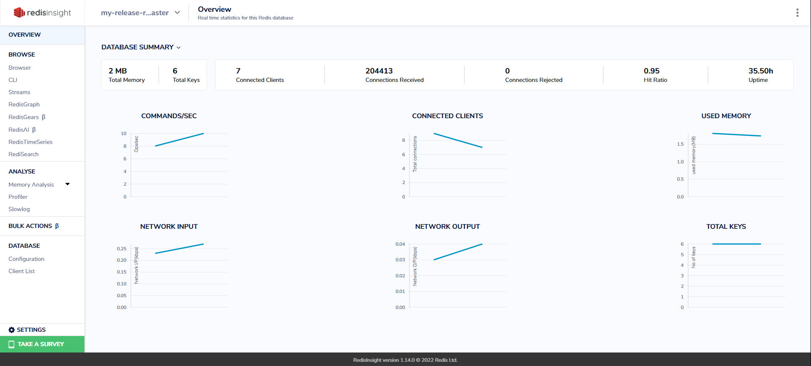

# Redis Hands-in

> Redis On Kubernetes


# 1. Redis Install 준비

Bastion Server 에서 redis 를 설치해 보자.


## 1.1 namespace 생성

```sh
$ kubectl create ns redis-system

```


## 1.2 helm chart

쿠버네티스에 서비스를 배포하는 방법이 다양하게 존재하는데 그중 대표적인 방법중에 하나가 Helm chart 방식 이다.


### (1) [참고] Helm Architecture

- helm chart 의 필요성

일반적으로 Kubernetes 에 서비스를 배포하기 위해 준비되는 Manifest 파일은 정적인 형태이다. 따라서 데이터를 수정하기 위해선 파일 자체를 수정해야 한다.  잘 관리를 한다면야 큰 어려움은 없겠지만, 문제는 CI/CD 등 자동화된 파이프라인을 구축해서 애플리케이션 라이프사이클을 관리할 때 발생한다.  

보통 애플리케이션 이미지를 새로 빌드하게 되면, 빌드 넘버가 변경된다. 이렇게 되면 새로운 이미지를 사용하기 위해 Kubernetes Manifest의 Image도 변경되어야 한다.  하지만 Kubernetes Manifest를 살펴보면, 이를 변경하기 쉽지 않다. Image Tag가 별도로 존재하지 않고 Image 이름에 붙어있기 때문입니다. 이를 자동화 파이프라인에서 변경하려면, sed 명령어를 쓰는 등의 힘든 작업을 해야 한다.

Image Tag는 굉장히 단적인 예제이다.  이 외에 도 Configmap 등 배포시마다 조금씩 다른 형태의 데이터를 배포해야 할때 Maniifest 파일 방식은 너무나 비효율적이다.  Helm Chart 는 이런 어려운 점을 모두 해결한 훌륭한 도구이다.  비단,  사용자가 개발한 AP 뿐아니라 kubernetes 에 배포되는 오픈소스 기반 솔루션들은 거의 모두 helm chart 를 제공한다.


### (2) helm Client 설치

Bastion Server 에는 Helm 이 설치되어 있다.

helm client 설치에 대한 내용은 `cloud-setup.md` 파일에서 `helm install` 부분을 참고하자.


# 2. Redis Cluster Install

kubernetes 기반에서 Redis 를 설치해보자.

참조link : https://github.com/bitnami/charts/tree/master/bitnami/redis-cluster


## 2.1 helm chart download


### (1) Repo add

redis-cluster chart 를 가지고 있는 bitnami repogistory 를  helm repo 에 추가한다.

```sh
$ helm repo add bitnami https://charts.bitnami.com/bitnami
$ helm repo list
NAME    URL
bitnami https://charts.bitnami.com/bitnami
```


### (2) Helm Search

추가된 bitnami repo에서 redis-cluster 를 찾는다.

```sh
$ helm search repo redis
NAME                                            CHART VERSION   APP VERSION     DESCRIPTION
bitnami/redis                                   17.11.2         7.0.11          Redis(R) is an open source, advanced key-value ...
bitnami/redis-cluster                           8.6.1           7.0.11          Redis(R) is an open source, scalable, distribut...


```

우리가 사용할 redis-cluster 버젼은 chart version 8.6.1( app version: 7.0.11) 이다.


### (3) Helm Fetch

helm chart 를 fetch 받는다.

```sh
# chart 를 저장할 적당한 위치로 이동
$ mkdir -p ~/temp/helm/charts
  cd ~/temp/helm/charts

$ helm fetch bitnami/redis-cluster

$ ll
-rw-r--r-- 1 ktdseduuser ktdseduuser 105787 Jul  9 06:39 redis-cluster-8.6.6.tgz


$ tar -xzvf redis-cluster-8.6.6.tgz
...

$ cd redis-cluster

$ ls -ltr
-rw-r--r-- 1 ktdseduuser ktdseduuser   333 May 21 17:57 .helmignore
-rw-r--r-- 1 ktdseduuser ktdseduuser   225 May 21 17:57 Chart.lock
-rw-r--r-- 1 ktdseduuser ktdseduuser   747 May 21 17:57 Chart.yaml
-rw-r--r-- 1 ktdseduuser ktdseduuser 75124 May 21 17:57 README.md
drwxrwxr-x 3 ktdseduuser ktdseduuser  4096 Jun 11 09:57 charts/
drwxrwxr-x 2 ktdseduuser ktdseduuser  4096 Jun 11 09:57 img/
drwxrwxr-x 2 ktdseduuser ktdseduuser  4096 Jun 11 09:57 templates/
-rw-r--r-- 1 ktdseduuser ktdseduuser 42471 May 21 17:57 values.yaml


```


## 2.2 Install

> without pv


### (1) helm install

```sh
$ cd  ~/temp/helm/charts/redis-cluster

## dry-run 으로 실행
$ helm -n redis-system install my-release . \
    --set password=new1234 \
    --set persistence.enabled=false \
    --set metrics.enabled=true \
    --set cluster.nodes=6 \
    --set cluster.replicas=1 \
    --dry-run=true
    
    
    ### 추가옵션 ###
    ### 아래와 같이설정되면 svc 명으로 redirect 됨
    --set cluster.externalAccess.enabled=true \
    --set cluster.externalAccess.service.type=LoadBalancer \
    --set cluster.externalAccess.service.loadBalancerIP[0]=my-release-redis-cluster-0-svc \
    --set cluster.externalAccess.service.loadBalancerIP[1]=my-release-redis-cluster-1-svc \
    --set cluster.externalAccess.service.loadBalancerIP[2]=my-release-redis-cluster-2-svc \
    --set cluster.externalAccess.service.loadBalancerIP[3]=my-release-redis-cluster-3-svc \
    --set cluster.externalAccess.service.loadBalancerIP[4]=my-release-redis-cluster-4-svc \
    --set cluster.externalAccess.service.loadBalancerIP[5]=my-release-redis-cluster-5-svc \
    

## 실행
$ helm -n redis-system install my-release . \
    --set password=new1234 \
    --set persistence.enabled=false \
    --set metrics.enabled=false \
    --set cluster.nodes=6 \
    --set cluster.replicas=1 


# [참고]
    # node port 접속시 - redis cluster  에서는 의미 없다.
    --set service.type=NodePort \
    --set service.nodePorts.redis=32300 \


NAME: my-release
LAST DEPLOYED: Sun Jun 11 09:58:55 2023
NAMESPACE: redis-system
STATUS: deployed
REVISION: 1
TEST SUITE: None
NOTES:
CHART NAME: redis-cluster
CHART VERSION: 8.6.2
APP VERSION: 7.0.11** Please be patient while the chart is being deployed **


To get your password run:
    export REDIS_PASSWORD=$(kubectl get secret --namespace "redis-system" my-release-redis-cluster -o jsonpath="{.data.redis-password}" | base64 -d)

You have deployed a Redis&reg; Cluster accessible only from within you Kubernetes Cluster.INFO: The Job to create the cluster will be created.To connect to your Redis&reg; cluster:

1. Run a Redis&reg; pod that you can use as a client:
kubectl run --namespace redis-system my-release-redis-cluster-client --rm --tty -i --restart='Never' \
 --env REDIS_PASSWORD=$REDIS_PASSWORD \
--image docker.io/bitnami/redis-cluster:7.0.11-debian-11-r12 -- bash

2. Connect using the Redis&reg; CLI:

redis-cli -c -h my-release-redis-cluster -a $REDIS_PASSWORD


## 확인
$ helm -n redis-system ls
NAME            NAMESPACE       REVISION        UPDATED                                 STATUS          CHART                   APP VERSION
my-release      redis-system    1               2023-06-11 09:58:55.994892092 +0000 UTC deployed        redis-cluster-8.6.2     7.0.11


$ helm -n redis-system status my-release


```


### (2) pod/svc 확인

```sh
## redis cluster 를 구성하고 있는 pod 를 조회
$ kubectl -n redis-system get pod -o wide
NAME                         READY   STATUS    RESTARTS   AGE   IP           NODE        NOMINATED NODE   READINESS GATES
my-release-redis-cluster-0   1/1     Running   0          57s   10.42.0.27   bastion03   <none>           <none>
my-release-redis-cluster-1   1/1     Running   0          56s   10.42.0.26   bastion03   <none>           <none>
my-release-redis-cluster-2   1/1     Running   0          56s   10.42.0.28   bastion03   <none>           <none>
my-release-redis-cluster-3   1/1     Running   0          56s   10.42.0.29   bastion03   <none>           <none>
my-release-redis-cluster-4   1/1     Running   0          56s   10.42.0.30   bastion03   <none>           <none>
my-release-redis-cluster-5   1/1     Running   0          56s   10.42.0.31   bastion03   <none>           <none>
...


$ kubectl -n redis-system get svc
NAME                                TYPE        CLUSTER-IP     EXTERNAL-IP   PORT(S)              AGE
my-release-redis-cluster-headless   ClusterIP   None           <none>        6379/TCP,16379/TCP   68s
my-release-redis-cluster            ClusterIP   10.43.13.151   <none>        6379/TCP             68s


```


## 2.3 Internal Access

redis client를 cluster 내부에서 실행후 접근하는 방법을 알아보자.

### (1) Redis client 실행

먼저 아래와 같이 동일한 Namespace 에 redis-client 를 실행한다.

```sh
## redis-client 용도로 deployment 를 실행한다.
$ kubectl -n redis-system create deploy redis-client --image=docker.io/bitnami/redis-cluster:6.2.7-debian-11-r3 -- sleep 365d
deployment.apps/redis-client created


## redis client pod 확인
$ kubectl -n redis-system get pod
NAME                            READY   STATUS    RESTARTS   AGE
redis-client-7cdd56bb6c-njjls   1/1     Running   0          5s     <--- redis client pod


# 약 20초 정도 소요됨


## redis-client pod 내부로 접근한다.
$ kubectl -n redis-system exec -it deploy/redis-client -- bash
I have no name!@redis-client-69dcc9c76d-kc8r9:/$    # <-- 이런 Prompt가 나오면 정상

```


### (2) Redis-cli 으로 확인

#### Redis-cli 실행

```sh

## redis-client pod 내부에서...

## service 명으로 cluster mode 접근
$ redis-cli -h my-release-redis-cluster -c -a new1234

## cluster node 를 확인
my-release-redis-cluster:6379> cluster nodes

7b8609f45e62d6060c3e34cd8bea661aeeed4e95 10.42.0.31:6379@16379 slave 89bd93950f1c63bce34d6639a056a6c59dd3bc6e 0 1686477766458 2 connected
da8eb2aaedc3906d4a3b7d56cf174a4b7c33f857 10.42.0.28:6379@16379 master - 0 1686477765454 3 connected 10923-16383
4a2e520ded34b4d21336089fe576c3c097eb97ea 10.42.0.27:6379@16379 myself,master - 0 1686477763000 1 connected 0-5460
15e403bacd76ad0cff575a8e86d24f58e20183f5 10.42.0.30:6379@16379 slave 4a2e520ded34b4d21336089fe576c3c097eb97ea 0 1686477764000 1 connected
89bd93950f1c63bce34d6639a056a6c59dd3bc6e 10.42.0.26:6379@16379 master - 0 1686477765000 2 connected 5461-10922
be0633d61c1da6271ed43f404f77b55792150765 10.42.0.29:6379@16379 slave da8eb2aaedc3906d4a3b7d56cf174a4b7c33f857 0 1686477764450 3 connected

## master 3개, slave가 3개 사용하는 모습을 볼 수가 있다.


## cluster info 확인
my-release-redis-cluster:6379> cluster info

cluster_state:ok
cluster_slots_assigned:16384
cluster_slots_ok:16384
cluster_slots_pfail:0
cluster_slots_fail:0
cluster_known_nodes:6
cluster_size:3
cluster_current_epoch:6
cluster_my_epoch:1
cluster_stats_messages_ping_sent:236
cluster_stats_messages_pong_sent:233
cluster_stats_messages_sent:469
cluster_stats_messages_ping_received:228
cluster_stats_messages_pong_received:236
cluster_stats_messages_meet_received:5
cluster_stats_messages_received:469
total_cluster_links_buffer_limit_exceeded:0

## cluster state 가 OK 인 것을 확인할 수 있다.

```


#### set / get 확인

```sh

# Redis cli 에서...


## set 명령 수행
my-release-redis-cluster:6379> set a 1
-> Redirected to slot [15495] located at 10.42.0.28:6379
OK
10.42.0.28:6379> set b 2
-> Redirected to slot [3300] located at 10.42.0.27:6379
OK
10.42.0.27:6379> set c 3
-> Redirected to slot [7365] located at 10.42.0.26:6379
OK
10.42.0.26:6379> set d 4
-> Redirected to slot [11298] located at 10.42.0.28:6379
OK
10.42.0.28:6379> set e 5
OK
10.42.0.28:6379> set f 6
-> Redirected to slot [3168] located at 10.42.0.27:6379
OK

## Set 명령수행시 master node 를 변경하면서 set 하는 모습을 확인할 수 있다.


# get 명령 수행
10.42.0.27:6379> get a
-> Redirected to slot [15495] located at 10.42.0.28:6379
"1"
10.42.0.28:6379> get b
-> Redirected to slot [3300] located at 10.42.0.27:6379
"2"
10.42.0.27:6379> get c
-> Redirected to slot [7365] located at 10.42.0.26:6379
"3"
10.42.0.26:6379> get d
-> Redirected to slot [11298] located at 10.42.0.28:6379
"4"
10.42.0.28:6379> get e
"5"
10.42.0.28:6379> get f
-> Redirected to slot [3168] located at 10.42.0.27:6379
"6"


## get 명령을 실행하면 해당 데이터가 존재하는 master pod 로 redirectred 되는 것을 확인할 수 있다.


# 테스트 완료후 
# Ctrl+C ,  Ctrl+D 명령으로 Exit 하자.

```


### (3) python 으로 확인

Kubernetes Cluster 내에서 redis 접근 가능여부를 확인하기 위해 python 을 설치후 redis 에 connect 해 보자.


#### python  설치

```sh
# python deploy
$ kubectl -n redis-system create deploy python --image=python:3.9 -- sleep 365d


# 설치진행 확인
$ kubectl -n redis-system get pod
...
python-fb57f7bd4-4w6pz                       1/1     Running   0              32s
...

## READY 상태가 1/1 로 변할때까지 대기...
## 약 1분 소요


# python pod 내부로 진입( bash 명령 수행)
$ kubectl -n redis-system exec -it deploy/python -- bash
root@python-7d59455985-ml8vw:/#                  <-- 이런 prompt 가 정상


```


#### python library install

kafka 에 접근하기 위해서 kafka-python 을 설치해야 한다.

```bash
# python pod 내부에서

$ pip install redis-py-cluster

Collecting redis-py-cluster
  Downloading redis_py_cluster-2.1.3-py2.py3-none-any.whl (42 kB)
     ━━━━━━━━━━━━━━━━━━━━━━━━━━━━━━━━━━━━━━━━ 42.6/42.6 kB 5.5 MB/s eta 0:00:00
Collecting redis<4.0.0,>=3.0.0
  Downloading redis-3.5.3-py2.py3-none-any.whl (72 kB)
     ━━━━━━━━━━━━━━━━━━━━━━━━━━━━━━━━━━━━━━━━ 72.1/72.1 kB 10.8 MB/s eta 0:00:00
Installing collected packages: redis, redis-py-cluster
  Attempting uninstall: redis
    Found existing installation: redis 4.6.0
    Uninstalling redis-4.6.0:
      Successfully uninstalled redis-4.6.0
Successfully installed redis-3.5.3 redis-py-cluster-2.1.3


```


#### [참고] redis host 확인

```sh
# internal 접근을 위한 host 확인
# nc 명령으로 접근가능여부를 확인할 수 있다.

$ apt update
$ apt install netcat

$ nc -zv my-release-redis-cluster.redis-system.svc 6379

Connection to my-release-redis-cluster.redis-system.svc (10.43.47.183) 6379 port [tcp/redis] succeeded!

$ nc -zv my-release-redis-cluster-0-svc.redis-system.svc 6379
$ nc -zv my-release-redis-cluster-1-svc.redis-system.svc 6379
$ nc -zv my-release-redis-cluster-2-svc.redis-system.svc 6379
$ nc -zv my-release-redis-cluster-3-svc.redis-system.svc 6379
$ nc -zv my-release-redis-cluster-4-svc.redis-system.svc 6379
$ nc -zv my-release-redis-cluster-5-svc.redis-system.svc 6379


```


#### redis 확인

consumer 실행을 위해서 python cli 환경으로 들어가자.

```sh
# python pod 내부에서
$ python

Python 3.9.13 (main, May 28 2022, 13:56:03)
[GCC 10.2.1 20210110] on linux
Type "help", "copyright", "credits" or "license" for more information.
>>>

```


CLI 환경에서 아래  Python 명령을 하나씩 실행해 보자.

```python
from rediscluster import RedisCluster


startup_nodes = [{"host":"my-release-redis-cluster", "port":"6379"}]
rc = RedisCluster(startup_nodes=startup_nodes, 
                      decode_responses=True, 
                      skip_full_coverage_check=True,
                     password="new1234")

print(rc.cluster('slots'))

'''
{
(0, 5460): {'master': ('my-release-redis-cluster-0-svc', 6379), 'slaves': [('my-release-redis-cluster-4-svc', 6379)]}, 
(5461, 10922): {'master': ('my-release-redis-cluster-1-svc', 6379), 'slaves': [('my-release-redis-cluster-5-svc', 6379)]}, 
(10923, 16383): {'master': ('my-release-redis-cluster-2-svc', 6379), 'slaves': [('my-release-redis-cluster-3-svc', 6379)]}
}
'''


# redis set
rc.set("a", "python1")
rc.set("b", "python2")
rc.set("c", "python3")

# redis get
rc.get("a")
rc.get("b")
rc.get("c")

# delete key
rc.delete("c")

# 기타
rc.set('foo','bar')
print(rc.get('foo'))
key_list  = rc.keys("*")
print(key_list)
```


## 2.4 결론

- External (Cluster 외부) 에서 access 하기 위해서 node port 를 이용해야 함

- 하지만 Redis Cluster 의 경우 접근해야 할 Node 가 두개 이상이며 데이터가 저장된 위치를 찾아 redirect 됨

- 이때 redirect 가 정확히 이루어지려면 Client 가 인식가능한 Node 주소를 알아야 함

- 하지만 Redis Cluster 는 원격지 Client 가 인식가능한 Node 들의 DNS 제공을 지원하지 않음

- 결국 Redis Cluster 는 PRD환경과 같이 Kubernetes Cluster 내에서는 사용가능하지만 

- 개발자 PC에서 연결이 필요한 DEV환경에서 적절치 않음


## 2.5 Clean Up

```sh

# 1) helm 삭제
# helm delete 명령을 이용하면 helm chart 로 설치된 모든 리소스가 한꺼번에 삭제된다.
$ helm -n redis-system delete my-release
$ helm -n redis-system ls


# 2) helm chart 삭제
$ rm -rf ~/temp/helm/charts/redis-cluster/
$ rm -rf ~/temp/helm/charts/redis-cluster-8.6.2.tgz


## 3) redis-client 삭제
$ kubectl -n redis-system delete deploy/redis-client
$ kubectl -n redis-system get all


```


# 3. Redis Install

Redis-Cluster 는 Local 에서 접속 시도할때는 Redirect 가 불가능하므로 사용할 수 없다.

그러므로 redis-cluster 가 아닌 redis 로 설치 하여 테스트를 진행한다.


## 3.1 Redis(Single Master) Install


### (1) helm search

추가된 bitnami repo에서 redis-cluster 를 찾는다.

```sh
$ helm search repo redis
NAME                    CHART VERSION   APP VERSION     DESCRIPTION
bitnami/redis           17.11.3         7.0.11          Redis(R) is an open source, advanced key-value ...
bitnami/redis-cluster   8.6.2           7.0.11          Redis(R) is an open source, scalable, distribut...

```

bitnami/redis chart 를 이용할 것이다.


### (2) helm install

```sh

# helm install
# master 1, slave 3 실행

# dry-run
$ helm -n redis-system install my-release bitnami/redis \
    --set global.redis.password=new1234 \
    --set image.registry=docker.io \
    --set master.persistence.enabled=false \
    --set master.service.type=NodePort \
    --set master.service.nodePorts.redis=32300 \
    --set replica.replicaCount=3 \
    --set replica.persistence.enabled=false \
    --set replica.service.type=NodePort \
    --set replica.service.nodePorts.redis=32310 \
    --dry-run=true

# 설치
$ helm -n redis-system install my-release bitnami/redis \
    --set global.redis.password=new1234 \
    --set image.registry=docker.io \
    --set master.persistence.enabled=false \
    --set master.service.type=NodePort \
    --set master.service.nodePorts.redis=32300 \
    --set replica.replicaCount=3 \
    --set replica.persistence.enabled=false \
    --set replica.service.type=NodePort \
    --set replica.service.nodePorts.redis=32310

##
NAME: my-release
LAST DEPLOYED: Sun Jun 11 10:16:14 2023
NAMESPACE: redis-system
STATUS: deployed
REVISION: 1
TEST SUITE: None
NOTES:
CHART NAME: redis
CHART VERSION: 17.11.3
APP VERSION: 7.0.11

** Please be patient while the chart is being deployed **

Redis&reg; can be accessed on the following DNS names from within your cluster:

    my-release-redis-master.redis-system.svc.cluster.local for read/write operations (port 6379)
    my-release-redis-replicas.redis-system.svc.cluster.local for read-only operations (port 6379)


To get your password run:

    export REDIS_PASSWORD=$(kubectl get secret --namespace redis-system my-release-redis -o jsonpath="{.data.redis-password}" | base64 -d)

To connect to your Redis&reg; server:

1. Run a Redis&reg; pod that you can use as a client:

   kubectl run --namespace redis-system redis-client --restart='Never'  --env REDIS_PASSWORD=$REDIS_PASSWORD  --image docker.io/bitnami/redis:7.0.11-debian-11-r12 --command -- sleep infinity

   Use the following command to attach to the pod:

   kubectl exec --tty -i redis-client \
   --namespace redis-system -- bash

2. Connect using the Redis&reg; CLI:
   REDISCLI_AUTH="$REDIS_PASSWORD" redis-cli -h my-release-redis-master
   REDISCLI_AUTH="$REDIS_PASSWORD" redis-cli -h my-release-redis-replicas

To connect to your database from outside the cluster execute the following commands:

    export NODE_IP=$(kubectl get nodes --namespace redis-system -o jsonpath="{.items[0].status.addresses[0].address}")
    export NODE_PORT=$(kubectl get --namespace redis-system -o jsonpath="{.spec.ports[0].nodePort}" services my-release-redis-master)
    REDISCLI_AUTH="$REDIS_PASSWORD" redis-cli -h $NODE_IP -p $NODE_PORT


# 설치목록 확인
$ helm -n redis-system ls
NAME            NAMESPACE       REVISION        UPDATED                                 STATUS          CHART           APP VERSION
my-release      redis-system    1               2023-06-11 10:16:14.122487498 +0000 UTC deployed        redis-17.11.3   7.0.11


# 확인
$ helm -n redis-system status my-release
$ helm -n redis-system get all my-release


```

my-release-redis-master 는 read/write 용도로 사용되며 my-release-redis-replicas 는 read-only 용도로 사용된다.


#### [참고] remote설치가 안될때는 fetch 받아서 수행

설치 과정에서 chart 를 다운 받지 못한다면 Chart 를 fetch 받아서 설치하자.

```sh
# chart 를 저장할 적당한 위치로 이동
$ mkdir -p ~/helm/charts

$ cd ~/helm/charts

$ helm fetch bitnami/redis

$ ll
-rw-r--r-- 1 song song 88772 Jul  3 16:46 redis-16.13.1.tgz

$ tar -xzvf redis-16.13.1.tgz
...

$ cd redis

$ ls -ltr
-rw-r--r-- 1 song song    333 Jun 30 18:13 .helmignore
-rw-r--r-- 1 song song    220 Jun 30 18:13 Chart.lock
-rw-r--r-- 1 song song    773 Jun 30 18:13 Chart.yaml
-rw-r--r-- 1 song song 100896 Jun 30 18:13 README.md
drwxr-xr-x 3 song song   4096 Jul  3 16:46 charts/
drwxr-xr-x 2 song song   4096 Jul  3 16:46 img/
drwxr-xr-x 5 song song   4096 Jul  3 16:46 templates/
-rw-r--r-- 1 song song   4483 Jun 30 18:13 values.schema.json
-rw-r--r-- 1 song song  68559 Jun 30 18:13 values.yaml


$ cd ~/helm/charts/redis

# helm install
# node 2, replicas 1 이므로 Master / Slave 한개씩 사용됨
$ helm -n redis-system install my-release . \
    --set global.redis.password=new1234 \
    --set image.registry=docker.io \
    --set master.persistence.enabled=false \
    --set master.service.type=NodePort \
    --set master.service.nodePorts.redis=32300 \
    --set replica.replicaCount=3 \
    --set replica.persistence.enabled=false \
    --set replica.service.type=NodePort \
    --set replica.service.nodePorts.redis=32310

##
my-release-redis-master.redis-system.svc.cluster.local for read/write operations (port 6379)
my-release-redis-replicas.redis-system.svc.cluster.local for read-only operations (port 6379)


$ helm -n redis-system ls
NAME            NAMESPACE       REVISION        UPDATED                                 STATUS          CHART                   APP VERSION
my-release      redis-system    1               2022-06-26 06:59:30.08278938 +0000 UTC  deployed        redis-cluster-7.6.3     6.2.7


# 삭제시
$ helm -n redis-system delete my-release


```


### (3) pod / svc 확인

```sh
$ kubectl -n redis-system get pod

NAME                          READY   STATUS    RESTARTS   AGE
my-release-redis-master-0     1/1     Running   0          99s
my-release-redis-replicas-0   1/1     Running   0          99s
my-release-redis-replicas-1   1/1     Running   0          64s
my-release-redis-replicas-2   1/1     Running   0          43s

# 약 1분 정도 소요됨 

$ kubectl -n redis-system get svc
NAME                        TYPE        CLUSTER-IP       EXTERNAL-IP   PORT(S)          AGE
my-release-redis-headless   ClusterIP   None             <none>        6379/TCP         7m2s
my-release-redis-master     NodePort    10.99.252.81     <none>        6379:32300/TCP   7m2s
my-release-redis-replicas   NodePort    10.103.228.149   <none>        6379:32310/TCP   7m2s

```

- master / replicas service 는 nodeport 로 접근한다.


## 3.2 Internal Access

redis client를 cluster 내부에서 실행후 접근하는 방법을 알아보자.


### (1) Redis Service 확인

```sh
$ kubectl -n redis-system get svc
NAME                        TYPE        CLUSTER-IP      EXTERNAL-IP   PORT(S)          AGE
my-release-redis-headless   ClusterIP   None            <none>        6379/TCP         7m17s
my-release-redis-replicas   NodePort    10.43.232.115   <none>        6379:32310/TCP   7m17s
my-release-redis-master     NodePort    10.43.160.148   <none>        6379:32300/TCP   7m17s


$ kubectl -n redis-system  get pod
NAME                          READY   STATUS    RESTARTS   AGE
my-release-redis-master-0     1/1     Running   0          13m
my-release-redis-replicas-0   1/1     Running   0          13m
my-release-redis-replicas-1   1/1     Running   0          12m
my-release-redis-replicas-2   1/1     Running   0          12m
```

- my-release-redis-master 이 일반 kubernetes service 이며 POD 로 트래픽을 RR 방식으로 연결한다.
- my-release-redis-headless 는 ip 가 없는 headless service 이다. 그러므로 pod 명을 붙여서 DNS 로 사용된다.
  - headless service 사용예시
    - my-release-redis-master-0.my-release-redis-headless.redis-system.svc

- 우리는 Cluster 내에서  my-release-redis-master:6379로 접근을 시도할 것이다.


### (2) Redis-cli 으로 확인

#### Redis-cli 실행

먼저 아래와 같이 동일한 Namespace 에 redis-client 를 실행한다.

```sh
## redis-client 용도로 deployment 를 실행한다.
$ kubectl -n redis-system create deploy redis-client --image=docker.io/bitnami/redis-cluster:6.2.7-debian-11-r3 -- sleep 365d
deployment.apps/redis-client created


## redis client pod 확인
$ kubectl -n redis-system get pod
NAME                            READY   STATUS    RESTARTS   AGE
redis-client-69dcc9c76d-rgtgx   1/1     Running   0          8s

# 약 10초 정도 소요된다.


## redis-client 로 접근한다.
## okd web console 에서 해당 pod 의 terminal 로 접근해도 된다.
$ kubectl -n redis-system exec -it deploy/redis-client -- bash
I have no name!@redis-client-69dcc9c76d-rgtgx:/$    # <-- 이런 Prompt 가 나오면 정상

```


#### Redis Info

```sh
## redis-client pod 내부에서...

$ redis-cli -h my-release-redis-master -a new1234

# redis info 
$ my-release-redis-master:6379> info
# Server
redis_version:7.0.11
redis_git_sha1:00000000
redis_git_dirty:0
redis_build_id:a34ca35dd6ccc3a6
redis_mode:standalone
os:Linux 5.19.0-1022-gcp x86_64
arch_bits:64
monotonic_clock:POSIX clock_gettime
multiplexing_api:epoll
atomicvar_api:c11-builtin
gcc_version:10.2.1
process_id:1
process_supervised:no
run_id:956136515f55cbe85554aaa17d949539d475b8eb
tcp_port:6379
server_time_usec:1686479219566383
uptime_in_seconds:638
uptime_in_days:0
hz:10
configured_hz:10
lru_clock:8757619
executable:/redis-server
config_file:
io_threads_active:0
...
...

```


#### set / get 확인

```sh
## redis-client pod 내부에서...

my-release-redis-master:6379>


## set 명령 수행
my-release-redis-master:6379> set a 1
OK
my-release-redis-master:6379> set b 2
OK
my-release-redis-master:6379> set c 3
OK
my-release-redis-master:6379> set d 4


## Redis Cluster 와 다르게 한개의 노드에서만 동작한다.


# get 명령 수행
my-release-redis-master:6379> get a
"1"
my-release-redis-master:6379> get b
"2"
my-release-redis-master:6379> get c
"3"
my-release-redis-master:6379> get d
"4"


# 테스트 완료시
# Ctrl+D,   Ctrl+D 로   Exit 하자.
```


### (3) python 으로 확인

Kubernetes Cluster 내에서 redis 접근 가능여부를 확인하기 위해 python 을 설치후 redis 에 connect 해 보자.


#### python  설치

```sh
# python deploy
$ kubectl -n redis-system create deploy python --image=python:3.9 -- sleep 365d


# 설치진행 확인
$ kubectl -n redis-system get pod
...
python-fb57f7bd4-4w6pz                       1/1     Running   0              32s
...

## READY 상태가 1/1 로 변할때까지 대기...
## 약 1분 소요


# python pod 내부로 진입( bash 명령 수행)
$ kubectl -n redis-system exec -it deploy/python -- bash
root@python-7d59455985-ml8vw:/#                  <-- 이런 prompt 가 정상


```


#### python library install

kafka 에 접근하기 위해서 kafka-python 을 설치해야 한다.

```bash
# python pod 내부에서

$ pip install redis

Collecting redis
  Downloading redis-4.6.0-py3-none-any.whl (241 kB)
     ━━━━━━━━━━━━━━━━━━━━━━━━━━━━━━━━━━━━━━━━ 241.1/241.1 kB 24.0 MB/s eta 0:00:00
Collecting async-timeout>=4.0.2
  Downloading async_timeout-4.0.2-py3-none-any.whl (5.8 kB)
Installing collected packages: async-timeout, redis
Successfully installed async-timeout-4.0.2 redis-4.6.0
WARNING: Running pip as the 'root' user can result in broken permissions and conflicting behaviour with the system package manager. It is recommended to use a virtual environment instead: https://pip.pypa.io/warnings/venv

[notice] A new release of pip is available: 23.0.1 -> 23.1.2
[notice] To update, run: pip install --upgrade pip


```


#### [참고] redis host 확인

```sh
# internal 접근을 위한 host 확인
# nc 명령으로 접근가능여부를 확인할 수 있다.

$ apt update
$ apt install netcat

$ nc -zv my-release-redis-master.redis-system.svc 6379

Connection to my-release-redis-master.redis-system.svc (10.43.83.105) 6379 port [tcp/redis] succeeded!


```


#### redis 확인

consumer 실행을 위해서 python cli 환경으로 들어가자.

```sh
# python pod 내부에서
$ python

Python 3.9.13 (main, May 28 2022, 13:56:03)
[GCC 10.2.1 20210110] on linux
Type "help", "copyright", "credits" or "license" for more information.
>>>

```


CLI 환경에서 아래  Python 명령을 하나씩 실행해 보자.

```python
import redis

# redis 연결
rd = redis.Redis(host='my-release-redis-master', port=6379, db=0, password="new1234")
#rd = redis.StrictRedis(host='my-release-redis-master', port=6379, db=0, password="new1234")
#rd = redis.Redis(host='localhost', port=6379, decode_responses=True)
#rc = RedisCluster(host='my-release-redis-cluster', port=6379)

'''
r = redis.Redis(
    host="my-redis.cloud.redislabs.com", port=6379,
    username="default", # use your Redis user. More info https://redis.io/docs/management/security/acl/
    password="secret", # use your Redis password
    ssl=True,
    ssl_certfile="./redis_user.crt",
    ssl_keyfile="./redis_user_private.key",
    ssl_ca_certs="./redis_ca.pem",
)
'''

# redis set
rd.set("a", "python1")
rd.set("b", "python2")
rd.set("c", "python3")

# redis get
rd.get("a")
rd.get("b")
rd.get("c")

# delete key
rd.delete("c")
```


## 3.3 External Access

redis client를 cluster 외부에서 실행후 접근하는 방법을 알아보자.


### (1) Redis Service 확인

```sh
# bastion server 에서...

$ kubectl -n redis-system get svc
NAME                        TYPE        CLUSTER-IP      EXTERNAL-IP   PORT(S)          AGE
my-release-redis-headless   ClusterIP   None            <none>        6379/TCP         14m
my-release-redis-replicas   NodePort    10.43.232.115   <none>        6379:32310/TCP   14m
my-release-redis-master     NodePort    10.43.160.148   <none>        6379:32300/TCP   14m


```

- my-release-redis-master 서비스가 Node Port 32300 로 접근이 가능하다.
- 그러므로 Node Ip알아낸 다음 해당 IP 의 33200 로 접근할 수 있다.


### (2) Node IP 확인


#### Node IP 확인

- node port 를 인식할 수 있는 본인 Bastion Server IP를 확인해야 한다.

- Bastion Server IP 는 개인별로 부여된 IP 이므로 이를 사용하자.

  ※ Typora 를 사용하고 있다면 본문서에 등장하는 35.xx.xx.xx 를 모두 자신의 IP 로 Replace 사용하자.

```
Ctrl + H

35.xx.xx.xx --> 34.95.147.185 (자신의 Bastion Server IP)   모두 변경
```

- 접근 주소
  - 35.xx.xx.xx:32300
  - 위 주소로 본인의 local PC 에서도 위 Redis 주소로 접근할 수 있다.

  


### (3) Redis client 확인

bastion Server 에서 Kubernetes redis access 테스트를 위해 Container redis client 를 설치하자.

```sh
## redis-client 용도로 docker client 를 실행한다.
$ podman run --name redis-client -d --user root docker.io/bitnami/redis-cluster:6.2.7-debian-11-r3 sleep 365d

## docker 내에 진입후
$ podman exec -it redis-client bash

## Local PC IP로 cluster mode 접근
$ redis-cli -h 35.xx.xx.xx -c -a new1234 -p 32300

```


### (4) set/get 확인

```sh

# get 명령 수행
# Internal Access 에서 테스트 했던 4개 값을 읽어오자.
35.xx.xx.xx:32300> get a
"1"
35.xx.xx.xx:32300> get b
"2"
35.xx.xx.xx:32300> get c
"3"
35.xx.xx.xx:32300> get d
"4"


# set 명령 수행
35.xx.xx.xx:32300> set e 1
OK
35.xx.xx.xx:32300> set f 2
OK
35.xx.xx.xx:32300> set g 3
OK


# 테스트 완료시
# Ctrl+D,   Ctrl+D 로   Exit 하자.
```


## 3.4 ACL

Redis 6.0 이상부터는 계정별 access 수준을 정의할 수 있다.  

이러한 ACL 기능을 이용해서 아래와 같은 계정을 관리 할 수 있다.

- 읽기전용 계정 생성 가능

- 특정 프리픽스로 시작하는 Key 만 access 가능하도록 하는 계정 생성


### (1) Redis Client 확인

bastion Server 에서 Kubernetes redis access 테스트를 위해 Container redis client 를 설치하자.

```sh
## redis-client 용도로 docker client 를 실행한다.
$ podman run --name redis-client -d --rm --user root docker.io/bitnami/redis-cluster:6.2.7-debian-11-r3 sleep 365d


## Container 확인
$ podman ps -a


## Container 내에 진입후
$ podman exec -it redis-client bash

root@453e3debccb3:/#


## Local PC IP로 cluster mode 접근
$ redis-cli -h 35.xx.xx.xx -c -a new1234 -p 32300
35.xx.xx.xx:32300>

```


### (2) ACL 기본명령

```sh

# 1) 계정 목록
35.xx.xx.xx:32300> acl list
1) "user default on #65fd3b5c243ea857f91daef8e3d5c203fa045f33e034861998b9d74cc42ceb24 ~* &* +@all"

## 기본적으로 default 라는 계정이 존재한다.


# 2) 계정 추가
35.xx.xx.xx:32300> acl setuser supersong on >new1234 allcommands allkeys
OK
35.xx.xx.xx:32300> acl setuser tempsong on >new1234 allcommands allkeys
OK
35.xx.xx.xx:32300>  acl list
1) "user default on #65fd3b5c243ea857f91daef8e3d5c203fa045f33e034861998b9d74cc42ceb24 ~* &* +@all"
2) "user supersong on #65fd3b5c243ea857f91daef8e3d5c203fa045f33e034861998b9d74cc42ceb24 ~* resetchannels +@all"
3) "user tempsong on #65fd3b5c243ea857f91daef8e3d5c203fa045f33e034861998b9d74cc42ceb24 ~* resetchannels +@all"


# 3) 계정 전환
35.xx.xx.xx:32300> acl whoami
"default"
35.xx.xx.xx:32300> auth supersong new1234
OK
35.xx.xx.xx:32300> acl whoami
"supersong"
35.xx.xx.xx:32300> auth default new1234
OK
35.xx.xx.xx:32300> acl whoami
"default"


# 4) 계정 삭제
35.xx.xx.xx:32300> acl deluser tempsong
(integer) 1
35.xx.xx.xx:32300> acl list
1) "user default on #65fd3b5c243ea857f91daef8e3d5c203fa045f33e034861998b9d74cc42ceb24 ~* &* +@all"
2) "user supersong on #65fd3b5c243ea857f91daef8e3d5c203fa045f33e034861998b9d74cc42ceb24 ~* resetchannels +@all"

```


### (3) 읽기전용 계정 생성

- 읽기전용 계정 테스트

```sh

# 1) 읽기 계정 생성
35.xx.xx.xx:32300> acl setuser readonlysong on >new1234 allcommands allkeys -set +get
OK
35.xx.xx.xx:32300> acl list
1) "user default on #65fd3b5c243ea857f91daef8e3d5c203fa045f33e034861998b9d74cc42ceb24 ~* &* +@all"
2) "user readonlysong on #65fd3b5c243ea857f91daef8e3d5c203fa045f33e034861998b9d74cc42ceb24 ~* resetchannels +@all -set"
3) "user supersong on #65fd3b5c243ea857f91daef8e3d5c203fa045f33e034861998b9d74cc42ceb24 ~* resetchannels +@all"


# 2) 계정 전환
35.xx.xx.xx:32300> acl whoami
"default"
35.xx.xx.xx:32300> auth readonlysong new1234
OK

35.xx.xx.xx:32300> acl whoami
"readonlysong"


# 3) 읽기 / 쓰기 확인
35.xx.xx.xx:32300> get a
"1"

35.xx.xx.xx:32300> set a 1
(error) NOPERM this user has no permissions to run the 'set' command


# 4) 계정 전환
35.xx.xx.xx:32300> auth default new1234
OK
35.xx.xx.xx:32300> acl whoami
"default"


```


### (4) 특정 key만 접근 허용

- song으로 로그인 하면 song으로 시작하는 key 만 get/set 가능하도록 설정

```sh

# 1) song 으로 시작하는 key 만 접근가능한 User 새성
## 1-1) song 계정 생성
35.xx.xx.xx:32300> acl setuser song on >new1234 allcommands allkeys
OK

35.xx.xx.xx:32300> acl list
1) "user default on #65fd3b5c243ea857f91daef8e3d5c203fa045f33e034861998b9d74cc42ceb24 ~* &* +@all"
2) "user readonlysong on #65fd3b5c243ea857f91daef8e3d5c203fa045f33e034861998b9d74cc42ceb24 ~* resetchannels +@all -set"
3) "user song on #65fd3b5c243ea857f91daef8e3d5c203fa045f33e034861998b9d74cc42ceb24 ~* resetchannels +@all"
4) "user supersong on #65fd3b5c243ea857f91daef8e3d5c203fa045f33e034861998b9d74cc42ceb24 ~* resetchannels +@all"


## 1-2) song 으로 시작하는 key 만 접근가능도록 설정
35.xx.xx.xx:32300> acl setuser song resetkeys ~song*
OK

35.xx.xx.xx:32300> acl list
1) "user default on #65fd3b5c243ea857f91daef8e3d5c203fa045f33e034861998b9d74cc42ceb24 ~* &* +@all"
2) "user readonlysong on #65fd3b5c243ea857f91daef8e3d5c203fa045f33e034861998b9d74cc42ceb24 ~* resetchannels +@all -set"
3) "user song on #65fd3b5c243ea857f91daef8e3d5c203fa045f33e034861998b9d74cc42ceb24 ~song* resetchannels +@all"
4) "user supersong on #65fd3b5c243ea857f91daef8e3d5c203fa045f33e034861998b9d74cc42ceb24 ~* resetchannels +@all"


# 2) 계정전환
35.xx.xx.xx:32300> auth song new1234
OK

35.xx.xx.xx:32300> acl whoami
"song"


# 3) set 명령 테스트
35.xx.xx.xx:32300> set a 1
(error) NOPERM this user has no permissions to access one of the keys used as arguments

35.xx.xx.xx:32300> set song_a 1
OK


# 4) get 명령 테스트
35.xx.xx.xx:32300> get a
(error) NOPERM this user has no permissions to access one of the keys used as arguments

35.xx.xx.xx:32300> get song_a
"1"


# 테스트 완료시
# Ctrl+D,   Ctrl+D 로   Exit 하자.
```


## 3.5 Clean Up

```sh
# Bastion Server 에서...

# 1) Redis 삭제
$ helm -n redis-system delete my-release
# 확인
$ helm -n redis-system ls


# 2) redis-client 삭제
$ kubectl -n redis-system delete deploy/redis-client
# 확인
$ kubectl -n redis-system get deploy

# 3) python 삭제
$ kubectl -n redis-system delete deploy/python
# 확인
$ kubectl -n redis-system get deploy


# 4) namespace 삭제
$ kubectl delete namespace redis-system


# 5) Container 삭제
$ podman rm -f redis-client
$ podman ps -a

```


# 4. [공용서버] Redis Server 접근

아래부터는 실습은 공용서버에서 수행한다.


## 4.1 Monitoring

이미 설치되어 있는 Monitoring tool 을 함께 보면서 실습을 할 것이다.


### (1) P3X

* 링크 : http://p3x.redis-system.35.209.207.26.nip.io/


### (2) RedisInsight

* 링크 : http://redisinsight.redis-system.35.209.207.26.nip.io/




## 4.2 공용서버 Redis Access

### (1) 접속정보 확인

* 확인

```sh
# Bastion Server 에서...

$ nc -zv 35.209.207.26 32300
Connection to 35.209.207.26 32300 port [tcp/*] succeeded!

$ nc -zv 35.209.207.26 32310
Connection to 35.209.207.26 32310 port [tcp/*] succeeded!

```


### (2) Redis-cli 로 확인

개인 bastion Server 에서 공용서버 Redis access 테스트를 위해 redis client  Container 를 설치하자.

```sh
# Bastion Server 에서...

## redis-client 용도로 docker client 를 실행한다.
$ podman run --name redis-client -d --user root docker.io/bitnami/redis-cluster:7.0.11-debian-11-r3 sleep 365d

## Container 내에 진입후
$ podman exec -it redis-client bash

## Local PC IP로 cluster mode 접근
$ redis-cli -h 35.209.207.26 -a new1234 -p 32300


```


### (3) set/get 확인

```sh
35.209.207.26:32300> get a
"1"
35.209.207.26:32300> get b
"2"
35.209.207.26:32300> get c
"3"
35.209.207.26:32300> get d
"4"
35.209.207.26:32300> get e
"5"
35.209.207.26:32300> get f
(nil)
35.209.207.26:32300> set f 6
OK
35.209.207.26:32300> get f
"6"


# 테스트 완료시
# Ctrl+D,   Ctrl+D 로   Exit 하자.
```


## 4.3 Clean Up

```sh
# Bastion Server 에서...

# 1) redis-client 삭제
$ podman rm -f redis-client

# 확인
$ podman ps -a

```


# 5. Java Sample


## 5.1 Jedis vs Lettuce


Java에서 Redis Client 를 사용할때는 Jedis 와 Lettuce  를 주로 사용한다.

- 초기에는 Jedis 를 많이 사용했으나 현재는 Lettuce 를 많이 사용하는 추세임

- Jedis 의 단점
  -  멀티 쓰레드 불안정, Pool 한계 등
- Lettuce 의 장점
  - Netty 기반으로 비동기 지원 가능 등

- 결국 Spring Boot 2.0 부터 Jedis 가 기본 클라이언트에서 deprecated 되고 Lettuce 가 탑재되었음

- 관련링크 : https://jojoldu.tistory.com/418


## 5.2 redis-sample

### (1) sample import

- STS 에서 import 
  - Package Explorer 에서 우클릭 이후 아래 메뉴 선택


```
1) import > Maven > Existing Maven Projects

2) Root Directory
   directory 선택 : C:\githubrepo\ktds-edu-kafka-redis\redis\SpringBootSample\redis-sample   

3) finish
```


### (2) 소스 확인

#### 접속 정보 확인

src/main/resources/config/application.yaml 에서 아래 내용 확인

- application.yaml

```yaml
server:
  port: 8082
  
spring:
  redis:
    lettuce:
      pool:
        max-active: 8   # pool에 할당할수 있는 커넥션 최대수(default:8)
        max-idle: 8     # pool의 idle 커넥션 최대수(default:8)
        min-idle: 0     # pool의 idle 커넥션 최소수(default:0)
    host:35.209.207.26  # 
    port: 32300
    password: 'new1234'
```


- 참고 : 각 항목들에 대한 설명

| 변수                         | 기본값                             | 설명                                                         |
| ---------------------------- | ---------------------------------- | ------------------------------------------------------------ |
| spring.redis.database        | 0                                  | 커넥션  팩토리에 사용되는 데이터베이스 인덱스                |
| spring.redis.host            | localhost                          | 레디스  서버 호스트                                          |
| spring.redis.password        | 레디스  서버 로그인 패스워드       |                                                              |
| spring.redis.pool.max-active | 8                                  | pool에  할당될 수 있는 커넥션 최대수 (음수로 하면 무제한)    |
| spring.redis.pool.max-idle   | 8                                  | pool의  "idle" 커넥션 최대수 (음수로 하면 무제한)            |
| spring.redis.pool.max-wait   | -1                                 | pool이  바닥났을 때 예외발생 전에 커넥션 할당 차단의 최대 시간 (단위: 밀리세컨드, 음수는 무제한 차단) |
| spring.redis.pool.min-idle   | 0                                  | 풀에서  관리하는 idle 커넥션의 최소 수 대상 (양수일 때만 유효) |
| spring.redis.port            | 6379                               | 레디스  서버 포트                                            |
| spring.redis.sentinel.master | 레디스  서버 이름                  |                                                              |
| spring.redis.sentinel.nodes  | 호스트:포트  쌍 목록 (콤마로 구분) |                                                              |
| spring.redis.timeout         | 0                                  | 커넥션  타임아웃 (단위: 밀리세컨드)                          |


#### Redis Source 확인

* RedisConfig()

* Person()

  * RedisHash 에 value 를 본인의 값으로 변경하자.

  * ex) bastion03 라면 

    * people__ ==> people03   

  * ```java
    
    @RedisHash(value = "people__", timeToLive = 3600)   // 수강생 각자의 번호를 포함하자.
    public class Person {
        @Id
        private String id;
        private String name;
        private Integer age;
        private LocalDateTime createdAt;
    ```

* PersonRedisRepository()

* PersonController()


### (3) 실행

```
[Package Explorer] 
- redis-sample 에서 우측버튼 클릭
- Run As 
- Spring Boot App 실행
```

* health check


```sh
$ curl -X GET http://localhost:8082/health
OK                                                                                                
```


## 5.3 CRUD 테스트


### (1) Web UI Tool 확인

Redis Web UI tool 로 모니터 하면서 아래 CRUD 테스트를진행해 보자.

- RedisInsight

  - 링크 : http://redisinsight.redis-system.35.209.207.26.nip.io/
  - 메뉴 : Browser
    - Filter : Hash - Hash 값만 조회한다.


### (2) health Check


```sh
$ curl -X GET http://localhost:8082/health
OK
```


### (3) set


```sh
$ curl -X POST http://localhost:8082/person \
  -H "Content-Type: application/json" \
  -d '{  
          "id": "1001",
          "name": "Song",
          "age": 20,
          "createdAt": "2023-06-11T20:03:00"
        }'

$ curl -X POST http://localhost:8082/person \
  -H "Content-Type: application/json" \
  -d '{  
          "id": "1002",
          "name": "Park",
          "age": 25,
          "createdAt": "2023-06-11T20:03:00"
        }'

```

### (4) get

```sh
$ curl localhost:8082/person/1001
{"id":"1001","name":"Song","age":20,"createdAt":"2023-06-06T11:03:00"}

$ curl localhost:8082/person/1002
{"id":"1002","name":"Park","age":20,"createdAt":"2023-06-06T11:03:00"}

```


### (5) delete

```sh
$ curl -X DELETE localhost:8082/person/1001

$ curl -X DELETE localhost:8082/person/1002

```


